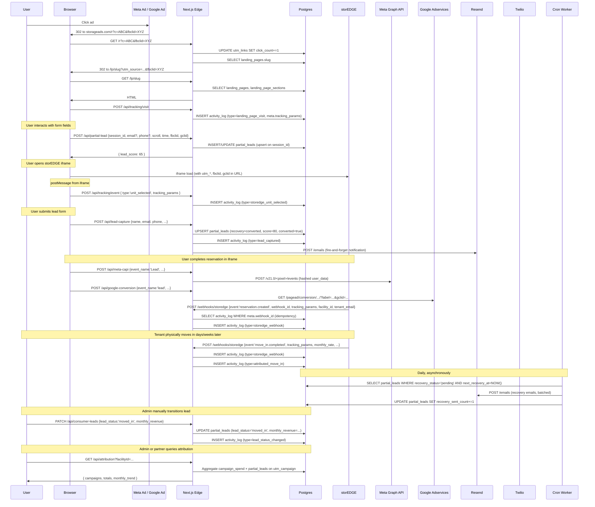

# Phase 4 — Core Workflow Spine

The spine workflow is the single longest, most-elaborate end-to-end workflow in the codebase. By the criteria in the task brief — files touched, external systems integrated, identifiers propagated, persistence written — the spine is identified, traced, and audited.

## 4.1 Candidate Identification and Selection

Three end-to-end workflows are candidates for the spine. Each is enumerated numerically before selection.

### Candidate A: B2B Audit Funnel

Click on ad → `/audit-tool` → `/api/diagnostic-intake` (40+ field operator survey) → `/api/audit-generate-diagnostic` (Anthropic Sonnet 4 with operator-specific prompt) → `shared_audits` slug → operator views `/audit/[slug]` → `/api/audit-load` (view-count instrumented) → "Schedule a call" → Cal.com booking → `/api/webhooks/calcom` → `facilities.pipeline_status = "call_booked"` → admin works lead → status transitions to `"client_signed"` → `/api/admin-leads` PATCH spawns `clients` row, access code, welcome email → client uses portal at `/portal` → onboarding via `/portal/onboarding` → `/api/onboarding-checklist`.

**Quantification.**
- Files touched: ~9 route handlers, 2 React shells, 3 lib helpers — approximately 15 files
- External systems: Anthropic, Google Places, Cal.com (inbound), Resend (multiple), Stripe (for paid signup)
- Tables written: `facilities` (multiple updates), `audits`, `places_data`, `audit_report_cache`, `shared_audits`, `activity_log` (multiple), `drip_sequences`, `clients`, `client_onboarding`, `org_users` (if Stripe checkout occurs)
- Identifiers introduced: `facilityId`, audit `slug`, `access_code`, `drip sequence_id`, possibly `stripe_customer_id`
- Length: 10–12 distinct steps

### Candidate B: B2C Tenant Acquisition Attribution Chain

Paid ad → `/api/r?c=<short_code>` → 302 redirect to `/lp/[slug]` with UTM params → landing page renders + client-side tracker fires `/api/tracking/visit` → visitor engages with form fields, client fires `/api/partial-lead` POSTs (multiple times, with growing form state) → visitor interacts with storEDGE iframe, client fires `/api/tracking/event` POSTs → visitor submits → `/api/lead-capture` (or `/api/consumer-lead`) → `/api/meta-capi` + `/api/google-conversion` fire server-side conversion events → storEDGE iframe redirects through reservation flow → storEDGE POSTs `/api/webhooks/storedge` with `reservation.created` then `move_in.completed` → activity_log entries written → cron `process-recovery` may fire emails to abandoned leads → cron `process-nurture` may send tenant nurture messages → `/api/attribution` GET surfaces CPL, cost-per-move-in, ROAS reports.

Alternative branches: walk-in tenant scans QR → `/api/walkin-attribution`; inbound call to tracked number → Twilio → `/api/call-webhook` → `call_logs`.

**Quantification.**
- Files touched: 12 route handlers (`/api/r`, `/api/tracking/visit`, `/api/tracking/event`, `/api/partial-lead`, `/api/lead-capture`, `/api/consumer-lead`, `/api/meta-capi`, `/api/google-conversion`, `/api/walkin-attribution`, `/api/webhooks/storedge`, `/api/call-webhook`, `/api/attribution`), 3 cron handlers (`process-recovery`, `process-nurture`, `check-campaign-alerts`), 4 lib helpers (`tracking-params`, `rate-limit`, `csrf`, `validation`), several client-side components — approximately 20–22 files
- External systems: Meta Graph API (CAPI), Google Adservices Conversion API, Twilio (calls), storEDGE (inbound webhook), Resend (recovery emails), Google Places (sometimes, for landing pages) — 6 distinct external systems
- Tables written: `utm_links` (click_count), `activity_log` (multiple types — visit, storedge event, storedge webhook, attributed move-in), `partial_leads` (upsert, multiple times per session), `call_logs`, `call_tracking_numbers` (aggregates), `tenants` (eventually, via separate path), `campaign_spend` (read-side join)
- Identifiers introduced or propagated: `short_code`, `utm_source/medium/campaign/content/term`, `fbclid`, `gclid`, `session_id` (client-generated), `ip_hash`, `facility_id`, `landing_page_id`, `reservation_id`, `webhook_id`, `tenant_name/email/phone`, `monthly_rate`, `twilio_call_sid`, `access_code` (for walk-in) — 14+ distinct identifiers
- Length: 12+ distinct steps depending on path

### Candidate C: B2C Operator Operational Cycle (PMS Upload → Intelligence)

`/portal/upload` → `/api/portal-upload` → file lands in Vercel Blob → `pms_reports` row created → admin notification email → admin reviews via `/admin/pms-queue` → `/api/admin-pms-queue` → admin parses CSV and calls `/api/storedge-import` → 9 `facility_pms_*` tables populated → cron `aggregate-page-stats` and `data-retention` maintain → admin and client query via `/api/pms-data` and `/api/facility-pms` → `/api/occupancy-forecast`, `/api/revenue-intelligence`, `/api/churn-predictions`, `/api/market-intel` use the data → outputs feed admin dashboards and client reports.

**Quantification.**
- Files touched: ~9 route handlers, several lib helpers — approximately 12 files
- External systems: Vercel Blob, Resend, possibly Anthropic, possibly external scrapers
- Tables: `pms_reports`, all 9 `facility_pms_*` tables, `facility_market_intel`, `churn_predictions`
- Identifiers: `pms_report_id`, `facility_id`, `tenant_external_id`, `unit_id`
- Length: 6–8 distinct steps

### Selection

Candidate B is the spine.

| Metric | Candidate A (B2B Audit) | Candidate B (B2C Attribution) | Candidate C (PMS) |
|--------|-------------------------|-------------------------------|--------------------|
| Distinct route handlers traversed | 9 | 15 | 9 |
| Distinct external systems | 5 | 6 | 3 |
| Distinct identifiers introduced | 5 | 14+ | 4 |
| Tables touched (write or join) | 9 | 11 | 12 |
| Synchronous vs. asynchronous steps | mostly sync, single Cal.com webhook | mixed; many async client events + webhooks + crons | mostly admin-driven |
| Crosses external domains | No (Cal.com is iframe but completes server-side) | Yes (storEDGE iframe, click identifiers from external ad platforms) | No |

Candidate B touches more handlers, more external systems, and an order of magnitude more distinct identifiers. It is the technical center of gravity of the platform. Candidate A is the commercial center — it converts prospects into paying clients — but architecturally it is shorter and less crosses-system. Candidate C is operational backbone but mostly internal.

The B2C tenant acquisition attribution chain is selected as the spine.

## 4.2 Step-by-Step Trace

Each step lists the trigger, file/line, state written, external calls, identifiers introduced or propagated, idempotency posture, failure handling, latency characteristics, and observability hooks.

### Step 0: Setup (admin-side, not part of per-tenant trace)

A facility admin creates a UTM short link via `/admin/facilities/[id]` → `/api/utm-links` POST. A row is written to `utm_links` with:
- `facility_id` (UUID)
- `landing_page_id` (optional UUID)
- `label` (admin-readable)
- `utm_source`, `utm_medium`, `utm_campaign`, `utm_content`, `utm_term`
- `short_code` (8-char hex, random)

The admin places `https://storageads.com/r?c=<short_code>` in ad creative.

Independently, the admin (or platform) records spend via `/api/campaign-spend` or via ad-platform sync, producing rows in `campaign_spend` keyed by `(facility_id, platform, campaign_id, date)`.

### Step 1: Ad Click

**Trigger.** A user clicks the ad on Meta or Google.

**Code.** `src/app/api/r/route.ts:6-57`.

**Mechanism.**
1. Public rate-limit (`PUBLIC_READ` tier) passes.
2. `UPDATE utm_links SET click_count = click_count + 1, last_clicked_at = NOW() WHERE short_code = ${c} RETURNING *` (`src/app/api/r/route.ts:17-22`).
3. If `landing_page_id` is set, look up the landing page slug.
4. Construct destination URL: `https://storageads.com/lp/<slug>` (or `storageads.com` if no LP).
5. Append `utm_source`, `utm_medium`, `utm_campaign`, `utm_content`, `utm_term` query params drawn from `utm_links` row.
6. 302 redirect to the destination URL.

**State written.** `utm_links.click_count++`, `utm_links.last_clicked_at = NOW()`.

**Identifiers introduced.** None new — `short_code` is the carrier from URL to lookup; UTMs are propagated from the `utm_links` row into the destination URL.

**Observability.** Click count increment is visible in the `utm_links` row. No `activity_log` entry, no `partial_leads` row.

**Failure handling.** Any database error returns a 302 redirect to `https://storageads.com` (silent failover). The user always lands somewhere; the click is silently lost only if the DB update fails.

**Latency.** Single SQL UPDATE + optional SELECT + redirect. Edge runtime.

**Critical observation.** The user's `fbclid` or `gclid` is *appended by the ad platform* to the redirect URL the ad platform produced. It does not flow through `/api/r`. The click identifier is in the URL the platform created, which encodes `c=<short_code>`, and additionally has `fbclid=...` or `gclid=...` appended by the ad network. When the browser follows the `/r` 302, the `fbclid`/`gclid` would be preserved in the eventual landing URL only if the browser carries them through — but since `/r` 302-redirects without preserving query params other than what it sets, the click ID is *lost* at this step unless the ad URL includes them separately from the `c=` parameter.

This is a structural attribution gap. Phase 7b logs it.

### Step 2: Landing Page Render

**Trigger.** Browser GETs `https://storageads.com/lp/<slug>?utm_source=...&utm_campaign=...&fbclid=...&gclid=...`.

**Code.** The landing page route (`src/app/lp/[slug]/page.tsx`, not read in this analysis but inferred from the slug pattern) reads sections from `landing_pages` and `landing_page_sections`. Client-side React then mounts and runs the tracking initializer.

**Mechanism (client-side).**
1. The client reads `window.location.search` for UTMs, `fbclid`, `gclid`, `referrer`.
2. Generates or reads a `session_id` from `localStorage` (per-tab persistence).
3. Fires `POST /api/tracking/visit` with `{ tracking_params, landing_page_id, facility_id, url }`.

**Code.** `src/app/api/tracking/visit/route.ts:17-69`.

**State written.** `activity_log` row with `type: 'landing_page_visit'`, optional `facility_id`, `meta` JSON containing `tracking_params`, `landing_page_id`, `url`, `source` (utm_source or `'direct'`), `timestamp`. 100 KB payload cap on the JSON.

**Identifiers introduced.** `session_id` is generated client-side (not visible in this handler — visible later in `/api/partial-lead`).

**Observability.** `activity_log` entry. Sentry route tag set in middleware.

**Failure handling.** Returns 200 even on database error (fire-and-forget tracking, per the route's comment). Tracking should never block the page.

### Step 3: Form Interaction (Incremental)

**Trigger.** As the user interacts with the form, client-side handlers POST to `/api/partial-lead` with the growing form state.

**Code.** `src/app/api/partial-lead/route.ts:152-256`.

**Mechanism.**
1. `AUTHENTICATED` rate-limit (relatively high quota, but POST is public).
2. Read body for `sessionId`, `landingPageId`, `facilityId`, `email`, `phone`, `name`, `unitSize`, behavioral signals (`fieldsCompleted`, `totalFields`, `scrollDepth`, `timeOnPage`, `exitIntent`), tracking params (`utmSource`, `utmMedium`, `utmCampaign`, `utmContent`, `fbclid`, `gclid`, `referrer`, `userAgent`).
3. Hash inbound IP with SHA-256 + `IP_SALT` (`prisma/schema.prisma:1213`); take first 16 hex chars.
4. Compute heuristic lead score (`calculateLeadScore`, `src/app/api/partial-lead/route.ts:17-55`):
   - 40 points × (fields_completed / total_fields)
   - up to 20 points for time-on-page (10s→120s+)
   - up to 15 points for scroll depth (25%→80%+)
   - 15 points if email present
   - 10 points if phone present
   - 5 points if exit-intent detected
   - Clamped to [0, 100].
5. Compute `next_recovery_at = NOW() + 1 hour` if email is present; else NULL.
6. Raw SQL upsert via `INSERT ... ON CONFLICT (session_id) DO UPDATE` (lines 202-249). The update clauses:
   - `email`, `phone`, `name`, `unit_size`: `COALESCE(EXCLUDED.x, partial_leads.x)` — never overwrite a previously-supplied value with NULL.
   - `fields_completed`, `scroll_depth`, `time_on_page`: `GREATEST(EXCLUDED.x, partial_leads.x)` — monotonic over the session.
   - `exit_intent`: OR'd (sticky once set).
   - `fbclid`, `gclid`: `COALESCE` — capture as soon as available, never overwrite.
   - `lead_score`: `GREATEST` — never decrement.
   - `recovery_status`: transition from `'no_email'` to `'pending'` only when email first arrives.

**State written.** `partial_leads` row created or updated. Recovery state machine initialized.

**Identifiers introduced or propagated.**
- `session_id` (client-generated, persisted as unique key) — tags every subsequent partial-lead POST to the same row.
- `ip_hash` — server-computed, never exposed to client.
- `email`, `phone`, `name` — eventually become the post-hoc identity bridge across systems.
- `fbclid`, `gclid` — captured from the URL params the landing page received from the ad-platform redirect.
- `utm_*` — captured the same way.
- `facility_id`, `landing_page_id` — captured from the route the user landed on.

**Observability.** Every upsert returns the resulting `lead_score`. Sentry is set up but the route does not currently add custom breadcrumbs.

**Failure handling.** Catch-all 500 response. No retry. The client may retry on next interaction (the upsert is idempotent on `session_id`).

**Latency.** Single SQL upsert. Edge runtime. Multiple POSTs are fired per user session (every few seconds as the form is filled).

### Step 4: storEDGE Embed Interaction

**Trigger.** The user interacts with the storEDGE reservation iframe (`landing_pages.storedge_widget_url`) embedded on the landing page. The parent page receives `postMessage` events from the iframe and forwards them to `/api/tracking/event`.

**Code.** `src/app/api/tracking/event/route.ts:17-68`.

**Mechanism.**
1. Public rate-limit (`PUBLIC_WRITE` tier).
2. Parse event JSON, reject payloads >100 KB.
3. Validate `facilityId` as UUID or null.
4. Create `activity_log` row with `type: storedge_${event.type}` (e.g., `storedge_unit_selected`, `storedge_reservation_started`).
5. The `meta` JSON carries `event_type`, `tracking_params`, `unit_type`, `unit_size`, `monthly_rate`, `reservation_id`, `tenant_name`, `move_in_date`, `timestamp`.

**State written.** `activity_log` row only. *No update to `partial_leads`.*

**Identifiers propagated.** `tracking_params` from the parent-page URL are passed into the iframe's storEDGE URL as query parameters, then echoed back via postMessage, then logged into `activity_log.meta`. This is the storEDGE cross-domain identifier bridge — the iframe receives the UTMs at embed time and returns them with each event.

**Failure handling.** Returns 200 even on error (fire-and-forget).

### Step 5: Full Form Submission (Lead Capture)

**Trigger.** User submits the lead-capture form (the explicit "Get Pricing" or "Reserve Now" form on the landing page).

**Code.** `src/app/api/lead-capture/route.ts:20-159`.

**Mechanism.**
1. IP-based rate limit: 10 requests/60 sec per IP (`src/app/api/lead-capture/route.ts:24-27`).
2. Validate name, email, phone (all required). Email regex via `isValidEmail`. Length caps (254 for email, 30 for phone).
3. Compute `sessionId` from body or fabricate as `lead-<timestamp>`.
4. `db.partial_leads.upsert({ where: { session_id }, create: {...}, update: {...} })`:
   - `recovery_status = 'converted'`, `lead_score = 80`, `fields_completed = 5`, `total_fields = 5`.
   - On update: also set `converted = true`, `converted_at = NOW()`.
5. Fire-and-forget `activity_log.create({ type: 'lead_captured', ... })` if `facility_id` present.
6. If Resend key present and `facility_id` present:
   - Look up `facilities.contact_email` and `facilities.name`.
   - Send notification email to `AUDIT_NOTIFICATION_EMAILS` recipients + facility contact email.

**State written.** `partial_leads` row (converted state), `activity_log` row.

**Identifiers stitched.** The lead's `email`, `phone`, `name` are stitched with their `session_id`-keyed partial-lead row. If a `partial_leads` row already exists from earlier `/api/partial-lead` POSTs, the explicit submission updates it; otherwise a new row is created with the fabricated `lead-<timestamp>` session_id.

**External calls.** Resend email (fire-and-forget).

**Failure handling.** Catch-all 500. The Resend call is fire-and-forget — failure to send the notification does not block the response. The activity_log create is also fire-and-forget.

**Latency.** Synchronous DB upsert + facility lookup + asynchronous email.

### Step 6: Server-Side Conversion Forwarding

**Trigger.** Client-side code (or a server-side companion path) fires a POST to `/api/meta-capi` and/or `/api/google-conversion` to forward the conversion event server-side to Meta and Google.

**Code.**
- `/api/meta-capi`: `src/app/api/meta-capi/route.ts:220-279`.
- `/api/google-conversion`: `src/app/api/google-conversion/route.ts:175-229`.

**Mechanism (Meta CAPI).**
1. Public, WEBHOOK rate-limit tier.
2. Validate that `event_name` and `user_data` are present; require either PII (email/phone/firstName/lastName) or technical identifiers (fbc/fbp/client_user_agent/client_ip_address).
3. Hash PII fields with SHA-256 of the lowercase-trimmed value: `em` (email), `ph` (phone digits), `fn` (first), `ln` (last), `ct` (city), `st` (state), `zp` (zip), `country`.
4. Pass through unhashed: `fbc` (Facebook click cookie), `fbp` (Facebook browser cookie), `client_ip_address`, `client_user_agent`.
5. Map event names: `reservation_started → InitiateCheckout`, `move_in_completed → Purchase`, `unit_selected → ViewContent`, `lead_captured → Lead`, etc. (lines 56-68).
6. POST to `https://graph.facebook.com/v21.0/${pixelId}/events` with `{ data: [event], access_token }`.

**Mechanism (Google Conversion).**
1. Same hashing pattern but slightly different field names (`email`, `phone`, `firstName`, etc., each as a one-element array per Google's Enhanced Conversions schema).
2. Map `move_in_completed → purchase`, `lead_captured → lead`, `reservation_started → initiate_checkout`.
3. GET `https://www.googleadservices.com/pagead/conversion/${conversionId}/?label=...&value=...&currency=...&gclid=...`.

**State written.** None locally. The whole point is to push the event to the ad platform.

**Identifiers propagated.** PII → hashed and forwarded as match keys. Click IDs (`fbclid` via `fbc` cookie, `gclid` direct) → forwarded for click-to-conversion matching on the ad platform side. The local DB does not record that the forwarding happened.

**Failure handling.** Returns 500 if Meta or Google rejects. No retry. The local DB has no record of failed forwarding; the next time the same event fires, it would re-forward. (Idempotency is left to the ad platforms via their `event_id` deduplication.)

**Critical observation.** The Meta CAPI route accepts `event_id` from the caller and forwards it to Meta. The Google Conversion route does not have an explicit event_id mechanism. The Meta platform deduplicates by `event_id` (matching with the browser-side Pixel fire); Google does not in the same way. This is a known asymmetry between the two systems and is correctly handled.

### Step 7: storEDGE Reservation and Move-In Webhook

**Trigger.** The user completes a reservation inside the storEDGE widget. Some time later (immediately for instant-reservations, or upon physical move-in for delayed-move-in flows), storEDGE POSTs an event to `/api/webhooks/storedge` with `event: 'reservation.created'` or `event: 'move_in.completed'`.

**Code.** `src/app/api/webhooks/storedge/route.ts:47-145`.

**Mechanism.**
1. WEBHOOK rate-limit.
2. Read raw body for HMAC verification.
3. Verify signature: HMAC-SHA256 of raw body with `STOREDGE_WEBHOOK_SECRET`, compared timing-safe against `x-storedge-signature` (or `x-webhook-signature`) header.
4. Parse JSON payload `StorEdgeWebhookPayload` (typed in `src/types/storedge.ts`).
5. Idempotency check: if `payload.webhook_id` is set, look up existing `activity_log` row with same `webhook_id` in `meta` JSON. If found, return 200 with `{ duplicate: true }`.
6. Validate `facility_id` as UUID; set to null otherwise.
7. Create `activity_log` row with `type: 'storedge_webhook'`, the full payload data in `meta` JSON.
8. If event is `move_in.completed` AND `tracking_params` contains `utm_source`, `fbclid`, or `gclid`, create a SECOND `activity_log` row with `type: 'attributed_move_in'`, containing the tracking data + reservation_id + monthly_rate + move_in_date in `meta`.

**State written.** One or two `activity_log` rows. *No update to `partial_leads`.* *No update to `tenants`.* *No update to `facility_pms_revenue_history`.*

**Identifiers introduced.** `webhook_id` (storEDGE-assigned), `reservation_id` (storEDGE-internal), `tenant_name`, `tenant_email`, `tenant_phone`, `monthly_rate`, `move_in_date`.

**Identifiers stitched (or not).** The webhook does *not* attempt to find the originating `partial_leads` row. It logs the event in `activity_log` with its tracking_params and email, but no foreign key links a move-in event to the specific click that produced it. The join is post-hoc, performed by `/api/attribution` against `partial_leads.utm_campaign` and `campaign_spend.utm_campaign` — *campaign-level*, not *click-level* or *lead-level*.

**Failure handling.** Returns 500 on parse failure or signature mismatch. storEDGE is responsible for retry (with the same `webhook_id` — idempotency handles repeats).

### Step 8: Walk-In Attribution (Alternative Path)

**Trigger.** A walk-in tenant scans a QR code at the facility office.

**Code.** `src/app/api/walkin-attribution/route.ts:10-63`.

**Mechanism.**
1. IP rate-limit (10/60 sec).
2. Body: `accessCode`, `source` (e.g., "Drove by", "Saw on Google", "Friend referred"), `sawOnlineAd` (boolean), `tenantName`, `unitRented`, `loggedBy`.
3. Look up facility by `access_code`.
4. Create `activity_log` row with `type: 'walkin_attribution'`, source data in `meta`.

**State written.** `activity_log` row.

**Identifiers stitched.** Facility's `access_code` ties the walk-in to the facility. The `loggedBy` field captures staff identity. No tenant record is created.

### Step 9: Inbound Call Tracking (Alternative Path)

**Trigger.** A prospect calls the tracking number printed on the landing page or the GBP listing.

**Code.** `src/app/api/call-webhook/route.ts` (per Phase 3 agent summary).

**Mechanism.**
1. Twilio routes the call to the tracking number.
2. Twilio sends voice-webhook events (initial answer, status change).
3. The handler looks up `call_tracking_numbers` by the dialed number.
4. Derives `utm_campaign` via `utm_links.id` linkage on `call_tracking_numbers.utm_link_id`.
5. Inserts a `call_logs` row with `ON CONFLICT (twilio_call_sid) DO NOTHING` for idempotency.
6. Updates `call_tracking_numbers` aggregates (call_count, total_duration).

**Identifiers stitched.** The Twilio number → `call_tracking_numbers` row → `utm_link_id` → `utm_links.utm_campaign`. This is the audio-channel attribution.

**Limitation observed in Phase 3.** The handler does not verify Twilio webhook signatures (`X-Twilio-Signature`). It is protected only by rate limiting.

### Step 10: Reporting and Recovery

**`/api/attribution` GET** (Step 10a).

**Code.** `src/app/api/attribution/route.ts:18-186`.

The reporting endpoint computes attribution by joining:
- `campaign_spend` aggregated by `utm_campaign` over a date range → `total_spend`, `total_impressions`, `total_clicks`.
- `partial_leads` filtered to non-`partial` non-`lost` `lead_status`, aggregated by `utm_campaign` → `total_leads`, `move_ins` (`COUNT FILTER WHERE lead_status = 'moved_in'`), `total_revenue` (`SUM monthly_revenue FILTER WHERE lead_status = 'moved_in'`).

The join is a `FULL OUTER JOIN` on `utm_campaign`. The computed metrics:
- `cpl = total_spend / total_leads`
- `cost_per_move_in = total_spend / move_ins`
- `roas = (total_revenue × 12) / total_spend` (annualized; assumes lifetime value is 12 months of rent)

Plus a monthly trend that performs the same join bucketed by month.

**Identifiers used.** The join key is the *string* `utm_campaign`. The system reports campaign-level attribution. It does *not* report per-click attribution or per-lead attribution.

**`process-recovery` cron** (Step 10b).

Runs at 7 AM UTC daily. Finds `partial_leads` with `recovery_status = 'pending'` and `next_recovery_at < NOW()`. For each:
1. Send a recovery email via Resend.
2. Increment `recovery_sent_count`.
3. Advance `next_recovery_at` by 24 hours (per Phase 3 cron agent).
4. After a configured number of sends with no conversion, transition to `recovery_status = 'exhausted'`.
5. Hot-lead alerts go to admin (per `audit-load` view-count signal).

**`process-nurture` cron** (Step 10c).

Runs at 6 AM UTC daily. Advances `nurture_enrollments` whose `next_send_at < NOW()`. Generates per-step messages, sends via Resend (or Twilio SMS for SMS-channel enrollments), records in `nurture_messages`.

## 4.3 Identifier Propagation Table

This is the spine's central artifact.

| # | Identifier | Type | Introduced (file:lines) | Persisted (table.field) | Propagated to (external) | Stitched with | Survives boundary |
|---|------------|------|-------------------------|-------------------------|--------------------------|---------------|-------------------|
| 1 | `short_code` | 8-hex string | `/api/utm-links` POST creates; admin places in ad URL | `utm_links.short_code` (UNIQUE) | URL query `?c=<short_code>` | — | Click only |
| 2 | `utm_source` / `utm_medium` / `utm_campaign` / `utm_content` / `utm_term` | strings | Admin sets at `utm_links` creation; `/api/r` propagates to redirect URL | `utm_links.utm_*`, `partial_leads.utm_*`, `campaign_spend.utm_campaign`, `activity_log.meta.tracking_params.*` | Forwarded to client URL, to storEDGE iframe, to Meta CAPI / Google Conversion | The join key in `/api/attribution` | Visit → form → storEDGE event → webhook |
| 3 | `fbclid` | string | URL-attached by Meta ad delivery | `partial_leads.fbclid`, `activity_log.meta.tracking_params.fbclid` | Forwarded as `fbc` cookie value to Meta CAPI | storEDGE webhook tracking_params | Visit → form → storEDGE webhook (if iframe propagates) |
| 4 | `gclid` | string | URL-attached by Google ad delivery | `partial_leads.gclid`, `activity_log.meta.tracking_params.gclid` | Forwarded as `gclid` URL param to Google Conversion | storEDGE webhook tracking_params | Same as fbclid |
| 5 | `session_id` | client-generated string | Client-side JS on landing page mount; persisted in `localStorage` | `partial_leads.session_id` (UNIQUE) | — | The upsert key for form-state evolution | Per browser session |
| 6 | `ip_hash` | SHA-256[0:16] | `/api/partial-lead` server hashes inbound IP with `IP_SALT` | `partial_leads.ip_hash` | — (never exposed externally) | — | Form session |
| 7 | `email` (form-entered) | string | Visitor types | `partial_leads.email`, then `clients.email`, `tenants.email` (post-move-in) | Forwarded as SHA-256(email) to Meta CAPI as `em`; to Google as `email`; via Resend to user inbox; passed to storEDGE iframe (optional) | The cross-system identity bridge — joins partial_lead row to tenants row and to facility's tenant roster, by exact email match | Form → reservation → move-in → tenant |
| 8 | `phone` (form-entered) | string | Visitor types | `partial_leads.phone`, eventually `tenants.phone` | Forwarded as SHA-256(digits) to Meta CAPI as `ph` | Same role as email | Same |
| 9 | `facility_id` | UUID | Pre-existing on `facilities` row | `facilities.id`, propagated to nearly every facility-scoped table; passed in storEDGE webhook payload; embedded in storEDGE widget URL | Echoed back via storEDGE webhook | The primary cross-domain join key from storEDGE side | Permanent |
| 10 | `landing_page_id` | UUID | Pre-existing on `landing_pages` row | `partial_leads.landing_page_id`, `utm_links.landing_page_id`, `call_tracking_numbers.landing_page_id` | — | Used to derive landing-page-level analytics | Visit → form lifecycle |
| 11 | `reservation_id` | storEDGE-internal | storEDGE creates at reservation time | `activity_log.meta.reservation_id` (one or two log rows) | — | *Not* persisted in `tenants` or in `partial_leads`; only in the meta JSON | storEDGE permanent; StorageAds log-only |
| 12 | `webhook_id` | storEDGE-assigned | storEDGE assigns per webhook event | `activity_log.meta.webhook_id` | — | Idempotency dedup key for the storEDGE webhook handler | Webhook lifecycle |
| 13 | `tenant_name` / `tenant_email` / `tenant_phone` | storEDGE payload | storEDGE collects during reservation | `activity_log.meta.tenant_*`; potentially synced to `tenants.name/email/phone` if/when tenant is created from storEDGE export | — | Optional join to `partial_leads.email` by exact-match for *post-hoc* attribution | Webhook + tenant lifecycle |
| 14 | `monthly_rate` | Decimal | storEDGE payload at move-in | `activity_log.meta.monthly_rate`, eventually `tenants.monthly_rate` | — | The revenue value that closes the attribution loop in `/api/attribution`'s ROAS calculation | Move-in onwards |
| 15 | `twilio_call_sid` | Twilio-assigned | Twilio provisions per call | `call_logs.twilio_call_sid` (UNIQUE), `call_tracking_numbers` aggregates | — | Call-level idempotency | Call lifetime |
| 16 | `access_code` (facility) | 16-char string | Generated when `facility.pipeline_status = 'client_signed'` | `facilities.access_code`, `clients.access_code` | URL query for QR-coded walk-in capture | Walk-in attribution to facility | Permanent until rotated |

The table is 16 distinct identifiers, ranging in lifetime from "single click event" (short_code) to "permanent" (facility_id, access_code).

## 4.4 The Critical Break: Click → Move-In

The thesis the marketing claims — "move-in attribution" — implies a chain that ends at *this click* producing *this move-in*. The chain in code does *not* close at the row level. It closes at the *campaign* level via `/api/attribution`.

Specifically, the chain breaks in three places:

### Break 1: Click → Page Visit

The `/api/r` redirect does not preserve `fbclid` or `gclid` from the inbound URL. The ad-platform URL is `https://storageads.com/r?c=<short_code>&fbclid=<X>`, but the handler only reads `c` and constructs a new URL with the `utm_*` from the database. The `fbclid` and `gclid` arrive at the landing page only if the ad-platform redirect appends them directly to the destination URL — which it usually does (Meta and Google append click IDs to the redirected URL).

So in practice, the click IDs survive Step 1 because the ad networks add them at the destination, not because `/api/r` propagates them. But the `/api/r` route does not control or persist the click IDs at the click event itself. They first appear in the StorageAds system in Step 3 (`/api/partial-lead`).

If the user clicks but never reaches Step 3 (closes the browser before form interaction), `partial_leads` has no row for that click. The click is visible only in `utm_links.click_count`.

### Break 2: Form Lead → storEDGE Reservation

When the user clicks "Reserve Now" in the storEDGE iframe, the StorageAds backend is not directly notified of the reservation. The iframe handles the reservation flow internally and POSTs the result to *its own* backend (storedge.com). Some time later, storEDGE calls back via `/api/webhooks/storedge` with `event: 'reservation.created'`.

The storEDGE webhook payload includes `tracking_params` because the StorageAds frontend embeds the iframe with the `tracking_params` in the iframe URL (per the `landing_pages.storedge_widget_url` pattern). storEDGE round-trips these params back. But the webhook payload does not include the `session_id` (a client-generated identifier opaque to storEDGE).

So the webhook handler knows:
- `facility_id` (in payload).
- `utm_source`, `utm_campaign`, `fbclid`, `gclid` (in payload tracking_params).
- `tenant_email`, `tenant_phone`, `tenant_name` (if storEDGE collected them).
- `reservation_id` (storEDGE-internal).

It does *not* know:
- The `session_id` of the client browser.
- Therefore, the specific `partial_leads.id` row that produced this reservation.

The webhook creates an `activity_log` row but does *not* update `partial_leads` to reflect the reservation. The link between the form-side row and the reservation event is implicit through *email match* — and storEDGE may or may not have captured the same email the form did.

### Break 3: Move-In → Lead Status Transition

When `event: 'move_in.completed'` arrives at `/api/webhooks/storedge`, the handler creates the `attributed_move_in` activity_log row. It does *not* update any `partial_leads.lead_status` to `'moved_in'`. The `partial_leads` row remains at `recovery_status = 'converted'`, `lead_status` field (which is what `/api/attribution` uses for the move-in count) is *not* automatically advanced.

The `/api/attribution` reporting query joins `campaign_spend.utm_campaign` with `partial_leads` filtered to `lead_status = 'moved_in'`. For a move-in to count in the attribution report, *some other process* must transition the `partial_leads.lead_status` to `'moved_in'`.

Looking at the system for that transition:
- `/api/consumer-leads` PATCH allows admin to manually set status (`src/app/api/consumer-leads/route.ts`, per Phase 3 agent summary).
- `/api/v1/leads` PATCH allows external API to set status.
- No cron job and no webhook handler automatically transitions on storEDGE move-in.

**The conclusion:** The system *captures the move-in event* (in `activity_log`) and the system *reports move-in attribution* (in `/api/attribution`), but the *transition between these two states is manual.* An admin must observe the `attributed_move_in` activity-log entry and manually update the `partial_leads.lead_status` to `'moved_in'`, possibly also setting `monthly_revenue` from the storEDGE-reported `monthly_rate`.

Alternatively, the system could be operated such that admins use `/api/v1/tenants` POST to sync tenant rosters from the PMS, and a separate process matches tenants to partial-leads by email — but that automation is not in the codebase.

This is the spine's most consequential structural finding.

## 4.5 Sequence Diagram

The diagram is 40+ messages. Asynchronous and batched paths are noted.

## 4.6 Variant Traces

### Variant V1: First-Time Tenant Happy Path

The trace in §4.2 is the happy path. The user clicks an ad, lands, interacts, submits the form, reserves in storEDGE, eventually moves in. Attribution requires the admin step.

### Variant V2: Cross-Device Path

The user clicks on mobile (Step 1 + 2 + 3 with `session_id_mobile`), abandons the form, returns later on desktop (new `session_id_desktop`, new `partial_leads` row), completes the reservation on desktop.

**What works:** The desktop path produces its own complete `partial_leads` row. The storEDGE webhook fires when the desktop reservation completes.

**What degrades:** The original mobile click is recorded in `utm_links.click_count`, with a `partial_leads` row containing the partial form state. The desktop conversion appears in a *different* `partial_leads` row.

**What breaks:** The two rows cannot be merged automatically. Two leads, one move-in — would be reported as 50% conversion rate from one click but 0% from the other, with attribution credited to whichever `utm_campaign` the desktop URL carried.

If the user comes back via the same ad network's cookie (so the desktop URL also has the same `utm_campaign`), the campaign-level attribution still works — but the lead-count is inflated by 1. If the user comes back via organic search or directly, the desktop visit has no UTMs and the conversion is attributed to direct/organic, not to the original paid click.

This is a known limitation of UTM-based attribution and is not solvable in code without identity resolution (the ability to recognize the same person across sessions before they identify themselves).

### Variant V3: Offline-Completion (Walk-In) Path

The user clicks an ad, lands, abandons, walks into the facility, asks to rent a unit. Staff logs the walk-in via `/api/walkin-attribution`.

**What works:** `activity_log` records the walk-in, attributable to the facility. The `source` field captures whether the user "saw an online ad" — a staff-attested attribution signal.

**What degrades:** Without a `partial_leads` row (the user closed the browser before submitting), there is no `lead_score` and no engagement history. The activity_log row is a counter, not a join key.

**What breaks:** Connecting the walk-in to a specific ad click (closing the ad-to-walk-in attribution loop) is not possible from the codebase. The system records that *a walk-in occurred at this facility, attributed to "online ad" by staff*; it cannot tell you which specific ad or campaign produced the walk-in.

The honest reading: walk-in attribution is *facility-level* and *staff-attested*, not *campaign-level* or *click-level*.

## 4.7 Robustness Audit

### Idempotency Guarantees, Mechanically

- `/api/r`: SQL UPDATE is idempotent on `short_code` lookup; click_count increments are not (each call increments). Acceptable: clicks should count once per browser fetch.
- `/api/tracking/visit` and `/api/tracking/event`: log every event without dedup. If the same client fires twice (due to a network retry), two activity_log rows are produced. Acceptable: events are append-only and downstream consumers can dedup if needed.
- `/api/partial-lead`: `INSERT ... ON CONFLICT (session_id) DO UPDATE` is fully idempotent on `session_id`. Repeated POSTs with growing form state are merged correctly.
- `/api/lead-capture`: Prisma `upsert` on `session_id`. Idempotent.
- `/api/meta-capi`: Forwards an `event_id` from the caller to Meta. Meta deduplicates on `event_id`. Idempotent at the Meta side; the local side does not record forwarding.
- `/api/google-conversion`: No explicit event_id. Google deduplicates on `gclid` + conversion timing. Local side does not record.
- `/api/webhooks/storedge`: `webhook_id` dedup via `activity_log` meta-JSON path lookup. Idempotent.
- `/api/call-webhook`: `ON CONFLICT (twilio_call_sid) DO NOTHING`. Idempotent.
- `/api/walkin-attribution`: No dedup. Two walk-in submissions for the same tenant from the same staff member would produce two activity_log rows. Acceptable for an audit log but introduces noise.

### Race Conditions, Named Explicitly

**R1.** `/api/lead-capture` upsert vs concurrent `/api/partial-lead` upsert. Both target the same `session_id`. The interleaving could result in a partial row clobbering a converted-state row. The upserts' UPDATE clauses use COALESCE for textual fields (so empty values don't clobber filled values), but `recovery_status` and `lead_score` use direct assignment in `lead-capture` (`'converted'`, `80`) — a concurrent `partial-lead` upsert could *not* downgrade these because partial-lead's update uses CASE expressions that respect the converted state. Likely safe but worth a focused test.

**R2.** `/api/webhooks/storedge` idempotency check — read of existing activity_log row vs. concurrent insert of the same `webhook_id`. The check is a read-then-write, not a unique-constraint enforcement. If storEDGE retries the same webhook simultaneously to two replicas, both replicas could pass the dedup check and insert. The risk is small but real. A unique index on `activity_log.meta` JSONB `webhook_id` (using a partial functional index) would close the gap.

**R3.** `utm_links.click_count` increment via SQL UPDATE is row-level atomic in Postgres. No race.

### Failure at Step N+1 After External Commit at Step N

If `/api/meta-capi` POST succeeds but the response handling fails and the local DB has no record, the event is forwarded to Meta but not recorded locally. The local system has no way to know what was forwarded. If the same conversion fires again (e.g., the client retries), Meta deduplicates on `event_id`. Net effect: correct on the Meta side, blind on the local side.

Similarly, if `/api/webhooks/storedge` accepts a `move_in.completed` event, creates the `attributed_move_in` activity_log row, but the admin never advances `partial_leads.lead_status` to `'moved_in'`, the move-in is recorded but does not appear in `/api/attribution` reports. The data is captured but not surfaced. *This is the central operational risk in the attribution chain.*

### Attribution Window Enforcement

Phase 4 inspected attribution windows. Findings:
- `partial_leads.recovery_status = 'pending'` triggers `next_recovery_at = NOW() + 1 hour` (one-hour cooldown before first recovery email).
- The `process-recovery` cron schedules sub-sends at 24-hour intervals.
- No global attribution window is enforced for click-to-move-in. The `/api/attribution` query simply joins by `utm_campaign` regardless of how stale the click was.

If a user clicks an ad in January and moves in in June, the system would still join the spend with the lead (if `partial_leads.lead_status` was manually set to `'moved_in'`). There is no 30-day or 90-day attribution window in code. The honest report would include a window; the current report does not.

### Recovery Story Per Failure Class

| Failure | Recovery | Status |
|---------|----------|--------|
| `/api/r` DB error | Silent redirect to `storageads.com` | Acceptable |
| `/api/tracking/*` DB error | Fire-and-forget, returns 200 | Acceptable |
| `/api/partial-lead` DB error | 500 to client; client retries on next interaction | Acceptable |
| `/api/lead-capture` DB error | 500 to client; user must resubmit | Suboptimal — would prefer queue |
| `/api/meta-capi` Meta error | 500 to client; client doesn't retry | Risky — events can be lost |
| `/api/webhooks/storedge` parse failure | 500 to storEDGE; storEDGE retries | Acceptable |
| `/api/webhooks/storedge` DB error after signature pass | 500 to storEDGE; storEDGE retries (webhook_id idempotency catches duplicates) | Acceptable |
| Cron failure | Resend admin alert; resume next run | Acceptable |
| Admin forgets to advance `lead_status` | No alert; move-in invisible to attribution | **Suboptimal — primary risk** |

### Worst-Case Data Consistency Outcome

A partial failure that leaves an `attributed_move_in` row in `activity_log` but never produces a `partial_leads.lead_status = 'moved_in'` update. The attribution report would show zero move-ins for the campaign that produced the actual move-in. The lead is "lost" from the report's perspective despite being captured in the system's perspective.

Mitigation requires an automated reconciliation process that scans `activity_log` for `attributed_move_in` rows and transitions the matching `partial_leads`. The matching logic would be: same `facility_id` + same `tenant_email` (or `tenant_phone`, fuzzy) + same `utm_campaign`. This automation does not exist in the codebase.

## 4.8 Synthesis

The spine is the click-to-move-in attribution chain implemented across 15 routes, 6 external systems, 16 distinct identifiers, and 12 sequential steps with at least 4 asynchronous branches. The chain *captures* every relevant event server-side: clicks (`utm_links.click_count`), visits (`activity_log`), form interactions (`partial_leads`), iframe events (`activity_log`), reservations (`activity_log`), move-ins (`activity_log`), calls (`call_logs`), walk-ins (`activity_log`). It *forwards* conversion events to Meta and Google server-side with hashed PII and click IDs. It *aggregates* the captured data into a campaign-level attribution report via `/api/attribution`.

The chain does *not* close at the row level. The structural reason: the storEDGE move-in webhook does not update `partial_leads`; the connection between a specific click and a specific move-in must be reconstructed at report time by joining on `utm_campaign` strings, or manually maintained by an admin advancing `partial_leads.lead_status`. The marketing description "move-in attribution" is accurate at the *campaign* level — the system can tell you that the May Facebook campaign for facility X produced 7 move-ins worth $1,015/month total — but inaccurate at the *click* level. The system cannot tell you that *this specific click* produced *this specific move-in*.

This is not a defect; it is the choice the architecture made. Click-to-move-in attribution at the row level requires either (a) a propagated identifier that travels from click through storEDGE iframe to webhook callback to PMS roster sync, or (b) a deterministic identity-resolution layer (typically email + phone hashing + matching). The system has the *components* — click IDs are captured, emails are captured, storEDGE returns email — but the *join* is not performed automatically. The schema does not include a `partial_leads.tenant_id` or `tenants.partial_lead_id` field.

The thesis the paper will defend must reflect this honestly. The system is built *for* move-in attribution; it *reports* move-in attribution at the campaign level; it *captures* the events necessary to make move-in attribution exact; but the *automated stitching from click to physical move-in* is not yet implemented. The "missing link" is the post-storEDGE-webhook reconciliation that would advance `partial_leads.lead_status` to `'moved_in'` based on email/phone match against the inbound webhook.

This finding shapes Phase 7 (Honest Inventory), Phase 10 (Thesis Selection), and Phase 12 (the white paper's Limitations section).
