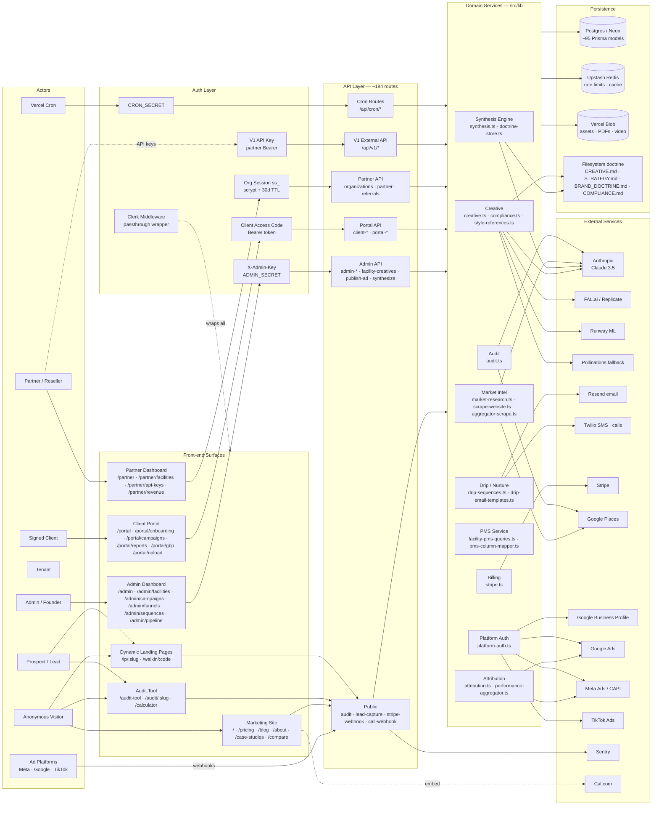
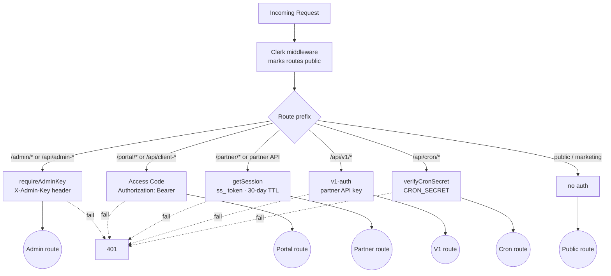
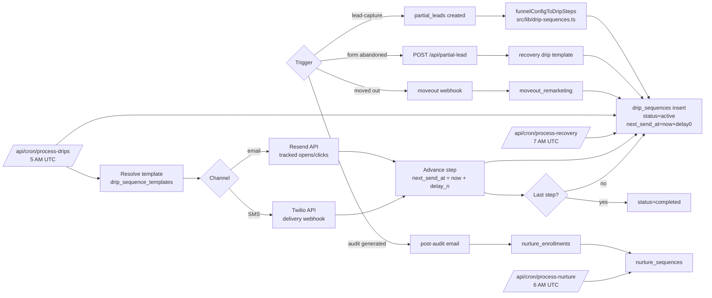
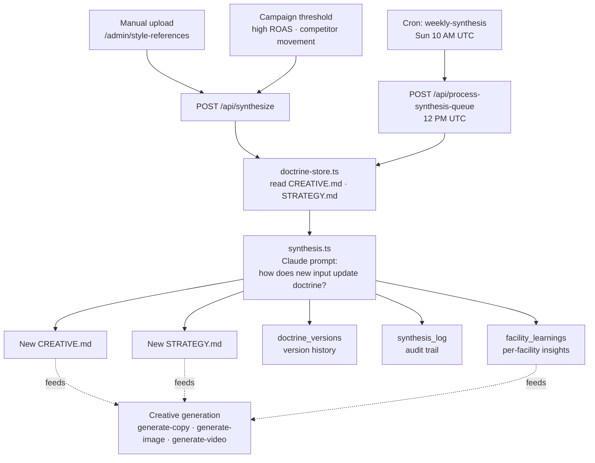
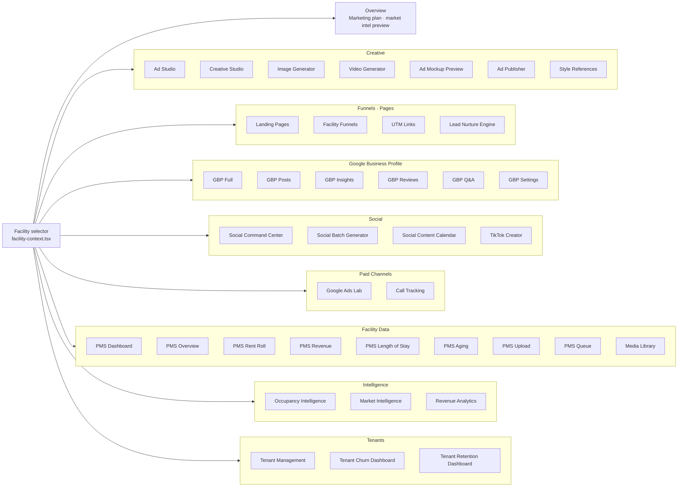
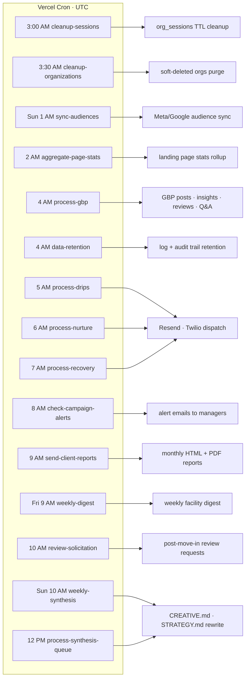

# StorageAds — Architecture & Connectivity Map

A layered view of every major surface, subsystem, and data flow in the codebase. Diagrams use Mermaid (renders natively on GitHub and most Markdown viewers).

Scope at a glance:
- **4** independent auth systems
- **~184** API route handlers
- **~95** Prisma models
- **~15** Vercel cron jobs
- **~62** lazy-loaded admin facility tabs
- **~20+** third-party integrations

---

## 0. Top-Level System Map

Every major surface, where users enter, and which layer they touch.



---

## 1. Authentication Routing

Four independent systems. Clerk wraps everything as passthrough; real gating happens in the other three.



---

## 2. Lead Journey — Audit → Client → Tenant

The end-to-end conversion path. This is the backbone.

```mermaid
flowchart LR
  A[Visitor on<br/>/audit-tool or /lp/:slug] --> B[POST /api/audit-form<br/>or /api/lead-capture]
  B --> C{Entry type}
  C -->|audit| D[POST /api/audit-generate<br/>Google Places · Claude]
  C -->|landing page| E[partial_leads record<br/>UTM params captured]

  D --> F[audits + audit_report_cache<br/>shared_audits]
  F --> G[/audit/:slug results page<br/>Cal.com CTA]
  G --> H[Call booked → demo]

  E --> I[Enroll in funnel drip<br/>drip_sequences created]
  H --> J[Contract signed<br/>status = client_signed]

  J --> K[Access code generated<br/>Resend email sent]
  K --> L[/portal login]
  L --> M[/portal/onboarding<br/>facility info + Stripe checkout]
  M --> N[clients + client_onboarding<br/>organizations.stripe_customer_id]

  N --> O[Active subscription<br/>Stripe webhooks keep state]
  O --> P[Campaigns run]
  P --> Q[Lead → tour → lease]
  Q --> R[Tenant record<br/>tenants table]

  R --> S[tenant_payments · tenant_communications]
  R --> T[churn_predictions · retention_campaigns]
  R -. moveout .-> U[moveout_remarketing drip]
```

---

## 3. Ad Creative & Publish Flow

From creative brief to platform to attributed revenue.

```mermaid
flowchart TB
  subgraph studio[Ad Studio · /admin/facilities → Ad Studio tab]
    A1[Creative brief<br/>angle · audience · platform]
    A2[Generate copy<br/>POST /api/generate-copy · Claude]
    A3[Generate image<br/>POST /api/generate-image<br/>FAL → Pollinations fallback]
    A4[Generate video<br/>POST /api/generate-video<br/>FAL Wan2.2 → Runway fallback]
    A5[Compliance validate<br/>src/lib/compliance.ts<br/>vs COMPLIANCE.md]
    A6[Funnel test<br/>funnel_config + metrics]
  end

  subgraph doctrine[Doctrine · filesystem + DB]
    D1[CREATIVE.md]
    D2[STRATEGY.md]
    D3[BRAND_DOCTRINE.md]
    D4[COMPLIANCE.md]
    D5[style_references<br/>images · videos · text]
  end

  D5 --> A2
  D5 --> A3
  D5 --> A4
  D1 --> A2
  D1 --> A3
  D2 --> A1
  D4 --> A5

  A1 --> A2 --> A5
  A1 --> A3 --> A5
  A1 --> A4 --> A5
  A5 --> A6
  A6 --> V[ad_variations<br/>compliance_status · funnel_config]

  V --> PUB[POST /api/publish-ad]
  PUB -->|Meta| M1[Meta Ads API<br/>platform_connections]
  PUB -->|Google| M2[Google Ads API]
  PUB -->|TikTok| M3[TikTok Ads API]
  PUB --> PL[publish_log]

  M1 --> IMP[Impressions · clicks]
  M2 --> IMP
  M3 --> IMP
  IMP --> LPGO[/lp/:slug landing page]
  LPGO --> LC[POST /api/lead-capture]
  LC --> PL2[partial_leads<br/>UTM captured]

  PL2 --> DRIP[drip_sequences enrolled]
  PL2 --> CT[call_tracking_numbers<br/>unique per LP]
  CT --> CL[call_logs]
  CL --> MOV[tenants record<br/>move-in linked]

  SPEND[campaign_spend<br/>daily sync] --> ATTR[GET /api/attribution]
  PL2 --> ATTR
  CL --> ATTR
  MOV --> ATTR
  ATTR --> CP[creative_performance<br/>client_campaigns · CPL · CPMI · ROAS]
```

---

## 4. Drip / Nurture Automation

How post-conversion and recovery sequences actually fire.



---

## 5. Attribution Pipeline

Spend + leads + calls + move-ins → ROAS.

```mermaid
flowchart LR
  subgraph sources[Sources]
    S1[Meta Ads API<br/>spend · impressions · clicks]
    S2[Google Ads API<br/>spend · conversions]
    S3[TikTok Ads API]
    S4[Meta CAPI<br/>POST /api/meta-capi]
    S5[Google Conversion<br/>POST /api/google-conversion]
  end

  S1 --> SP[campaign_spend<br/>daily rollup]
  S2 --> SP
  S3 --> SP

  subgraph capture[Lead + Call Capture]
    L1[/lp/:slug form] --> L2[POST /api/lead-capture]
    L2 --> PL[partial_leads<br/>utm_source · utm_campaign · session_id]
    C1[Twilio call webhook] --> C2[POST /api/call-webhook]
    C2 --> CL[call_logs<br/>move_in_linked FK]
  end

  subgraph fulfill[Fulfillment]
    T[tenants<br/>move_in_date]
    CS[clients<br/>status=client_signed]
  end

  SP --> ENG[attribution.ts<br/>performance-aggregator.ts]
  PL --> ENG
  CL --> ENG
  T --> ENG
  CS --> ENG

  S4 --> METAFB[Meta CAPI feedback<br/>improves audience]
  S5 --> GFB[Google feedback]

  ENG --> OUT[client_campaigns<br/>CPL · CPMI · ROAS · revenue]
  OUT --> VIZ1[/admin/facilities<br/>Revenue Analytics tab/]
  OUT --> VIZ2[/portal/reports<br/>monthly HTML + PDF/]
  OUT --> MR[monthly report cron<br/>/api/cron/send-client-reports]
```

---

## 6. Synthesis / Self-Evolving Doctrine

User uploads a style reference or campaign data → Claude rewrites `CREATIVE.md` and `STRATEGY.md`.



---

## 7. Admin Facility Manager — Tab Taxonomy

The 62 lazy-loaded tabs grouped by domain. Single facility selector at the top; each tab is an independent micro-app.



---

## 8. External Integration Surface

Every third-party and what it powers.

```mermaid
flowchart LR
  subgraph SA[StorageAds]
    core[Application Core]
  end

  core --> claude[Anthropic Claude<br/>ANTHROPIC_API_KEY]
  claude -. powers .-> F1[Audit generation]
  claude -. powers .-> F2[Copy generation]
  claude -. powers .-> F3[Marketing plans]
  claude -. powers .-> F4[Synthesis engine]
  claude -. powers .-> F5[Market intel analysis]

  core --> resend[Resend<br/>RESEND_API_KEY]
  resend -. powers .-> E1[Access codes]
  resend -. powers .-> E2[Drip email]
  resend -. powers .-> E3[Monthly reports]
  resend -. powers .-> E4[Alerts]

  core --> stripe[Stripe<br/>STRIPE_SECRET_KEY]
  stripe -. powers .-> B1[Checkout]
  stripe -. powers .-> B2[Customer portal]
  stripe -. powers .-> B3[Subscription webhooks]

  core --> twilio[Twilio<br/>TWILIO_*]
  twilio -. powers .-> TW1[SMS drips]
  twilio -. powers .-> TW2[Call tracking numbers]
  twilio -. powers .-> TW3[Call recordings]

  core --> falr[FAL.ai / Runway / Pollinations<br/>FAL_KEY · RUNWAY_API_KEY]
  falr -. powers .-> I1[Image generation]
  falr -. powers .-> I2[Video generation]

  core --> gemini[Gemini<br/>GEMINI_API_KEY]
  gemini -. powers .-> AV[Video analysis in Creative Library]

  core --> places[Google Places<br/>GOOGLE_PLACES_API_KEY]
  places -. powers .-> PL1[Facility lookup]
  places -. powers .-> PL2[Competitor research]
  places -. powers .-> PL3[Audit enrichment]

  core --> gbp[Google Business Profile<br/>GOOGLE_GBP_*]
  gbp -. powers .-> GBP1[Post publishing]
  gbp -. powers .-> GBP2[Insights · reviews · Q&A]

  core --> gads[Google Ads<br/>GOOGLE_ADS_*]
  gads -. powers .-> GA1[Campaigns]
  gads -. powers .-> GA2[Keyword research]
  gads -. powers .-> GA3[Conversion tracking]

  core --> meta[Meta / Facebook<br/>META_*]
  meta -. powers .-> MA1[Meta + IG ads]
  meta -. powers .-> MA2[CAPI events]
  meta -. powers .-> MA3[Audience sync]

  core --> tiktok[TikTok Ads<br/>TIKTOK_*]
  tiktok -. powers .-> TT1[TikTok ads]

  core --> upstash[Upstash Redis<br/>KV_REST_*]
  upstash -. powers .-> U1[Rate limiting]
  upstash -. powers .-> U2[Cache]

  core --> blob[Vercel Blob<br/>BLOB_READ_WRITE_TOKEN]
  blob -. powers .-> BL1[Assets · PDFs · video]

  core --> sentry[Sentry]
  sentry -. powers .-> SEN1[Error tracking]

  core --> clerk[Clerk]
  clerk -. powers .-> CL1[Session wrapper]

  core --> cal[Cal.com embed]
  cal -. powers .-> CA1[Demo booking]

  core --> replicate[Replicate]
  replicate -. fallback .-> I1
```



---

## 9. Cron Schedule

All 15 scheduled functions and their downstream effects.



---

## 10. Data Model Clusters

95 Prisma models grouped by domain. This is the schema backbone — arrows show the strongest foreign-key relationships.

```mermaid
flowchart TB
  subgraph ORG[Orgs & Users]
    organizations
    org_users
    org_sessions
    admin_keys
    api_keys
    api_usage_log
  end

  subgraph FAC[Facility]
    facilities
    facility_context
    facility_learnings
    facility_market_intel
    pms_reports
    facility_pms_snapshots
    facility_pms_aging
    facility_pms_rent_roll
    facility_pms_revenue_history
    facility_pms_rate_history
    facility_pms_length_of_stay
    facility_pms_tenant_rates
    facility_pms_units
    facility_pms_specials
  end

  subgraph PEOPLE[Clients · Leads · Tenants]
    clients
    client_onboarding
    client_campaigns
    client_reports
    partial_leads
    shared_audits
    tenants
    tenant_communications
    tenant_payments
    churn_predictions
    delinquency_escalations
    retention_campaigns
    moveout_remarketing
  end

  subgraph ADS[Campaigns · Creatives]
    creative_briefs
    ad_variations
    funnels
    funnel_stage_metrics
    publish_log
    creative_performance
    campaign_spend
    ab_tests
    ab_test_events
  end

  subgraph PAGES[Landing]
    landing_pages
    landing_page_sections
    utm_links
    page_interactions
    call_tracking_numbers
    call_logs
  end

  subgraph AUTO[Automation]
    drip_sequences
    drip_sequence_templates
    nurture_sequences
    nurture_enrollments
    nurture_messages
  end

  subgraph GBPM[GBP]
    gbp_connections
    gbp_insights
    gbp_posts
    gbp_reviews
    gbp_questions
    gbp_profile_sync_log
  end

  subgraph PLAT[Platforms]
    platform_connections
    audience_syncs
    social_posts
  end

  subgraph AUDIT[Audits]
    audits
    audit_report_cache
    website_scrape_cache
    places_data
  end

  subgraph DOCT[Doctrine]
    style_references
    synthesis_log
    doctrine_versions
    ideas
    marketing_plans
  end

  subgraph BILL[Billing]
    client_invoices
    referral_codes
    referrals
    referral_credits
    rev_share_payouts
    rev_share_referrals
  end

  subgraph SYS[System]
    activity_log
    audit_log
    notifications
    push_subscriptions
    webhooks
    webhook_deliveries
    changelog_entries
    commit_enrichments
    dev_handoffs
    data_deletion_requests
    fb_deletion_requests
    portal_login_codes
  end

  organizations --> org_users
  organizations --> org_sessions
  organizations --> facilities
  organizations --> api_keys
  organizations --> clients
  facilities --> facility_context
  facilities --> facility_learnings
  facilities --> facility_market_intel
  facilities --> pms_reports
  facilities --> facility_pms_snapshots
  facilities --> landing_pages
  facilities --> funnels
  facilities --> ad_variations
  facilities --> gbp_connections
  facilities --> platform_connections
  facilities --> call_tracking_numbers
  facilities --> tenants

  clients --> client_onboarding
  clients --> client_campaigns
  clients --> client_reports
  clients --> client_invoices
  partial_leads --> drip_sequences
  partial_leads --> nurture_enrollments

  funnels --> ad_variations
  funnels --> drip_sequence_templates
  funnels --> funnel_stage_metrics
  ad_variations --> publish_log
  ad_variations --> creative_performance
  campaign_spend --> creative_performance

  landing_pages --> landing_page_sections
  landing_pages --> utm_links
  landing_pages --> page_interactions
  landing_pages --> ab_tests
  ab_tests --> ab_test_events
  call_tracking_numbers --> call_logs
  call_logs --> tenants

  drip_sequences --> drip_sequence_templates
  nurture_sequences --> nurture_messages
  nurture_enrollments --> nurture_sequences

  gbp_connections --> gbp_insights
  gbp_connections --> gbp_posts
  gbp_connections --> gbp_reviews
  gbp_connections --> gbp_questions

  platform_connections --> audience_syncs
  platform_connections --> social_posts

  audits --> audit_report_cache
  shared_audits --> audits

  style_references --> synthesis_log
  synthesis_log --> doctrine_versions

  referral_codes --> referrals
  referrals --> referral_credits
  referrals --> rev_share_referrals
  rev_share_referrals --> rev_share_payouts
```



---

## 11. Where to look for what

Quick index mapping common questions to files.

| Question | Start here |
|---|---|
| How does a visitor become a client? | Section 2 above + `src/app/api/audit-*`, `src/app/api/lead-capture`, `src/lib/session-auth.ts` |
| How is an ad generated and published? | Section 3 + `src/components/admin/facility-tabs/ad-studio.tsx`, `src/app/api/generate-*`, `src/app/api/publish-ad/route.ts` |
| How does a drip fire? | Section 4 + `src/lib/drip-sequences.ts`, `src/app/api/cron/process-drips/route.ts` |
| How is ROAS calculated? | Section 5 + `src/lib/attribution.ts`, `src/lib/performance-aggregator.ts` |
| Why did CREATIVE.md change? | Section 6 + `src/lib/synthesis.ts`, `doctrine_versions` + `synthesis_log` tables |
| Which auth guards this route? | Section 1 + `src/lib/api-helpers.ts`, `src/lib/session-auth.ts`, `src/lib/v1-auth.ts`, `src/lib/cron-auth.ts` |
| Where is facility data stored? | Section 10 + `prisma/schema.prisma` FAC cluster |
| Which cron does X? | Section 9 + `vercel.json`, `src/app/api/cron/*` |
| What does a tab do? | Section 7 + `src/components/admin/facility-tabs/` |
| Which env var powers Y? | Section 8 |

---

## Maintenance

- **When a route is added/removed**, update Section 0 (top-level) and the relevant subsystem diagram (2–6).
- **When a model is added**, update Section 10.
- **When a cron is added**, update Section 9.
- **When a new integration is added**, update Section 8.
- Keep diagrams small enough to render cleanly. If a subsystem outgrows its diagram, split it rather than letting it sprawl.
