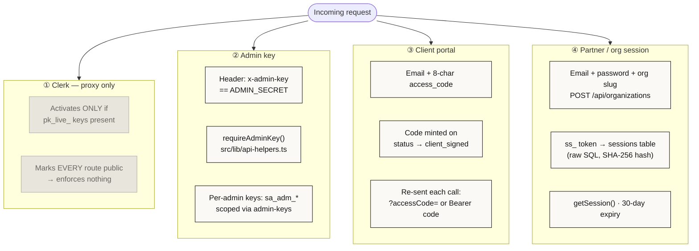
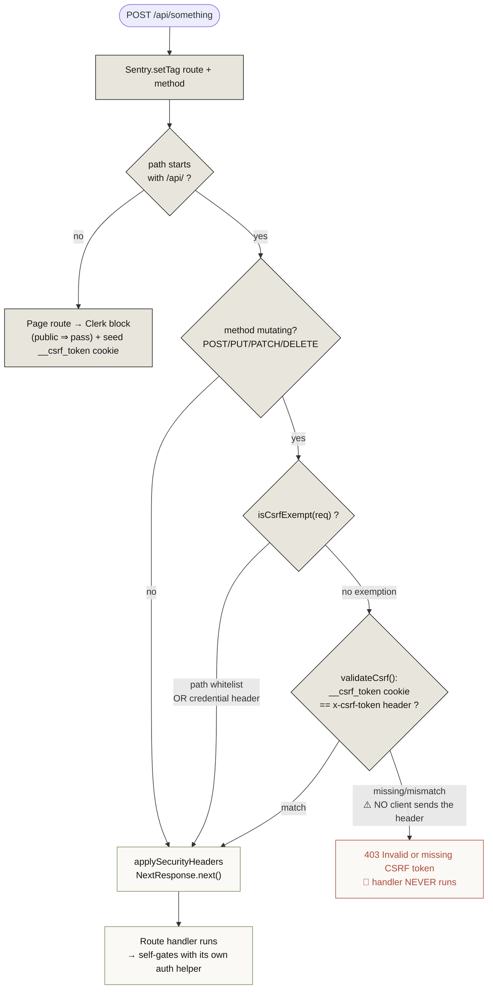
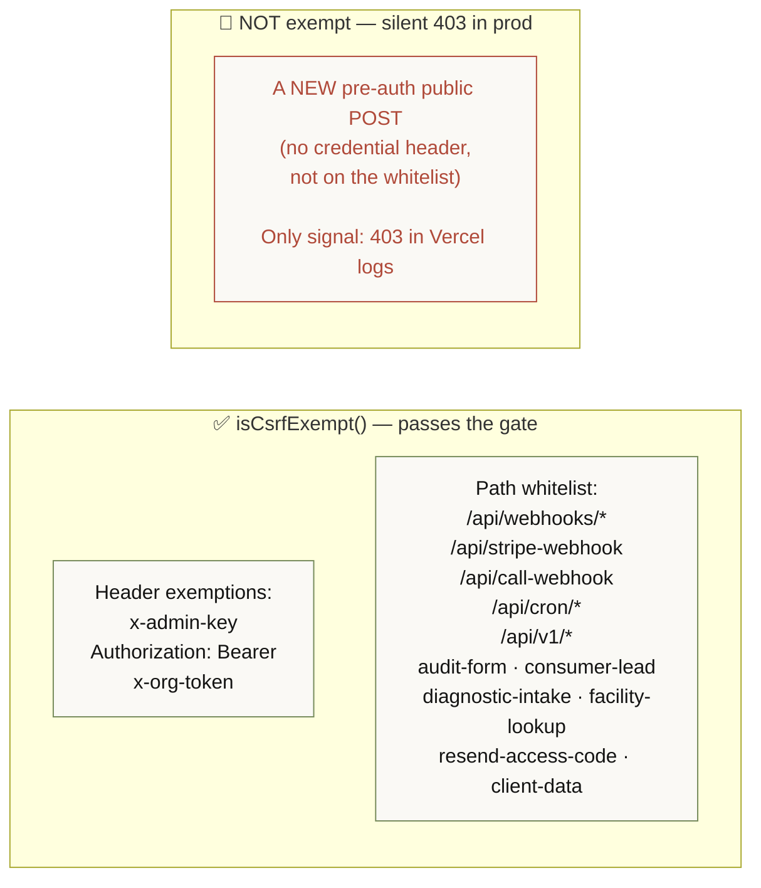
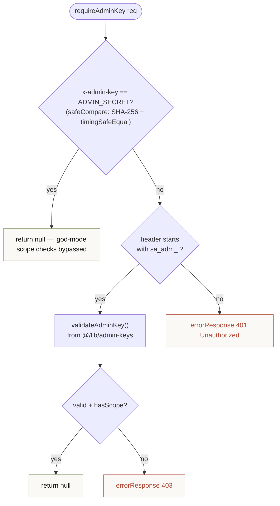
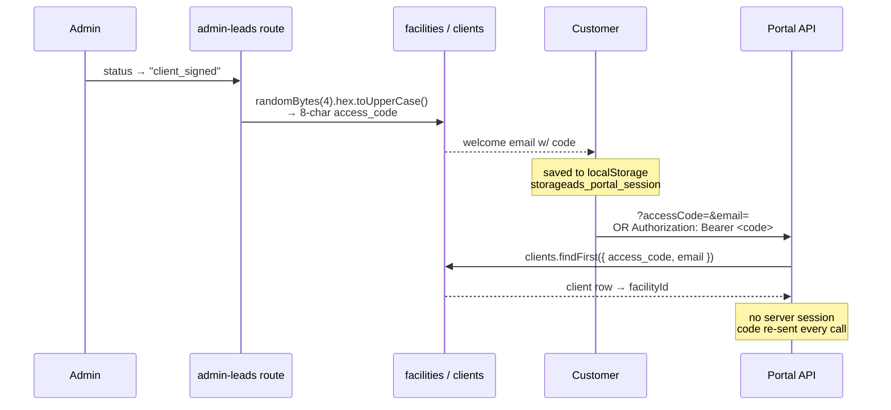
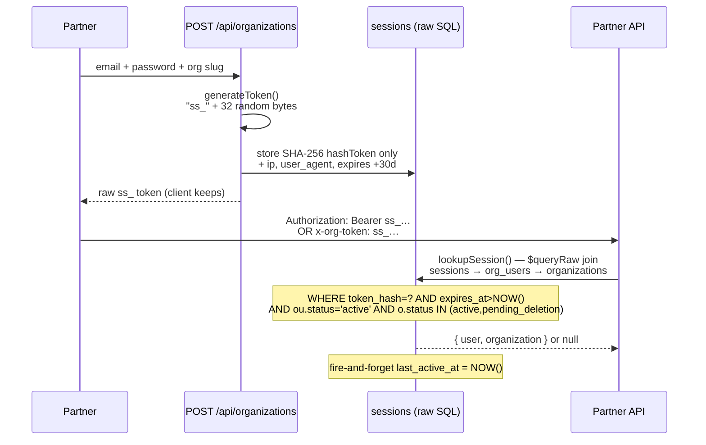
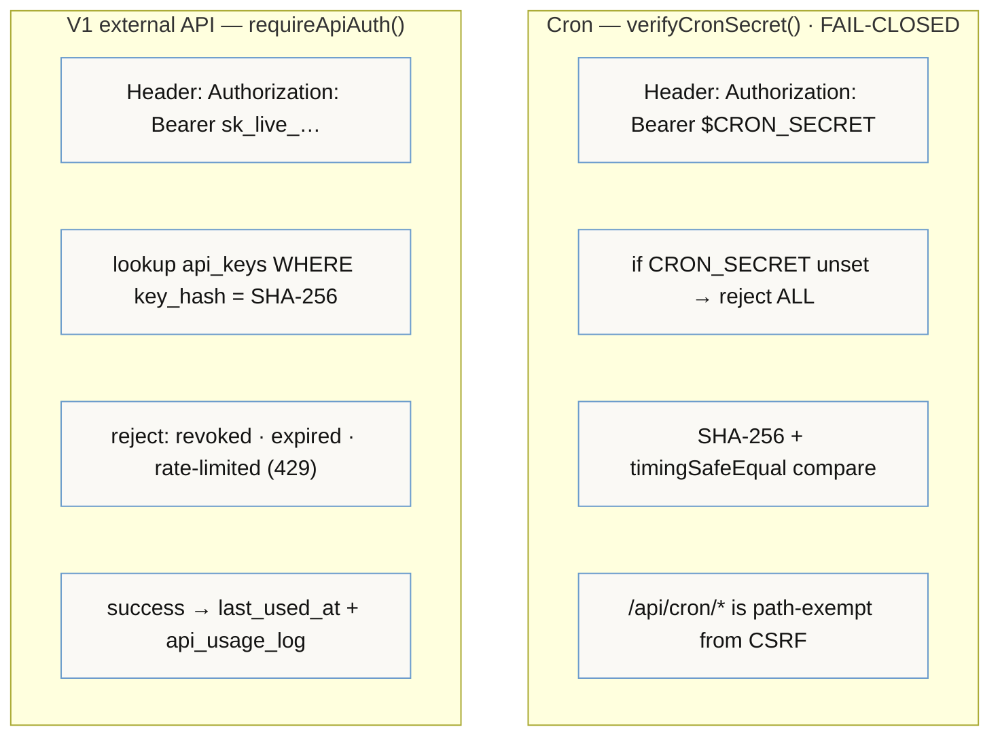

# 01 · Authentication & Request Lifecycle

> **The headline:** Clerk (the proxy) enforces nothing. Four independent systems each gate themselves. A CSRF gate at the edge will **silently 403 any new mutating public route** before your handler ever runs. This is the system that bites hardest in production.

---

## 1. The four auth systems at a glance

| System | Credential | Where checked | Helper | Storage |
|--------|-----------|---------------|--------|---------|
| **Clerk** | session cookie | `src/proxy.ts` (pages only) | `clerkMiddleware` | — (effectively pass-through) |
| **Admin key** | `x-admin-key` header == `ADMIN_SECRET` | per route handler | `requireAdminKey()` | env var; per-admin keys in `admin_keys` |
| **Client portal** | email + `access_code` (8 hex chars) | per route handler | `authenticatePortalRequest()` | `localStorage` key `storageads_portal_session` |
| **Partner/org** | `ss_`-prefixed bearer token | per route handler | `getSession()` | `sessions` table (hash only) |
| *(Cron)* | `Authorization: Bearer $CRON_SECRET` | per cron handler | `verifyCronSecret()` | env var (fail-closed) |
| *(V1 API)* | `Authorization: Bearer sk_live_…` | per V1 route | `requireApiAuth()` | `api_keys` table (hash only) |

**Why four?** They guard four different audiences: Blake/Angelo (admin), signed customers (portal), resellers & referral partners (partner), and external API consumers (V1). Clerk is wired but deliberately inert: API routes short-circuit before Clerk runs, and for page routes the finite `isPublicRoute()` matcher lists the app's known routes (marketing, `/portal`, `/partner`, `/admin`, `/api`) as public — so in practice `auth.protect()` guards nothing. (Strictly, a *page* route not in that finite list would be protected when `pk_live_` keys are set; the app doesn't rely on that.)

---

## 2. The request lifecycle (and the CSRF footgun)

Every request hits `src/proxy.ts` at the edge first. For `/api/*` this is the gauntlet:

### The footgun, stated plainly

The CSRF gate is a **double-submit check**: it needs a `__csrf_token` cookie *and* a matching `x-csrf-token` header. **No client in this app sends `x-csrf-token`.** So mutating `/api/*` requests only survive via `isCsrfExempt()`, which exempts:

- **By credential header** — any request carrying `x-admin-key`, `Authorization: Bearer …`, or `x-org-token`. This is how *every authenticated* admin/portal/partner call rides through: their credential header is itself the exemption.
- **By path whitelist** — webhooks, cron, V1, and the named pre-auth public POSTs.

> **Rule when adding a public POST route:** if it runs *before* any of the three credential headers exist (e.g. a login, a lead-capture form), you **must** add its exact path to `isCsrfExempt()` in `src/proxy.ts`. Otherwise it 403s in prod with no handler log. This is the documented cause of the `/portal` login break, and why `resend-access-code` and `client-data` are explicitly whitelisted.

---

## 3. Each system in detail

### ② Admin key — `requireAdminKey(req)` returns `NextResponse | null`

`null` means authorized; a non-null response is the 401/403 to return.

There's also `requireAdminAuth()` — dual auth that accepts the admin key **or** a Clerk session whose `role` is `admin`/`virtual_assistant`. The shared `ADMIN_SECRET` is god-mode (Blake + Angelo); the `sa_adm_*` per-admin keys carry scopes.

### ③ Client portal — the access code *is* the credential

Three coexisting validation patterns (all read the same `clients.access_code`): query params (`authenticatePortalRequest`), `Authorization: Bearer <code>`, and POST body `{ email, accessCode }` (the pre-auth, CSRF-exempt path).

### ④ Partner / org session — the only server-side session

This is the **only** raw-SQL island in the codebase (`src/lib/session-auth.ts`) — everything else uses Prisma client methods. Only the token *hash* is stored; the raw token lives only on the client.

---

## 4. Cron & V1 — the machine-to-machine auth

**Fail-closed matters:** if `CRON_SECRET` is missing, *no* cron can run — better than every cron being world-callable. V1 keys are revocable, expirable, scoped, and rate-limited per key.

---

## 5. What the proxy also does (besides CSRF)

`src/proxy.ts` is more than the CSRF gate — it's the single edge chokepoint:

1. **Sentry route tagging** — `route` + `method` on every request (first thing it does).
2. **CSRF gate** — section 2 above.
3. **API short-circuit** — `/api/*` skips Clerk entirely ("they handle their own auth") and returns with security headers.
4. **Clerk** — runs for *page* routes only, and only with `pk_live_` keys; `pk_test_` is skipped to avoid `dev-browser-missing` errors on Vercel.
5. **CSRF cookie seeding** — non-API page responses get a `__csrf_token` cookie if missing.
6. **Security headers** on every response — note **CSP is report-only** (`Content-Security-Policy-Report-Only`), plus `X-Content-Type-Options: nosniff`, `X-Frame-Options: DENY`, `Referrer-Policy`, `Permissions-Policy`.

---

## Key files

| Concern | File |
|---------|------|
| Edge gate / CSRF / Clerk / Sentry | `src/proxy.ts` |
| CSRF mechanics | `src/lib/csrf.ts` |
| Admin key + helpers | `src/lib/api-helpers.ts` (`requireAdminKey`, `requireAdminAuth`, `safeCompare`) |
| Partner sessions (raw SQL) | `src/lib/session-auth.ts` |
| Portal auth | `src/lib/portal-auth.ts`, `src/lib/portal-helpers.tsx` |
| Cron auth (fail-closed) | `src/lib/cron-auth.ts` |
| V1 API auth | `src/lib/v1-auth.ts` |
| Access-code minting | `src/app/api/admin-leads/route.ts` (lines ~234-257) |
