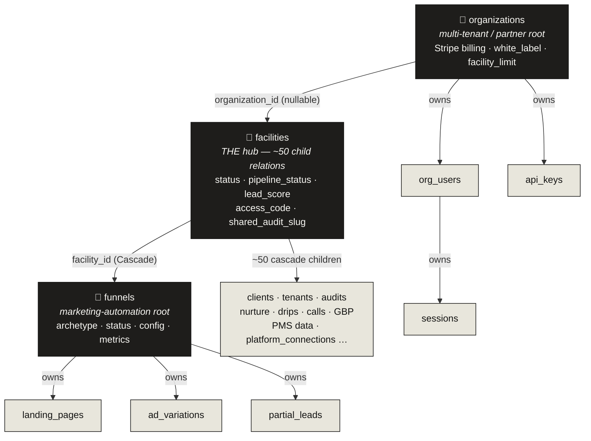
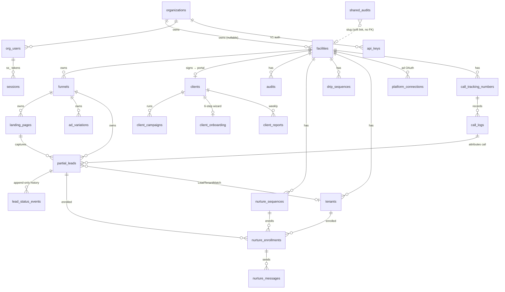
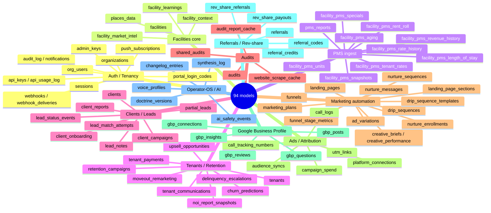
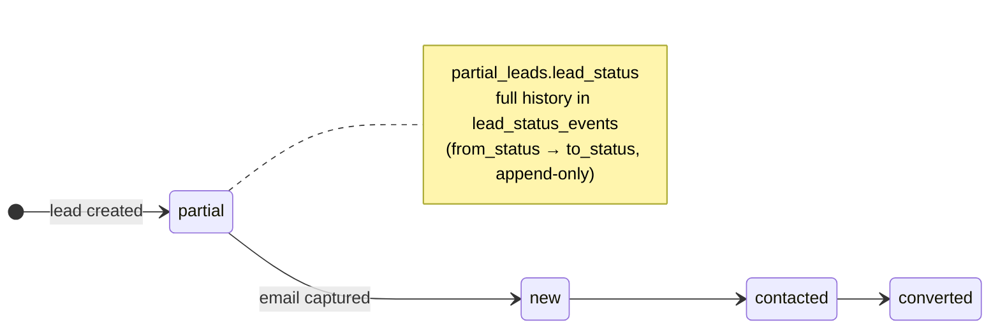
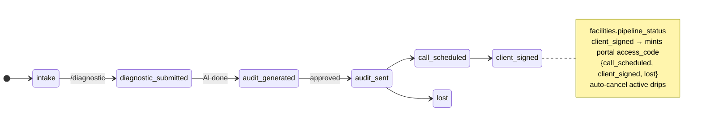

# 02 · Data Model

> **The headline:** 94 Prisma models, all UUID-keyed. `facilities` is the gravitational center — ~50 tables cascade-delete off it. There are **no native Prisma enums**; every state machine is a `String` field with a `@default()` and an inline comment listing allowed values.

Source: `prisma/schema.prisma` (~1960 lines). Singleton client at `src/lib/db.ts`.

---

## 1. The three hub models

Everything orbits three tables. If you understand these and their cascade topology, you understand the schema's shape.

**Cascade topology you must respect (prod has no staging — see [project safety notes]):**
- Deleting a **facility** cascades through ~50 tables.
- Deleting an **organization** cascades to `org_users → sessions`, `api_keys → api_usage_log`, etc.
- Soft-delete (`deleted_at` / `deleted_by`) exists on `facilities`, `organizations`, `clients`, `tenants`, `partial_leads` — prefer it over hard delete.

---

## 2. The core ER diagram (sales + automation spine)

This is the connective tissue from a stranger → a paying client, and the automation that surrounds it.

> **Note the dotted/soft links** (no FK constraint — render mentally as dotted):
> - `facilities.shared_audit_slug` → `shared_audits.slug`
> - `drip_sequences.lead_id` → `partial_leads.id`
> - `lead_status_events.source_ref_id` → polymorphic into `call_logs` / `tenants`
> - Named relations: `"LeadTenantMatch"` (partial_leads ↔ tenants), and two `moveout_remarketing` relations to `tenants` (`tenant_id` = moved-out, `new_tenant_id` = re-rented).

---

## 3. The 94 models by domain

---

## 4. State machines (encoded as `String @default`, not enums)

Because there are no Prisma enums, these lifecycles live as string fields. Draw them as the real state machines they are:

Other important status fields (all `String` defaults):

| Model.field | Default | Allowed values |
|-------------|---------|----------------|
| `funnels.status` | `draft` | draft · testing · live · paused · archived |
| `funnel_stage_metrics.stage` | — | impression · click · page_view · form_start · form_submit · conversion · drip_sent · drip_opened · move_in |
| `organizations.subscription_status` | `incomplete` | Stripe statuses |
| `org_users.status` / `.role` | `invited` / `viewer` | invited→active · viewer/admin |
| `nurture_enrollments.status` | `active` | active · paused · completed · unsubscribed |
| `nurture_messages.status` | `pending` | pending · sent · failed |
| `drip_sequences.status` | `active` | active · cancelled · completed |
| `platform_connections.status` | `disconnected` | disconnected · connected · error |
| `synthesis_log.status` | `pending` | pending · completed · failed · skipped |
| `upsell_opportunities.status` | `identified` | identified · … |

---

## 5. Reading guide

- **One Prisma client**, singleton at `src/lib/db.ts`. Use client methods everywhere.
- **Raw SQL is intentional and contained** to `src/lib/session-auth.ts` (the `sessions` table) and a few nurture/V1 lookups. The `sessions` table here is the *partner/org* session — distinct from Clerk and from the client-portal access-code flow.
- **The `funnel_stage_metrics.stage` list is the funnel telemetry vocabulary** — impression → click → page_view → form_start → form_submit → conversion → drip_sent → drip_opened → move_in. That's the canonical journey the analytics measure.
- When changing the schema, go through the `schema-guardian` agent — prod has no staging and no dev DB copy, so `db push` hits production.
