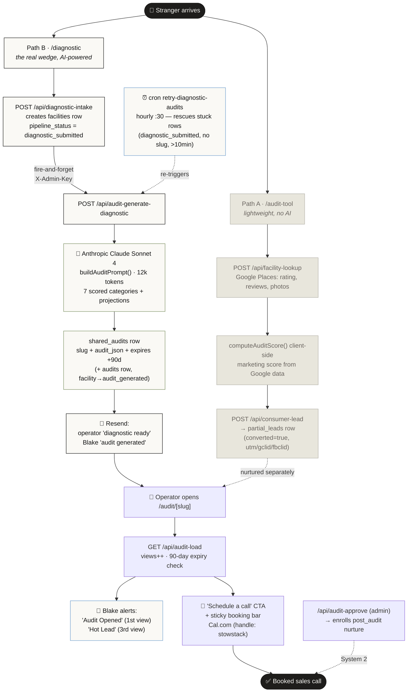
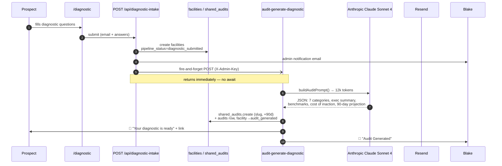
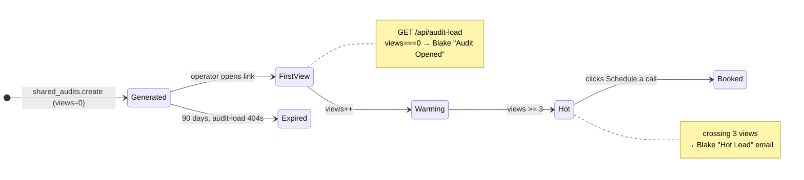

# 03 · Audit Funnel (Top-of-Funnel)

> **The headline:** This is the primary lead wedge — how a stranger becomes a booked sales call. There are **two distinct entry paths** that share one destination (`/audit/[slug]`). The deep AI diagnostic does **not** come from `/audit-tool` (a lightweight Google scorer) — it comes from `/diagnostic`. Opening the report triggers escalating hot-lead alerts to Blake.

---

## 1. The whole funnel on one canvas



---

## 2. Path A vs Path B — don't confuse them

| | **Path A — `/audit-tool`** | **Path B — `/diagnostic`** |
|---|---|---|
| Intent | Quick self-serve hook | The real diagnostic wedge |
| Input | Facility name + location | Multi-question form (occupancy, marketing, digital, revenue, ops, competition) |
| Scoring | `computeAuditScore()` **client-side**, from Google Places | **Anthropic Claude Sonnet 4**, `max_tokens: 12000` |
| AI? | ❌ No | ✅ Yes |
| Produces | `partial_leads` row | `facilities` + `shared_audits` (+ `audits`) |
| Lead capture | `POST /api/consumer-lead` | `POST /api/diagnostic-intake` |
| Files | `audit-tool/audit-client.tsx` | `diagnostic/diagnostic-form.tsx` |

Both can end at `/audit/[slug]`, but only Path B generates the shareable AI report. Path A's `partial_leads` row is nurtured/recovered separately (see [04 · Nurture](04-nurture-lifecycle.md)).

---

## 3. Path B in sequence (the AI diagnostic)



> **Why the fire-and-forget + retry cron?** `diagnostic-intake` doesn't `await` the AI generation (it'd block the form response for 10-30s). If that detached call fails, the row sits at `diagnostic_submitted` with no slug. The hourly `retry-diagnostic-audits` cron sweeps those up (>10 min old, max 5/run) — a reliability net for a deliberately unreliable pattern.

---

## 4. The hot-lead engagement loop

The clever bit: the static `/audit/[slug]` page is itself a lead-scoring instrument. Every open increments `views` and can fire an alert.



`/audit/[slug]` is a React Server Component (`loadAudit(slug)` wrapped in React `cache`). It special-cases `SAMPLE_AUDIT_SLUG` (static fixture, no DB), renders the diagnostic format (`audit.categories`) or falls back to `LegacyAuditPage`, and handles expired/not-found states. The sticky bottom bar reads *"You're leaving $X/mo on the table"* and routes to `CAL_BOOKING_URL` from `src/lib/booking.ts`.

---

## 5. `shared_audits` — the stateless share token

```
shared_audits
├── slug          unique varchar(60)   ← the public share token
├── facility_name
├── audit_json    Json                  ← the entire rendered report
├── views         int default 0         ← drives hot-lead alerts
├── expires_at    +90 days              ← audit-load 404s after
└── created_at
```

No FK to `facilities` — the slug *is* the link. `facilities.shared_audit_slug` points back as a soft string reference. Persists 90 days, then the report goes dark.

---

## 6. The bridge to nurture: `/api/audit-approve`

`audit-approve` (admin-key gated, from the facility manager) is the seam between **System 1 (this doc)** and **System 2 (nurture)**. It:

1. Takes an existing `audits` row + `facilityId`.
2. Creates a `shared_audits` slug, emails the lead (with `utm_campaign=audit_results` + Cal link).
3. Sets facility `pipeline_status = audit_sent`, logs `activity_log` (`audit_approved`).
4. **Enrolls the lead into the `post_audit` nurture sequence** — or falls back to a `post_audit` drip if there's no email or the nurture insert throws.

→ Continue at **[04 · Nurture & Drip Lifecycle](04-nurture-lifecycle.md)**.

---

## Key files

| Step | File / Route |
|------|--------------|
| Path A page | `src/app/audit-tool/page.tsx` → `audit-client.tsx` |
| Path A lead | `POST /api/consumer-lead` → `partial_leads` |
| Path B page | `src/app/diagnostic/page.tsx` → `diagnostic-form.tsx` |
| Path B intake | `src/app/api/diagnostic-intake/route.ts` |
| AI generation | `src/app/api/audit-generate-diagnostic/route.ts` |
| Report view | `src/app/audit/[slug]/page.tsx` |
| Load + alerts | `src/app/api/audit-load/route.ts` |
| Retry net | `src/app/api/cron/retry-diagnostic-audits/route.ts` |
| Approve → nurture | `src/app/api/audit-approve/route.ts` |
| Booking URL | `src/lib/booking.ts` (Cal handle `stowstack`) |
| Sample fixture | `src/lib/sample-audit.ts` |
