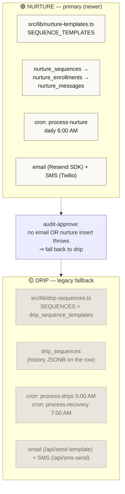
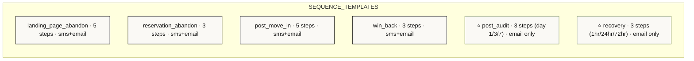
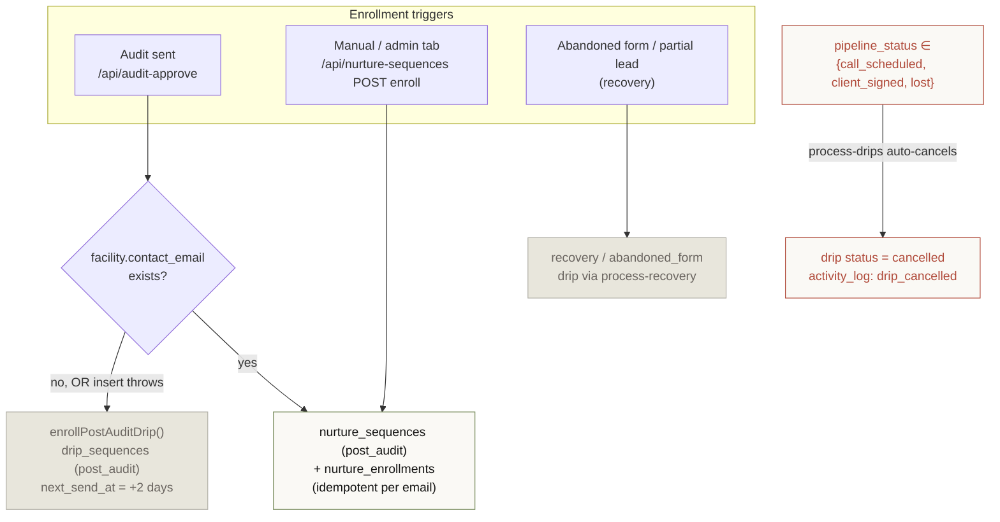
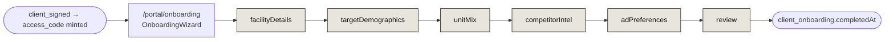

# 04 · Nurture & Drip Lifecycle

> **The headline:** Two parallel automation engines coexist *by design*. **Nurture** (newer, primary) drives email + SMS off the `nurture_*` tables. **Drip** (legacy) is the fallback safety net. Both are advanced by daily crons. Templates live in a shared lib so both the API and the audit-approve handoff can import them.

---

## 1. Two engines, one purpose



| | **Nurture** (primary) | **Drip** (legacy fallback) |
|---|---|---|
| Templates | `src/lib/nurture-templates.ts` (`SEQUENCE_TEMPLATES`) | `src/lib/drip-sequences.ts` (`SEQUENCES`) |
| DB models | `nurture_sequences → nurture_enrollments → nurture_messages` | `drip_sequences` (+ `drip_sequence_templates`) |
| Message log | one `nurture_messages` row per send | appended to `history` JSONB on the row |
| Channels | email + SMS | email + SMS |
| Cron(s) | `process-nurture` (6 AM) | `process-drips` (5 AM), `process-recovery` (7 AM) |
| Data access | raw SQL throughout | Prisma + raw SQL mix |

---

## 2. The shared template library

`src/lib/nurture-templates.ts` is the single source of truth — deliberately in `lib/` (not a route) so both `nurture-sequences` and `audit-approve` import it.



Each step carries `step_number`, `delay_minutes` (**incremental** — `process-nurture` schedules `next_send_at = now + delay` *after* the prior send, so cumulative diffs preserve the 1/3/7-day cadence), `channel`, `subject`, `body` (with `{merge_tags}`), and an optional `send_window`. `post_audit` and `recovery` were ported from the legacy drip `SEQUENCES`.

---

## 3. Enrollment triggers — what puts a lead into a sequence



Four ways in:
1. **Post-audit (the main handoff)** — `audit-approve` enrolls into `post_audit` nurture; drip is the catch-all safety net.
2. **Manual** — admin facility nurture tab → `nurture-sequences` route (`create_from_template`, `create_sequence`, `enroll`; `PATCH` for pause/resume/skip/convert/unsubscribe).
3. **Abandoned-form recovery** — `process-recovery` cron drives the `recovery` sequence for partial leads.
4. **Auto-cancellation** — when a facility's `pipeline_status` becomes `call_scheduled`, `client_signed`, or `lost`, `process-drips` cancels the active drip. **This is how booking a call / signing stops the emails.**

---

## 4. How `process-nurture` sends (the primary engine)

```mermaid
sequenceDiagram
    autonumber
    participant Cron as cron: process-nurture (6 AM)
    participant DB as nurture_enrollments + sequences
    participant Fac as facilities
    participant Send as Resend / Twilio
    participant Log as nurture_messages

    Cron->>DB: SELECT up to 50 due<br/>(both status='active' AND next_send_at <= NOW())
    loop each enrollment (45s budget)
        DB->>Cron: current step
        alt SMS outside send_window
            Cron->>Cron: skip this run
        else
            Cron->>Fac: load facility → build mergeData<br/>(first_name, facility_name, reserve_link, …)
            Cron->>Cron: resolveMergeTags() fills {tags}
            alt channel = SMS
                Cron->>Send: Twilio REST (+ "Reply STOP")
            else channel = email
                Cron->>Send: Resend SDK<br/>from notifications@storageads.com
            end
            Cron->>Log: nurture_messages (sent/failed, external_id)
            Cron->>DB: advanceStep() — next_send_at = now + nextStep.delay<br/>OR mark completed (all in a $transaction)
        end
    end
    Note over Cron: remainder picked up next run;<br/>fatal failure → emails Blake
```

> **Why advance-step inside a transaction?** The message-send and the step advance commit together. Drip does the inverse — it **advances *before* sending** specifically to avoid double-sends on a retry. Two different safety strategies for the same hazard (duplicate messages).

---

## 5. The daily cron cascade

The lifecycle crons run back-to-back each morning so a lead flows through recovery → nurture → drips → alerts in one window:

```mermaid
gantt
    title Daily lifecycle cron cascade (server time)
    dateFormat HH:mm
    axisFormat %H:%M
    section Messaging
    process-drips legacy        :05:00, 30m
    process-nurture primary     :06:00, 30m
    process-recovery winback    :07:00, 30m
    check-campaign-alerts       :08:00, 30m
    section Hourly
    retry-diagnostic-audits     :crit, 00:30, 20m
```



All gated by `verifyCronSecret()` (`src/lib/cron-auth.ts`, fail-closed). Full cron inventory in [05 · Background Jobs](05-background-jobs.md).

---

## 6. Portal onboarding — a *separate* lifecycle (post-signup)

Don't confuse this with marketing nurture. The onboarding wizard runs for **signed clients** (portal session: email + access code), not prospects.



Persists via `GET/POST /api/client-onboarding?code=&email=` (a `steps` JSON + `completedAt`). Six steps: `facilityDetails → targetDemographics → unitMix → competitorIntel → adPreferences → review`.

---

## Key files

| Concern | File |
|---------|------|
| Shared templates | `src/lib/nurture-templates.ts` (`SEQUENCE_TEMPLATES`) |
| Legacy drip templates | `src/lib/drip-sequences.ts` (`SEQUENCES`) |
| Nurture API (admin) | `src/app/api/nurture-sequences/route.ts` |
| Audit → nurture handoff | `src/app/api/audit-approve/route.ts` (`enrollPostAuditDrip`) |
| Nurture cron | `src/app/api/cron/process-nurture/route.ts` |
| Drip cron | `src/app/api/cron/process-drips/route.ts` |
| Recovery cron | `src/app/api/cron/process-recovery/route.ts` |
| Onboarding wizard | `src/app/portal/onboarding/page.tsx`, `src/app/api/client-onboarding/route.ts` |
| Models | `nurture_sequences`, `nurture_enrollments`, `nurture_messages`, `drip_sequences`, `drip_sequence_templates` in `prisma/schema.prisma` |
