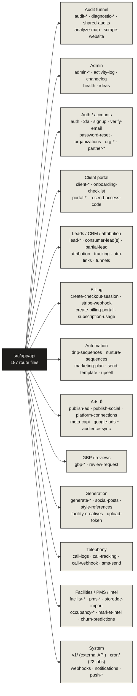

# 05 · Background Jobs (cron) & Integrations

> **The headline:** 22 Vercel crons (region `iad1`) on a daily clock, all gated by a fail-closed `CRON_SECRET`. 13 external services. The 187-route API surface is large but groups cleanly by concern.

---

## 1. The 24-hour cron clock

```mermaid
gantt
    title 22 Vercel crons across a day (server time)
    dateFormat HH:mm
    axisFormat %H:%M

    section Maintenance (night)
    cleanup-sessions            :03:00, 20m
    cleanup-organizations       :03:30, 20m
    data-retention              :04:00, 20m
    process-gbp                 :04:00, 20m

    section Lifecycle messaging (morning)
    process-drips               :05:00, 20m
    process-nurture             :06:00, 20m
    process-recovery            :07:00, 20m
    check-campaign-alerts       :08:00, 20m
    review-solicitation         :10:00, 20m

    section Analytics / scoring
    aggregate-page-stats        :02:00, 20m
    process-synthesis-queue     :12:00, 20m

    section Hourly
    retry-diagnostic-audits     :crit, 00:30, 15m
    process-pms-uploads         :crit, 00:00, 15m
```

> Weekly + monthly crons don't fit a 24h chart — they're in the tables below. Two crons deliberately share the **4:00 AM** slot (`process-gbp`, `data-retention`).

### Daily crons

| Path | Cron | When | Does |
|------|------|------|------|
| `cleanup-sessions` | `0 3 * * *` | 3:00 AM | Delete expired `sessions` rows |
| `cleanup-organizations` | `30 3 * * *` | 3:30 AM | Purge orgs past deletion date, cancel Stripe sub |
| `data-retention` | `0 4 * * *` | 4:00 AM | `RETENTION_POLICIES` — batched `$executeRaw` deletes of aged rows |
| `process-gbp` | `0 4 * * *` | 4:00 AM | Process Google Business Profile queue (posts/reviews/Q&A) |
| `process-drips` | `0 5 * * *` | 5:00 AM | Send due drip steps (legacy engine) |
| `process-nurture` | `0 6 * * *` | 6:00 AM | Advance nurture sequences (primary engine) |
| `process-recovery` | `0 7 * * *` | 7:00 AM | Win-back / recovery sends |
| `check-campaign-alerts` | `0 8 * * *` | 8:00 AM | Threshold alerts → Resend |
| `review-solicitation` | `0 10 * * *` | 10:00 AM | Email tenants requesting Google reviews |
| `aggregate-page-stats` | `0 2 * * *` | 2:00 AM | Roll up landing-page interaction stats |
| `process-synthesis-queue` | `0 12 * * *` | 12:00 PM | Run up to 3 pending `synthesis_log` AI syntheses |

### Hourly crons

| Path | Cron | Does |
|------|------|------|
| `process-pms-uploads` | `0 * * * *` | Classify uploaded PMS CSVs → `facility_pms_rent_roll`/`aging` |
| `retry-diagnostic-audits` | `30 * * * *` | Rescue facilities stuck at `diagnostic_submitted` (>10 min, no slug) |

### Weekly / monthly crons

| Path | Cron | When | Does |
|------|------|------|------|
| `send-client-reports` | `0 9 * * 1` | Mon 9 AM | Per-client report, AI narrative (Anthropic), email (Resend) |
| `weekly-digest` | `0 9 * * 5` | Fri 9 AM | Internal digest (spend, calls, leads, clients) |
| `weekly-synthesis` | `0 10 * * 0` | Sun 10 AM | Queue weekly AI synthesis per account |
| `generate-noi-reports` | `0 12 * * 5` | Fri 12 PM | `generateWeeklyNOISnapshots()` |
| `score-churn-risk` | `0 11 * * 1` | Mon 11 AM | `scoreActiveTenants()` |
| `update-retention-outcomes` | `30 11 * * 1` | Mon 11:30 | Realized retention vs prediction |
| `score-ecri-sensitivity` | `0 11 * * 2` | Tue 11 AM | ECRI rent-increase sensitivity scoring |
| `sync-audiences` | `0 1 * * 0` | Sun 1 AM | Refresh ad-platform custom audiences |
| `photo-refresh-prompts` | `0 13 1 * *` | 1st of month, 1 PM | Prompt owners to refresh GBP photos |

**Shared plumbing:** all 22 cron handlers call `verifyCronSecret()` **directly inline** (fail-closed; see `src/lib/cron-auth.ts`), and many also call `notifyCronFailure()` on error. Note: `src/lib/cron-runner.ts` exports a `createCronHandler` wrapper (verifyCronSecret + Sentry tagging + structured logging + failure notification), but it is **not currently wired into any handler** — it's defined and unused. Most crons send email by direct `fetch` to `https://api.resend.com/emails` rather than the SDK.

---

## 2. External integrations map

```mermaid
graph TB
    APP["StorageAds<br/>Next.js 16 on Vercel"]

    subgraph AI["AI / generation"]
        ANT["Anthropic Claude<br/>ANTHROPIC_API_KEY<br/>audits · copy · synthesis"]
        FAL["FAL.ai / Runway<br/>FAL_KEY / RUNWAY_API_KEY<br/>🔒 Angelo"]
    end
    subgraph Comms["Messaging"]
        RES["Resend<br/>RESEND_API_KEY<br/>all email · storageads.com"]
        TWI["Twilio<br/>TWILIO_*<br/>SMS + call tracking"]
    end
    subgraph Money["Billing"]
        STR["Stripe<br/>STRIPE_SECRET_KEY<br/>checkout · webhooks"]
    end
    subgraph Data["Data / infra"]
        UP["Upstash Redis<br/>KV_REST_API_URL<br/>rate limit · cache"]
        GP["Google Places<br/>GOOGLE_PLACES_API_KEY<br/>facility lookup"]
        BLOB["Vercel Blob<br/>BLOB_READ_WRITE_TOKEN<br/>asset uploads"]
        SEN["Sentry<br/>NEXT_PUBLIC_SENTRY_DSN<br/>errors + route tags"]
    end
    subgraph Ads["Ad platforms 🔒 Angelo"]
        META["Meta / CAPI · META_*"]
        GADS["Google Ads · GOOGLE_ADS_*"]
        TT["TikTok · TIKTOK_*"]
    end
    CAL["Cal.com<br/>NEXT_PUBLIC_CALCOM_LINK<br/>booking (handle: stowstack)"]

    APP --> ANT & FAL & RES & TWI & STR & UP & GP & BLOB & SEN & META & GADS & TT & CAL

    classDef core fill:#1e1d1b,stroke:#141413,color:#faf9f5
    classDef svc fill:#faf9f5,stroke:#141413,color:#141413
    classDef angelo fill:#e8e6dc,stroke:#b0aea5,color:#6a6560
    class APP core
    class ANT,RES,TWI,STR,UP,GP,BLOB,SEN,CAL svc
    class FAL,META,GADS,TT angelo
```

| Service | Env var(s) | Used for | Wrapper |
|---------|-----------|----------|---------|
| **Anthropic** | `ANTHROPIC_API_KEY` | Audits, copy, plans, GBP responses, synthesis, compliance | `src/lib/synthesis.ts`, `compliance.ts`, `voice/generate.ts`; many routes call directly — *no single client* |
| **Resend** | `RESEND_API_KEY` | All transactional email | `src/lib/verification-email.ts` (SDK); most code `fetch`es `api.resend.com/emails` |
| **Stripe** | `STRIPE_SECRET_KEY` | Billing, checkout, webhooks | `src/lib/stripe.ts` (central) |
| **Twilio** | `TWILIO_ACCOUNT_SID/_AUTH_TOKEN/_FROM_NUMBER` | SMS + call tracking | `sms-send`, `call-tracking`, `call-webhook` routes — no central lib |
| **FAL.ai / Runway** 🔒 | `FAL_KEY` / `RUNWAY_API_KEY` | AI image + video | `generate-image`, `generate-video` routes |
| **Upstash Redis** | `KV_REST_API_URL` (+ token) | Rate limiting, caching | `src/lib/rate-limit.ts`, `with-rate-limit.ts` |
| **Google Places** | `GOOGLE_PLACES_API_KEY` | Facility lookup, audit data | `facility-lookup`, `places-photo` routes |
| **Sentry** | `NEXT_PUBLIC_SENTRY_DSN` | Errors + route/cron tagging | `sentry.*.config.ts`, tags in `proxy.ts` + `cron-runner.ts` |
| **Vercel Blob** | `BLOB_READ_WRITE_TOKEN` | Asset/avatar uploads (5 routes) | `upload-token`, `portal-upload`, `partner/avatar`, … |
| **Cal.com** | `NEXT_PUBLIC_CALCOM_LINK` | Booking embed | `src/lib/booking.ts` (never hardcode; handle `stowstack`) |
| **Meta / Google / TikTok Ads** 🔒 | `META_*` / `GOOGLE_ADS_*` / `TIKTOK_*` | Conversions, audiences, publishing | `meta-capi.ts`, `publish-ad`, `platform-connections` |

🔒 = Angelo's domain — do not modify without coordination. `src/lib/env-check.ts` validates the full set.

---

## 3. The API surface — 187 routes, grouped

`find src/app/api -name route.ts | wc -l` → **187** files across 151 top-level directories.

---

## Key files

| Concern | File |
|---------|------|
| Cron schedules | `vercel.json` |
| Cron auth (called inline) | `src/lib/cron-auth.ts` (`verifyCronSecret`, `notifyCronFailure`) |
| Cron wrapper (defined, unused) | `src/lib/cron-runner.ts` (`createCronHandler`) |
| Cron auth (fail-closed) | `src/lib/cron-auth.ts` |
| Env validation | `src/lib/env-check.ts` |
| Stripe client | `src/lib/stripe.ts` |
| Rate limiting | `src/lib/rate-limit.ts`, `src/lib/with-rate-limit.ts` |
| Booking URL | `src/lib/booking.ts` |
