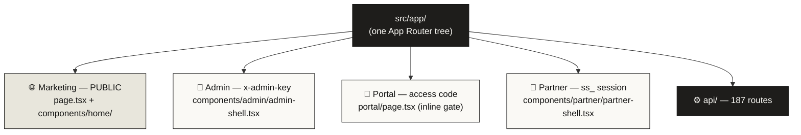
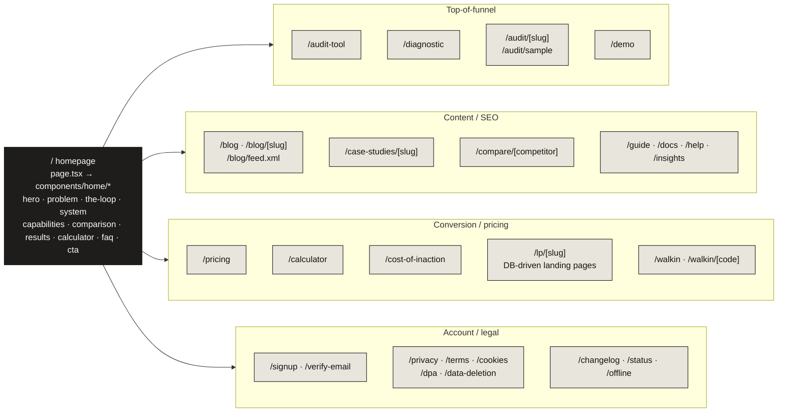
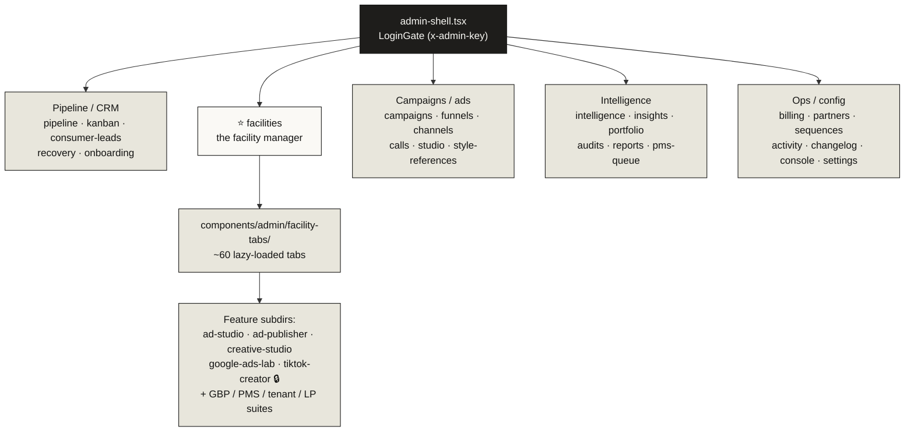
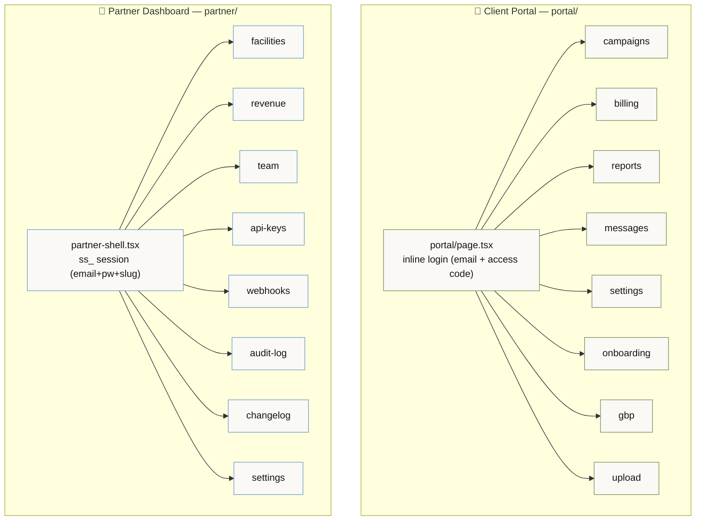
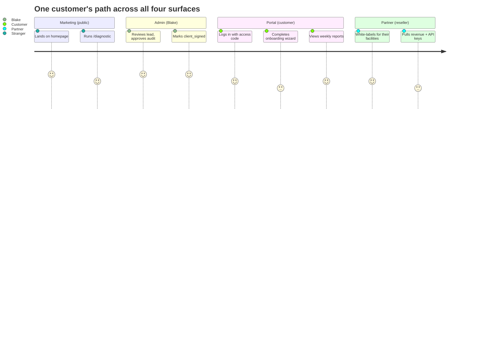

# 06 · Frontend Information Architecture

> **The headline:** Four app surfaces under one `src/app/` tree — Marketing, Admin, Portal, Partner. Each gates *itself* (admin key / portal access code / partner session / public). Clerk marks everything public, so **the auth boundaries, not the URL nesting, are the real dividers.** Note: the live homepage chapters live in `src/components/home/`, not `src/components/marketing/`.

---

## 1. The four surfaces

| Surface | Wrapper / gate | Auth | Audience |
|---------|----------------|------|----------|
| **Marketing** | none (public) | — | Strangers, prospects |
| **Admin** | `admin-shell.tsx` `LoginGate` | `x-admin-key` → localStorage | Blake, Angelo, VAs |
| **Portal** | inline gate in `portal/page.tsx` | email + access code → localStorage | Signed customers |
| **Partner** | `partner-shell.tsx` | `ss_` session token | Resellers, referral partners |

---

## 2. Marketing site map

> **Component gotcha:** the live homepage lazy-loads chapters from **`src/components/home/`** (`hero`, `problem`, `letterboard`, `the-loop`, `system`, `capabilities`, `comparison`, `results`, `numbers-strip`, `demand-triggers`, `calculator`, `faq`, `cta`, `footer`). `src/components/marketing/` is a second/legacy set, only partially still referenced (`sources-note`, `sticky-mobile-cta`). When editing homepage copy, edit `home/`, not `marketing/`.

---

## 3. Admin dashboard

**Route segments under `src/app/admin/`:** `activity`, `audits`, `billing`, `calls`, `campaigns`, `changelog`, `channels`, `console`, `consumer-leads`, `facilities`, `funnels`, `insights`, `intelligence`, `kanban`, `onboarding`, `partners`, `pipeline`, `pms-queue`, `portfolio`, `recovery`, `reports`, `sequences`, `settings`, `studio`, `style-references`.

> **🔧 Active IA redesign:** moving to *one* task-first sidebar + global facility switcher + ⌘K palette, replacing the two competing menus. Already scaffolded in `src/components/admin/`: `facility-switcher.tsx`, `facility-badge.tsx`, `command-palette.tsx`, `facility-tool-page.tsx`. **Hard rule:** relocate/re-route freely, but never modify the tool pages themselves or Angelo's ad-platform / video-image-gen internals (`ad-studio`, `ad-publisher`, `creative-studio`, `google-ads-lab`, `tiktok-creator`). Plan: `docs/admin-ia-redesign-plan.md`.

---

## 4. Portal & Partner

- **Portal** sub-pages: `campaigns`, `billing`, `reports`, `messages`, `settings`, `onboarding`, `gbp`, `upload`. The session carries `{ email, accessCode }`; data calls authenticate by passing the access code (see [01 · Auth](01-authentication.md)).
- **Partner** sub-pages: `facilities`, `revenue`, `team`, `api-keys`, `webhooks`, `audit-log`, `changelog`, `settings`. Auth hook: `src/components/partner/use-partner-auth.ts`. Partners are *both* resellers and referral partners; `api-keys` + `webhooks` feed the V1 external API.

---

## 5. How the four surfaces relate

---

## Key files

| Surface | Anchor |
|---------|--------|
| Marketing homepage | `src/app/page.tsx` + `src/components/home/` |
| Admin shell + redesign | `src/components/admin/admin-shell.tsx`, `facility-switcher.tsx`, `command-palette.tsx` |
| Facility manager | `src/app/admin/facilities/` + `src/components/admin/facility-tabs/` |
| Portal | `src/app/portal/page.tsx` |
| Partner | `src/app/partner/` + `src/components/partner/partner-shell.tsx` |
| IA redesign plan | `docs/admin-ia-redesign-plan.md` |
