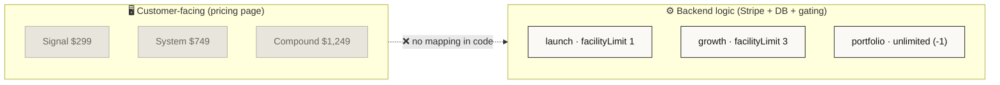
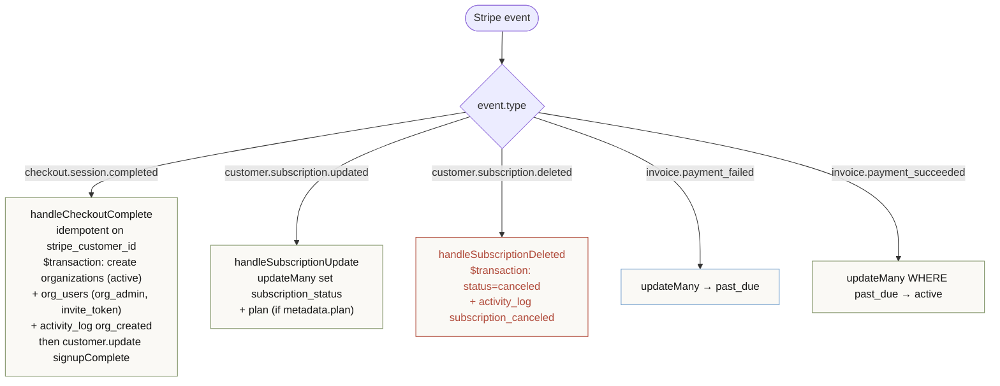
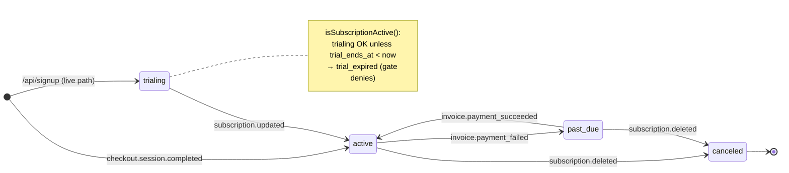
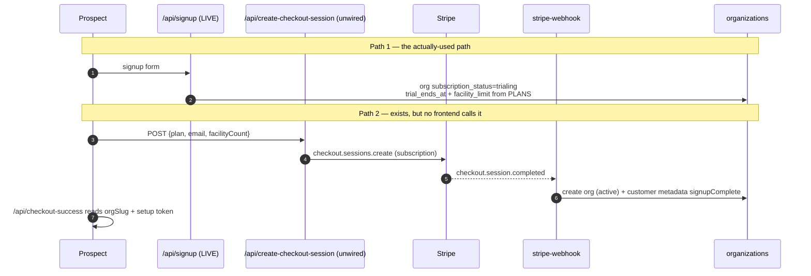
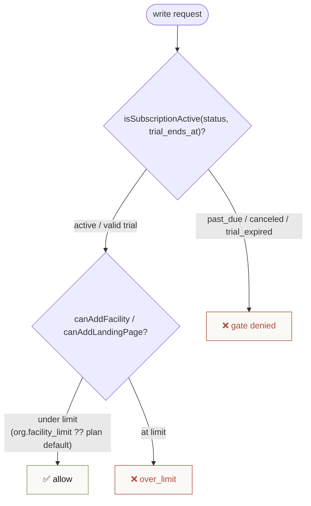
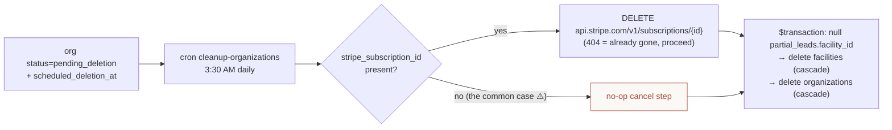

# 07 · Billing & Stripe

> **The headline:** Billing is driven by the Stripe webhook keyed on `stripe_customer_id`. But there are **two unmapped plan namespaces** (marketing `Signal/System/Compound` vs backend `launch/growth/portfolio`), prices that disagree across four files, and a `stripe_subscription_id` that no application code ever writes. The live org-creation path today is `/api/signup` (trial), not Checkout.

---

## 1. Two plan namespaces that never meet

The pricing page (`src/app/pricing/page.tsx`, `pricing-calculator.tsx`) speaks `Signal/System/Compound`. Every backend system — checkout, webhook, `plan-limits.ts`, gating — speaks `launch/growth/portfolio`. **Nothing translates between them.** Prices also disagree by source:

| Source file | launch | growth | portfolio |
|-------------|--------|--------|-----------|
| `src/lib/stripe.ts` `PLANS` (canonical) | $750 | $1500 | $0 (custom) |
| `client-invoices` `PLAN_PRICES` | $499 | $999 | $1499 |
| `pricing/page.tsx` | Signal $299 | System $749 | Compound $1,249 |

> **Study takeaway:** treat `src/lib/stripe.ts` `PLANS` as the source of truth for *limits* and price-IDs. The dollar figures elsewhere are display artifacts and drift. "Enterprise" is accepted as a checkout string but has no price-ID entry → it 400s; `portfolio` is the de-facto 10+/unlimited tier.

---

## 2. The Stripe webhook — the real state engine

`src/app/api/stripe-webhook/route.ts`. Verified via `stripe.webhooks.constructEvent(rawBody, sig, STRIPE_WEBHOOK_SECRET)`. CSRF-exempt by path (`isCsrfExempt` matches `/api/stripe-webhook`). Handler errors return 500 so Stripe retries. **All branches key on `stripe_customer_id`.**

### Subscription status state machine (on `organizations.subscription_status`)

---

## 3. Two checkout paths (only one is wired)

> The marketing pricing-page CTAs route to a **sales call** (`CAL_BOOKING_URL`) or `/audit-tool`, not Stripe Checkout. So in practice orgs are born `trialing` via `/api/signup`; the Checkout→webhook→active path is built but secondary/unwired.

---

## 4. Gating — how plan limits are enforced

`src/lib/plan-limits.ts` builds on `PLANS`:

`subscription-usage` route surfaces usage-vs-limit + feature flags (`abTesting`/`callTracking` gated to non-launch; `churnPrediction`/`whiteLabel` to portfolio). **This is feature-gating, not Stripe metered billing** — there are no `usageRecords` calls anywhere.

---

## 5. The "invoices" that aren't Stripe invoices

Two portal-side billing surfaces are **not** Stripe Invoice objects:
- `client-billing` — invoices stored in **Upstash Redis** under `billing:{accessCode}` (draft/sent/paid/overdue).
- `client-invoices` — renders an HTML invoice, emails it via **Resend** (`billing@storageads.com`), and logs `activity_log` type `invoice_sent`. The portal "invoices" list reads those activity-log rows.

---

## 6. Org deletion → Stripe cancel

> **⚠️ Known gap:** `stripe_subscription_id` is **never written by any application code** (the webhook stores `stripe_customer_id`, not the subscription id). So the cancel step only fires for orgs whose subscription id was populated out-of-band. See [13 · Gaps & Seams](13-gaps-and-seams.md).

---

## Key files

| Concern | File |
|---------|------|
| Stripe client + `PLANS` | `src/lib/stripe.ts` |
| Gating | `src/lib/plan-limits.ts` |
| Checkout | `src/app/api/create-checkout-session/route.ts`, `checkout-success/route.ts` |
| Webhook (state engine) | `src/app/api/stripe-webhook/route.ts` |
| Billing portal | `src/app/api/create-billing-portal/route.ts` |
| Usage / feature gates | `src/app/api/subscription-usage/route.ts` |
| Portal invoices | `src/app/api/client-billing/route.ts`, `client-invoices/route.ts` |
| Live signup path | `src/app/api/signup/route.ts` |
| Deletion cron | `src/app/api/cron/cleanup-organizations/route.ts` |
| Org billing fields | `organizations` in `prisma/schema.prisma` (~1056-1093) |
