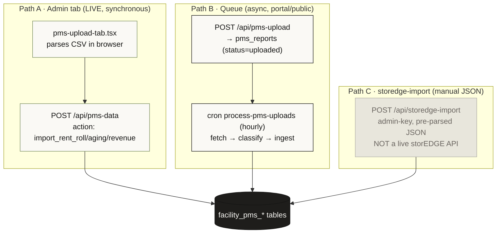
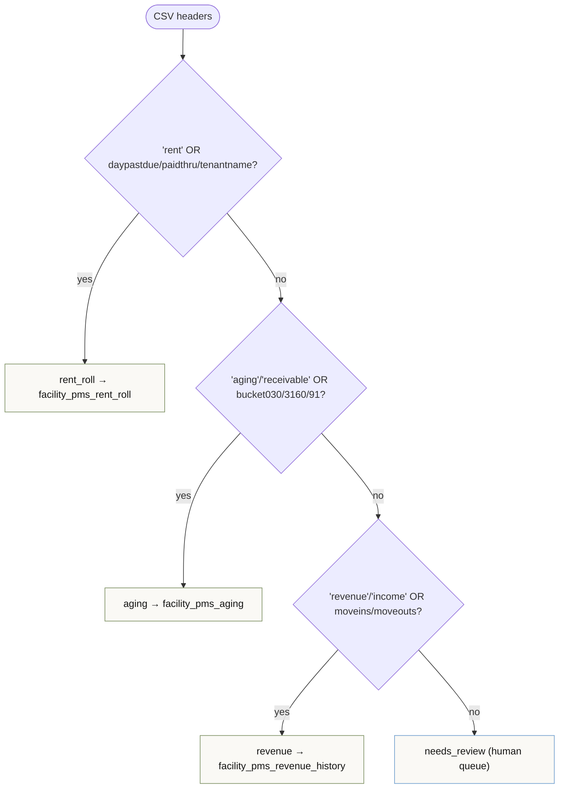
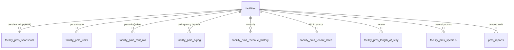
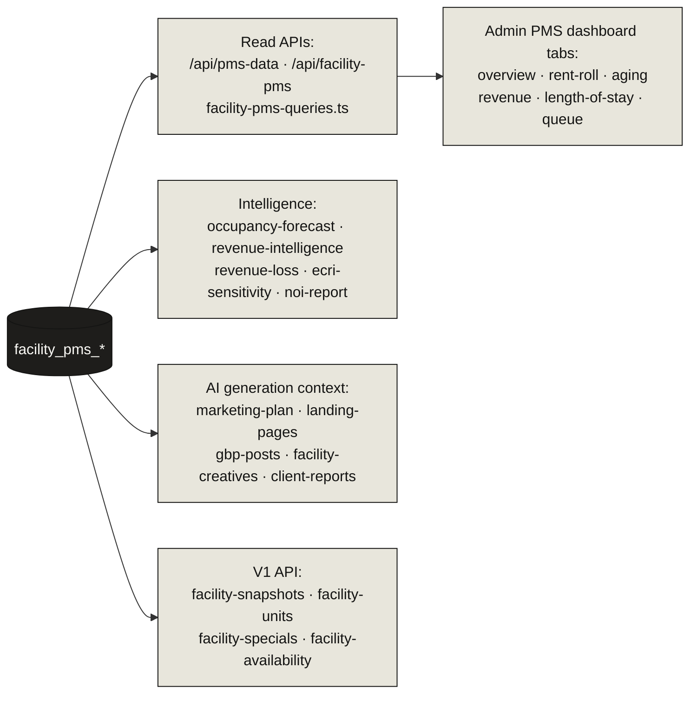
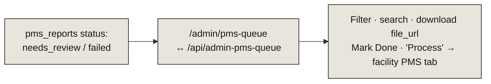

# 08 · PMS Data Ingestion Pipeline

> **The headline:** Facility management reports come in as **CSV** (Phase 1 — no live API). There are actually **three** ingestion paths into the `facility_pms_*` tables, not one. The hub table is `facility_pms_snapshots` (a per-facility, per-date rollup). Despite the name, `storedge-import` performs **no live storEDGE sync** — it's a manual JSON import.

---

## 1. Three ingestion paths



> **Watch out:** the `pms-upload-tab.tsx` UI does **not** POST to `/api/pms-upload`. It posts to `/api/pms-data` (Path A, synchronous, browser-parsed). `/api/pms-upload` is the separate queue feeder (Path B). Same destination tables, totally different mechanics.

---

## 2. Path B in full (the queue + cron)

```mermaid
sequenceDiagram
    autonumber
    participant U as Client / portal
    participant Up as POST /api/pms-upload
    participant Q as pms_reports
    participant Cron as cron process-pms-uploads (hourly)
    participant Blob as file_url
    participant T as facility_pms_*

    U->>Up: reportData (auth: admin key OR portal accessCode)
    Up->>Q: row status=uploaded (report_data JSON, file_url?)
    Up->>U: facilities.pms_uploaded=true + Resend notify
    Note over Cron: batch 10, oldest first, maxDuration 300s
    Cron->>Q: SELECT WHERE status=uploaded
    Cron->>Blob: fetch file_url → parseCSVText
    Cron->>Cron: classifyReport (headers/type sniff)
    alt classified rent_roll / aging / revenue
        Cron->>Cron: autoMapColumns vs EXPECTED_COLUMNS
        Cron->>T: deleteMany + createMany (rent_roll/aging)<br/>or upsert (revenue); rent_roll rolls up snapshot
        Cron->>Q: status=processed
    else missing columns / unknown
        Cron->>Q: status=needs_review (+ missing list)
    else non-CSV / no file_url / empty
        Cron->>Q: status=failed
    end
```

### Classification rules (`classifyReport`)



---

## 3. The `facility_pms_*` tables



| Table | Holds | Write pattern |
|-------|-------|---------------|
| `facility_pms_snapshots` ⭐ | Facility rollup: occupancy %, gross potential, actual revenue, delinquency %, move-ins/outs. Unique `(facility_id, snapshot_date)` | upsert (rolled up from rent_roll) |
| `facility_pms_units` | Per unit-type inventory + pricing (street/web/push rate, `ecri_eligible`). Unique `(facility_id, unit_type)` | upsert (storedge-import) |
| `facility_pms_rent_roll` | Per-unit tenancy line items at a snapshot date | deleteMany + createMany |
| `facility_pms_aging` | Per-unit buckets 0-30…120+ | deleteMany + createMany |
| `facility_pms_revenue_history` | Monthly revenue/tax/move-ins/outs. Unique `(facility_id, year, month)` | upsert |
| `facility_pms_tenant_rates` | Per-tenant rate + ECRI flags. **Feeds churn/ECRI/NOI** | storedge-import only |
| `facility_pms_length_of_stay` | Per-tenant tenure | storedge-import only |
| `facility_pms_specials` | Promos/discounts | manual CRUD (not CSV) |
| `pms_reports` | Upload metadata + `report_data` + `status` | the queue/audit log |

> `tenants` and `tenant_payments` are a **separate pipeline** (via `POST /api/tenants` and `/api/v1/tenants`), not part of CSV ingestion — they model live tenant records for the [retention engine](09-retention-engine.md).

---

## 4. Downstream consumers



The admin PMS dashboard (`pms-dashboard.tsx`) makes a single `/api/pms-data` fetch and fans it out to all read-only sub-tabs. The shared raw-query layer is `src/lib/facility-pms-queries.ts` (economic occupancy, rate-gap loss, etc.).

---

## 5. The human-review queue



Items the cron can't auto-classify land in `/admin/pms-queue` for manual handling. The same data embeds in the facility dashboard as `pms-queue-tab.tsx`.

---

## Key files

| Stage | File |
|-------|------|
| Admin tab (Path A) | `src/components/admin/facility-tabs/pms-upload-tab.tsx` → `/api/pms-data` |
| Queue feeder (Path B) | `src/app/api/pms-upload/route.ts` |
| Processing cron | `src/app/api/cron/process-pms-uploads/route.ts` |
| Column mapping | `src/lib/pms-column-mapper.ts` |
| Manual JSON import (Path C) | `src/app/api/storedge-import/route.ts` |
| Read APIs | `src/app/api/pms-data/route.ts`, `facility-pms/route.ts` |
| Shared queries | `src/lib/facility-pms-queries.ts` |
| Admin queue | `src/app/admin/pms-queue/page.tsx`, `/api/admin-pms-queue` |
| Tables | `facility_pms_*`, `pms_reports` in `prisma/schema.prisma` |
