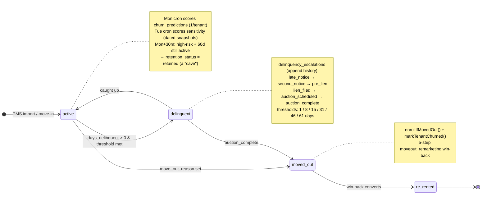
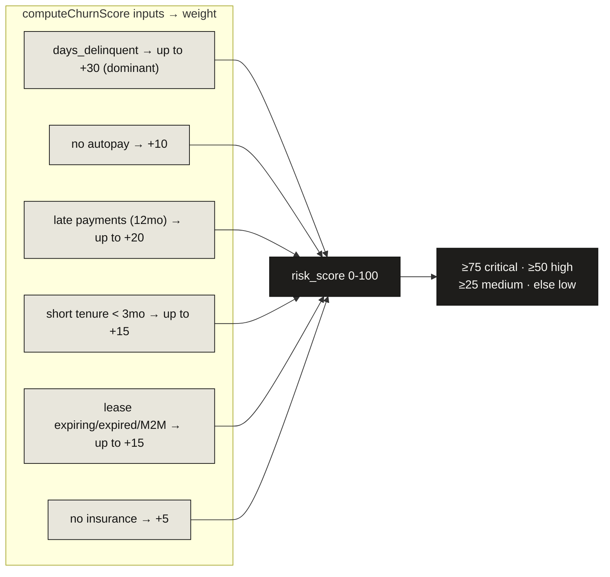
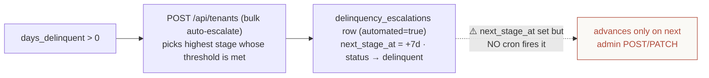
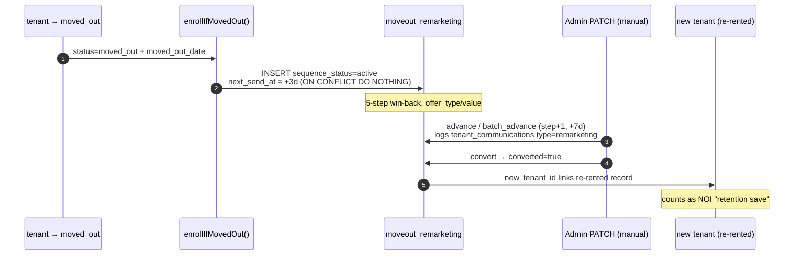
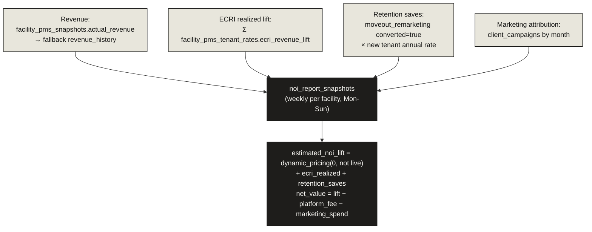
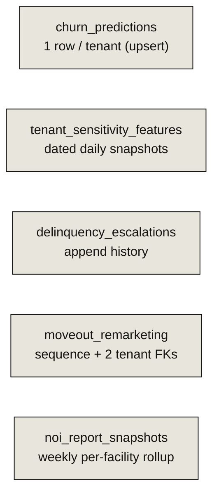

# 09 · Tenant Retention / Churn / Revenue-Intelligence Engine

> **The headline:** This is the *tenant-side* machine, entirely separate from the lead/marketing funnel. It's keyed off `tenants` (not `partial_leads`), admin-key gated, and **all scoring is heuristic — no LLM**. Four weekly crons score risk and roll up NOI. Crucially, escalation and move-out sequences have timers but **no cron fires them** — they advance via admin actions.

---

## 1. The tenant lifecycle state machine

---

## 2. The weekly scoring cascade

```mermaid
gantt
    title Weekly tenant-side crons (UTC)
    dateFormat HH:mm
    axisFormat %a %H:%M
    section Monday
    score-churn-risk            :11:00, 30m
    update-retention-outcomes   :11:30, 30m
    section Tuesday
    score-ecri-sensitivity      :11:00, 30m
    section Friday
    generate-noi-reports        :12:00, 30m
```

> The Monday ordering is deliberate: churn scoring writes `churn_predictions` at 11:00, then the retention-outcome sweep reads those predictions 30 min later (11:30) to mark realized "saves."

| Cron | Calls | Lib | Writes |
|------|-------|-----|--------|
| `score-churn-risk` (Mon 11:00) | `scoreActiveTenants` | `src/lib/churn-scoring.ts` | `churn_predictions` (1/tenant, upsert) |
| `update-retention-outcomes` (Mon 11:30) | `sweepRetainedTenants` | `src/lib/retention-outcomes.ts` | `churn_predictions.retention_status` |
| `score-ecri-sensitivity` (Tue 11:00) | `scoreAllActiveTenantsSensitivity` | `src/lib/ecri-sensitivity.ts` | `tenant_sensitivity_features` (dated snapshots) |
| `generate-noi-reports` (Fri 12:00) | `generateWeeklyNOISnapshots` | `src/lib/noi-report.ts` | `noi_report_snapshots` (per-facility weekly) |

---

## 3. Churn scoring model (heuristic, 0-100)

`churn_predictions` is **one row per tenant** (`tenant_id @unique`), upserted, with `recommended_actions` (personal_call, autopay_incentive, renewal_offer, payment_reminder) and `retention_status` (none → enrolled → retained / churned). Also drivable on-demand via `/api/churn-predictions`.

**ECRI sensitivity** (`tenant_sensitivity_features`, dated daily snapshots) is a weighted 0-1 score: tenure (30%), payment health (20%), rate gap vs facility-median market rate (20%), no-autopay (15%), small unit ≤5x10 (15%). Buckets very_low/low/medium/high.

---

## 4. Delinquency escalation (admin-driven, NOT cron)

Stages: `late_notice → second_notice → pre_lien → lien_filed → auction_scheduled → auction_complete` at thresholds `1/8/15/31/46/61` days. `delinquency_escalations` is append-history. **No cron auto-advances it** — the `next_stage_at` timer is informational; advancement requires an admin call to `/api/tenants`.

---

## 5. Move-out remarketing (the win-back loop)

`moveout_remarketing` has **two named relations to `tenants`**: `tenant_id` (the moved-out tenant, `@unique`) and `new_tenant_id` (the re-rented record). **No cron drives advancement** — it's manual/batch PATCH (the `process-drips`/`process-nurture` crons operate on the *lead-side* tables).

---

## 6. NOI report — the keystone weekly rollup

`noi_report_snapshots` stitches every subsystem into one weekly NOI-lift report card:

---

## 7. Revenue-intelligence read APIs (analytics, no writes)

| Route | Produces |
|-------|----------|
| `revenue-intelligence` | Gross-vs-actual-vs-lost, revenue capture %, ECRI lift, weighted **health score** (occupancy 30% + capture 25% + ECRI 15% + delinquency 15% + trend 15%), a revenue **waterfall** |
| `revenue-loss` | Lost revenue with severity tiers (critical ≥$24k, high ≥$12k, warning ≥$4k annual) |
| `occupancy-forecast` | 12-month **with-ads vs without-ads** projection (the sales-pitch artifact) — seasonal index, 6% monthly churn |
| `occupancy-intelligence` | Current-state occupancy detail (90-day window) |

---

## Data-shape cheat sheet (important asymmetry)

---

## Key files

| Concern | File |
|---------|------|
| Churn scoring | `src/lib/churn-scoring.ts`, `cron/score-churn-risk` |
| Retention outcomes | `src/lib/retention-outcomes.ts`, `cron/update-retention-outcomes` |
| ECRI sensitivity | `src/lib/ecri-sensitivity.ts`, `cron/score-ecri-sensitivity` |
| Escalation + move-out triggers | `src/app/api/tenants/route.ts`, `src/lib/moveout-trigger.ts` |
| Move-out remarketing | `src/app/api/moveout-remarketing/route.ts` |
| Upsell | `src/app/api/upsell/route.ts` |
| NOI rollup | `src/lib/noi-report.ts`, `cron/generate-noi-reports` |
| Revenue analytics | `revenue-intelligence`, `revenue-loss`, `occupancy-forecast`, `occupancy-intelligence` routes |
| Shared queries | `src/lib/queries/facility-analytics.ts` |
