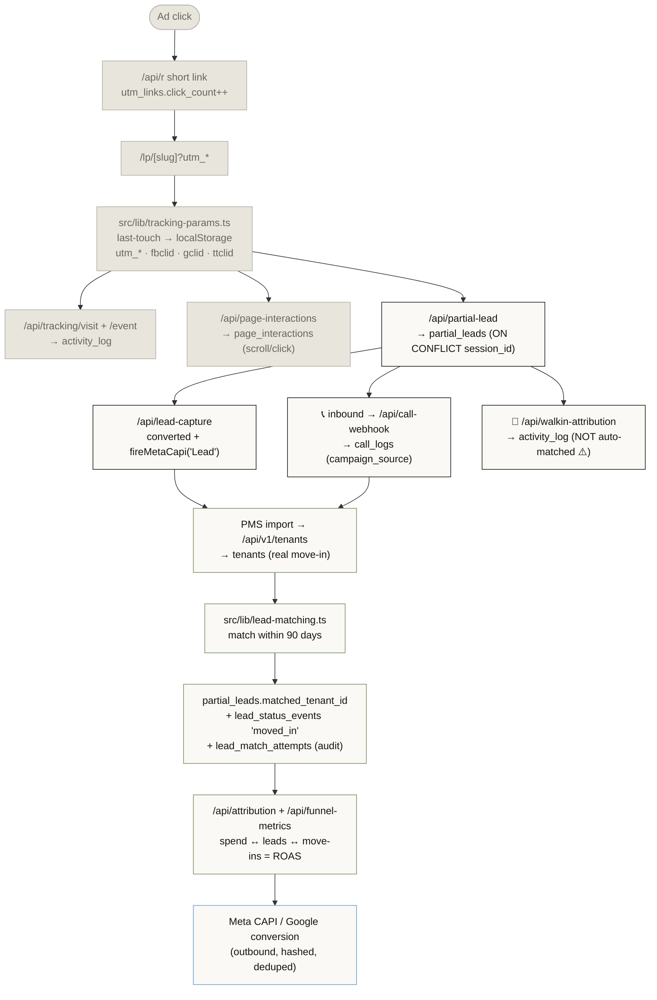
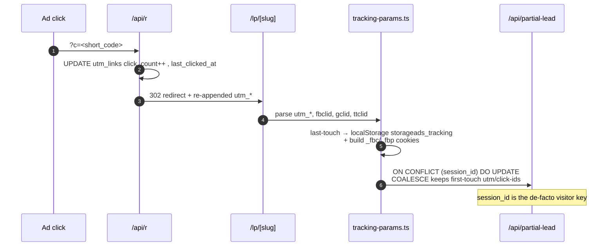
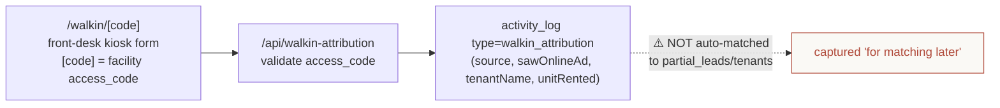
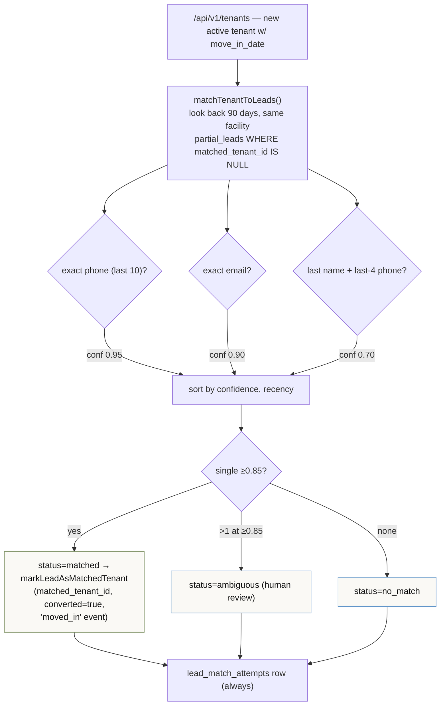
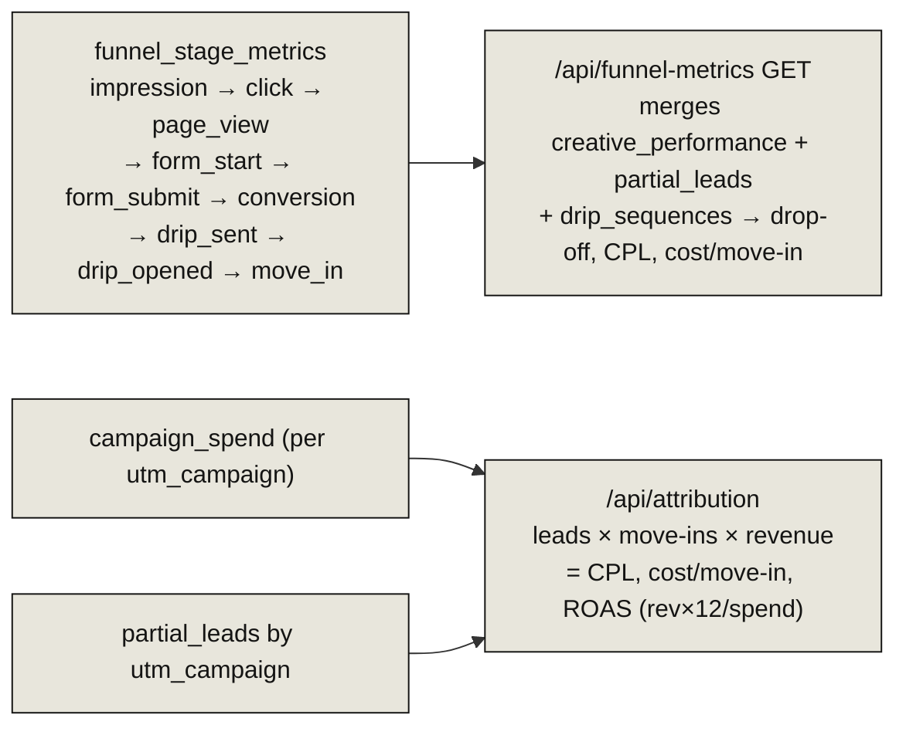

# 10 · Attribution & Call Tracking

> **The headline:** This is how an anonymous ad click becomes a measured move-in tied to spend. The chain is: click → `partial_leads` → call/walk-in → **lead↔tenant match** (the loop-closer) → ROAS. Two caveats to internalize: the `visitor_id`/`source_channel` columns are unwired scaffold (the real key is `session_id`), and walk-ins are **not** auto-matched.

---

## 1. The full attribution pipeline (anonymous → tenant)



---

## 2. Click & visitor attribution



- `utm_links` — named per-facility links with `short_code`, full utm set, optional `landing_page_id`, click counter. Managed via `/api/utm-links`.
- `tracking-params.ts` — **last-touch** model; new URL params overwrite, persisted in localStorage.
- `partial_leads` capture — raw `INSERT ... ON CONFLICT (session_id) DO UPDATE`, COALESCE-merging utm/click-ids so first-touch survives.

> **⚠️ Scaffold gap:** `partial_leads.visitor_id`, `source_channel`, `source_subchannel`, `audit_submission_id` are declared + indexed but **written nowhere**. The real visitor key today is `session_id`. See [13 · Gaps & Seams](13-gaps-and-seams.md).

---

## 3. Call tracking (Twilio)

```mermaid
sequenceDiagram
    autonumber
    participant Caller as Caller
    participant Twilio as Twilio number
    participant WH as /api/call-webhook
    participant CTN as call_tracking_numbers
    participant CL as call_logs

    Note over CTN: provisioned via /api/call-tracking<br/>(tied to landing_page_id AND/OR utm_link_id)
    Caller->>Twilio: dials tracked number
    Twilio->>WH: voice hit (x-twilio-signature verified, fail-closed)
    WH->>CTN: lookup by dialed number
    WH->>CL: INSERT campaign_source (from utm_link.utm_campaign)<br/>status=ringing → TwiML dial to forward_to (record)
    Twilio->>WH: ?event=status callback
    WH->>CL: final status/duration; recompute CTN aggregates
    Note over CL: PATCH /api/call-logs sets call_outcome +<br/>move_in_linked → activity_log attributed_move_in
```

`campaign_source` on `call_logs` is derived from `utm_link.utm_campaign` — that's how a phone call inherits its ad campaign. `partial_leads.call_log_id` (SetNull) ties a call to an identified lead.

---

## 4. Walk-in attribution



Walk-ins land in `activity_log` only. The free-text tenant name/unit is captured "for matching to move-in data later," but **no code path joins walk-ins to leads or tenants yet**.

---

## 5. Lead → tenant matching (closing the loop)

This is the join that makes attribution real — a PMS move-in matched back to the originating click.



`lead_status_events` is the append-only status history (`source`/`source_ref_id` point back into `call_logs`/`tenants`). The `"LeadTenantMatch"` named relation (`partial_leads.matched_tenant_id ↔ tenants`) is the link. **Only the PMS-import path auto-matches** — calls and walk-ins do not.

---

## 6. Funnel stage metrics → ROAS



`funnel_stage_metrics` upserts increment a `(funnel_id, period, stage)` counter (admin-gated POST). `/api/attribution` joins `campaign_spend` against `partial_leads` grouped by `utm_campaign` to compute the operator-facing ROI table. The outbound hop (`meta-capi.ts`, `google-conversion`) sends hashed, deduped conversions back to the ad platforms — Angelo's domain.

---

## Key files

| Hop | Route / lib | Writes |
|-----|-------------|--------|
| Short-link click | `src/app/api/r/route.ts` | `utm_links` |
| Param capture | `src/lib/tracking-params.ts` | localStorage |
| Visit/events | `tracking/visit`, `/event` | `activity_log` |
| Page interactions | `page-interactions` | `page_interactions` |
| Anon → partial | `partial-lead/route.ts` | `partial_leads` |
| Converted + CAPI | `lead-capture/route.ts` | `partial_leads`, Meta CAPI |
| Call provisioning | `call-tracking/route.ts` | `call_tracking_numbers` |
| Inbound call | `call-webhook/route.ts` | `call_logs` |
| Walk-in | `walkin-attribution/route.ts` | `activity_log` |
| Match engine | `src/lib/lead-matching.ts` | `lead_match_attempts` |
| Lead linking | `src/lib/lead-events.ts` | `matched_tenant_id`, `lead_status_events` |
| Funnel stages | `funnel-metrics/route.ts` | `funnel_stage_metrics` |
| ROAS | `attribution/route.ts`, `src/lib/attribution.ts` | `creative_performance` |
