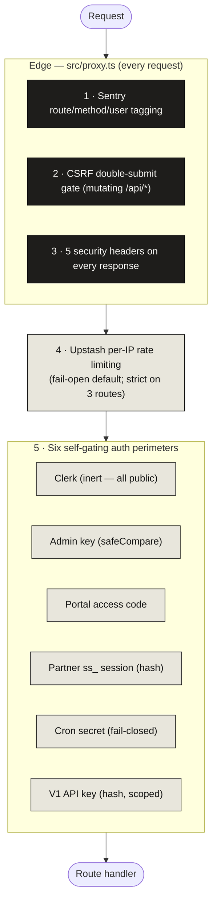
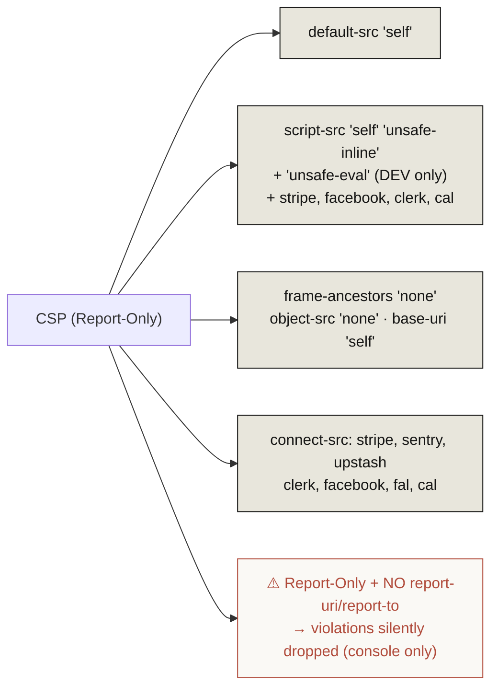
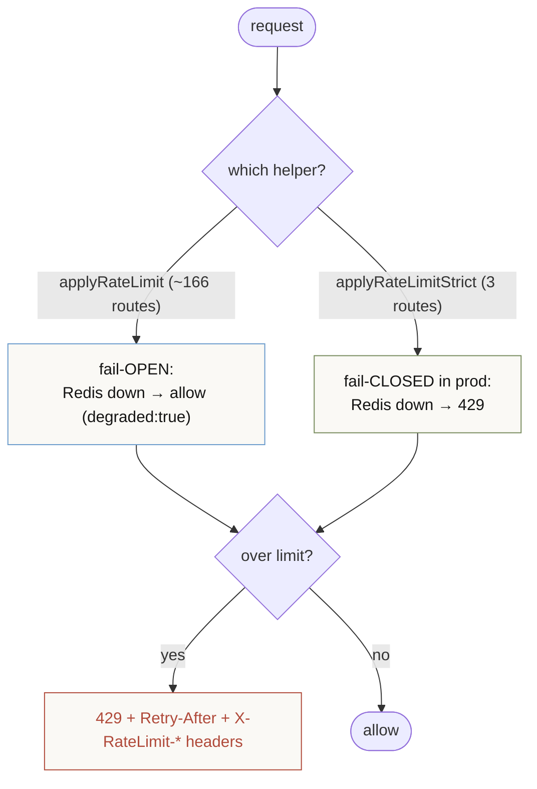
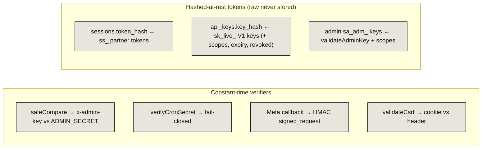
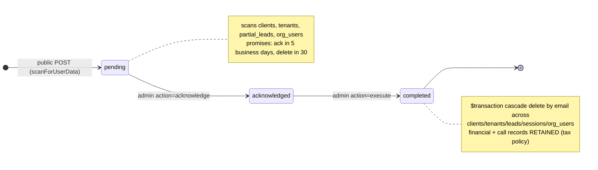
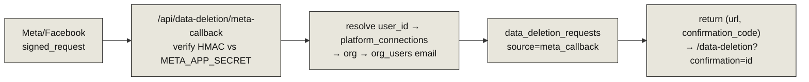
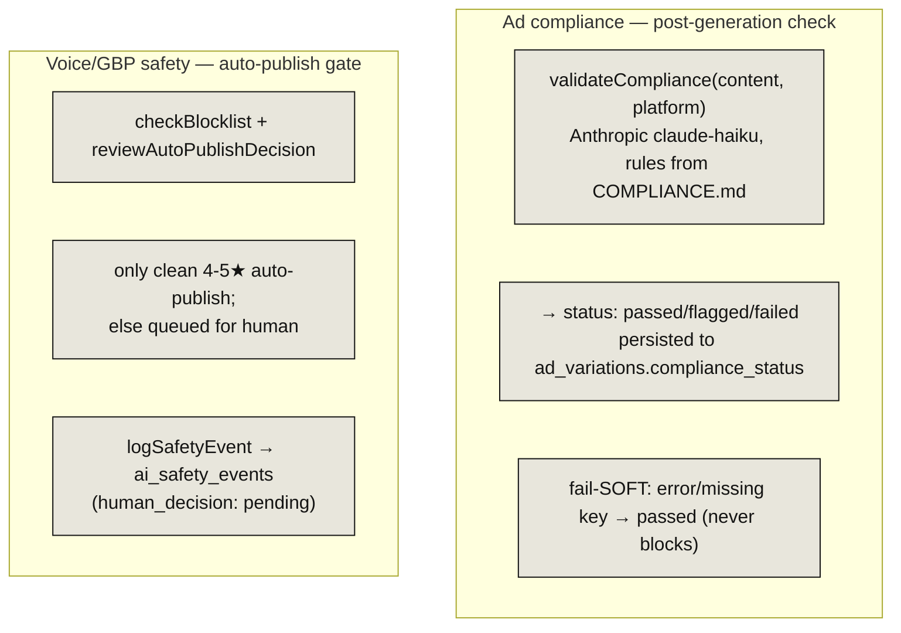

# 11 · Security & Compliance

> **The headline:** Defense is layered at the edge (`proxy.ts`) and per-route. Six self-gating auth perimeters, a CSRF double-submit gate, five security headers, and Upstash per-IP rate limiting. Three gaps worth knowing: **CSP is report-only with no report sink**, `applyRateLimit` is **fail-open**, and there's an orphaned `fb_deletion_requests` table.

---

## 1. The security layers

The four data-facing perimeters (admin/portal/partner/V1) are documented in detail in [01 · Authentication](01-authentication.md). This doc covers the wrapping layers: headers, rate limiting, secrets-at-rest, and compliance.

---

## 2. Security headers & CSP

`applySecurityHeaders()` sets five headers on **every** response (including the 403 CSRF reject):

| Header | Value |
|--------|-------|
| `Content-Security-Policy-Report-Only` | full directive set (see below) |
| `X-Content-Type-Options` | `nosniff` |
| `X-Frame-Options` | `DENY` |
| `Referrer-Policy` | `strict-origin-when-cross-origin` |
| `Permissions-Policy` | `camera=(), microphone=(), geolocation=()` |

> **Report-Only means CSP observes but does not block.** Combined with no report sink, a CSP violation produces no telemetry and no enforcement — it's effectively a dry run. Flagged in [13 · Gaps & Seams](13-gaps-and-seams.md).

---

## 3. Rate limiting

Upstash Redis sliding window, keyed per-IP (`rl:{prefix}:{ip}`). Two entry points with different failure modes:

The strict (fail-closed) variant guards the 3 expensive **unauthenticated** routes: `analyze-map`, `diagnostic-analyze`, `facility-lookup`.

**Tiers** (`RATE_LIMIT_TIERS`, requests / window):

| Tier | Limit | | Tier | Limit |
|------|-------|-|------|-------|
| EXPENSIVE_API | 10/60s | | WEBHOOK | 200/60s |
| BILLING | 5/60s | | EXPENSIVE_API_HOURLY | 5/hr |
| AUTHENTICATED | 60/60s | | BILLING_HOURLY | 10/hr |
| PUBLIC_WRITE | 10/60s | | SIGNUP_HOURLY | 5/hr |
| PUBLIC_READ | 120/60s | | EXTERNAL_API_HOURLY | 20/hr |

V1 API uses per-key limits keyed `v1:{apiKeyId}` (default 100/60s).

---

## 4. Secrets at rest & constant-time compares

Four independent constant-time implementations, all SHA-256-normalizing before compare (so length doesn't leak):

---

## 5. GDPR / data-deletion lifecycle

Single model `data_deletion_requests` backs the whole flow:

> **⚠️ Orphan:** the `fb_deletion_requests` table exists in the schema but is referenced nowhere — the live Meta flow writes to `data_deletion_requests`.

**Retention cron** (`cron/data-retention`, fail-closed): `RETENTION_POLICIES` — `activity_log` 90d, `api_usage_log` 30d, `betapad_notes` 90d — batched 1000-row raw deletes on `created_at`.

**Legal pages:** `/privacy`, `/terms`, `/cookies`, `/dpa`, `/data-deletion` (the last is the public request form, required for Meta advertising compliance).

---

## 6. AI compliance & safety (two separate systems)

Ad compliance (`src/lib/compliance.ts`) is a **post-generation classifier** — it labels but never alters or blocks creative (fail-soft). Voice/GBP safety (`src/lib/voice/safety.ts`) is a stricter **auto-publish gate** with a human-review queue in `ai_safety_events`.

---

## Key files

| Concern | File |
|---------|------|
| Headers / CSP / CSRF gate | `src/proxy.ts` |
| CSRF mechanics | `src/lib/csrf.ts` |
| Rate limiting | `src/lib/rate-limit.ts`, `with-rate-limit.ts`, `rate-limit-tiers.ts` |
| Constant-time admin compare | `src/lib/api-helpers.ts` (`safeCompare`) |
| Cron / V1 / session auth | `cron-auth.ts`, `v1-auth.ts`, `session-auth.ts` |
| Data deletion | `src/app/api/data-deletion/route.ts`, `meta-callback/route.ts` |
| Retention cron | `src/app/api/cron/data-retention/route.ts` |
| Ad compliance | `src/lib/compliance.ts` |
| Voice safety | `src/lib/voice/safety.ts`, `blocklist.ts` |
