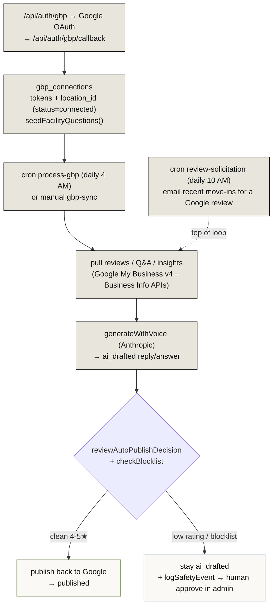
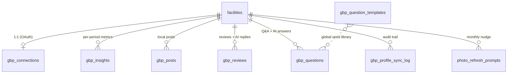
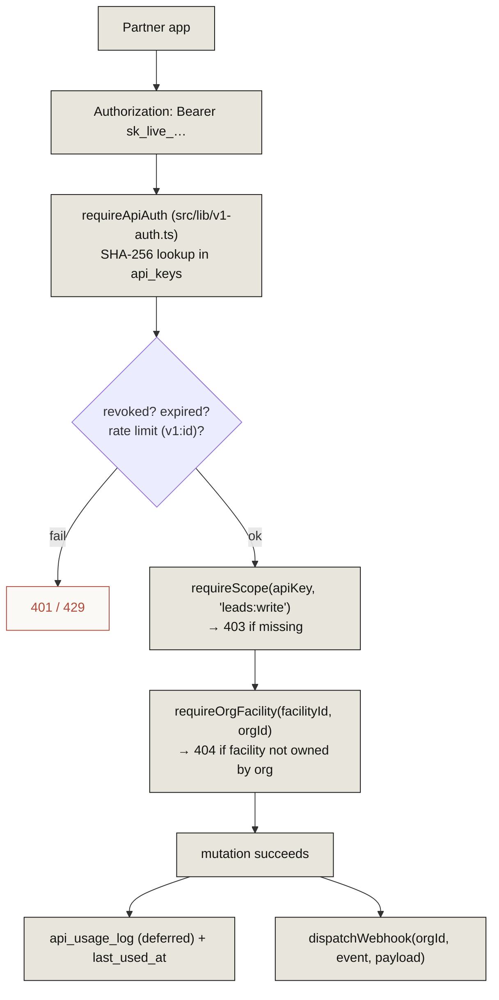
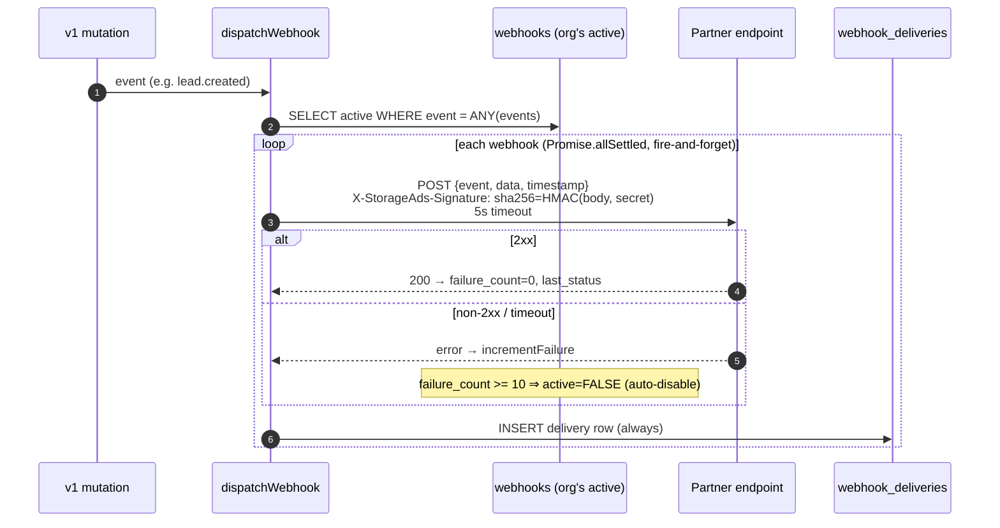

# 12 · Google Business Profile & External API + Webhooks

> **The headline:** Two integration-facing systems. **GBP** is a connect → sync → AI-draft → safety-gate → publish loop over a facility's Google listing. The **V1 API + webhooks** is the partner-facing surface: scoped `sk_live_` keys, tenant-isolated resources, and HMAC-signed outbound webhooks that auto-disable after 10 failures.

---

# Part A · Google Business Profile (GBP)

## A1. The connect → sync → respond loop

## A2. GBP data models

| Model | Status field → values |
|-------|----------------------|
| `gbp_connections` | `status`: disconnected → connected / pending_location_selection |
| `gbp_posts` | `status`: draft → scheduled → published / failed |
| `gbp_reviews` | `response_status`: pending → ai_drafted → published |
| `gbp_questions` | `answer_status`: pending → ai_drafted → published |
| `photo_refresh_prompts` | `status`: pending → sent (unique per facility+month) |

## A3. The three GBP crons

| Cron | When | Does |
|------|------|------|
| `process-gbp` | Daily 4 AM | The engine: publish due posts, sync reviews, auto-draft + safety-gated auto-respond (4-5★ only), sync hours, refresh expiring tokens |
| `review-solicitation` | Daily 10 AM | Email tenants 7-10 days post move-in asking for a Google review (dedup via `review_solicitation_sent`) |
| `photo-refresh-prompts` | 1st of month | Nudge operators to refresh GBP photos; upsert `photo_refresh_prompts` |

Admin tabs: `gbp-full`, `gbp-insights`, `gbp-posts`, `gbp-qa`, `gbp-reviews`, `gbp-settings`. Portal gets a read-only view via `portal-gbp`.

---

# Part B · V1 External API + Webhooks

## B1. Request flow with tenant isolation

**V1 resources & scopes:**

| Route | Scopes |
|-------|--------|
| `v1/leads` | `leads:read` / `leads:write` (fires `lead.created`/`lead.updated`) |
| `v1/tenants` | `tenants:read` / `tenants:write` (triggers lead-matching) |
| `v1/facilities` | `facilities:read` / `facilities:write` (fires `facility.updated`) |
| `v1/facility-snapshots`, `-units`, `-availability`, `-specials` | `facilities:read` / `facilities:write` / `units:read` / `units:write` |
| `v1/call-logs` | `calls:read` |
| `v1/landing-pages` | `pages:read` |
| `v1/webhooks` | `webhooks:manage` |
| `v1/api-keys` | **admin-gated** (provisioning) |
| `v1/usage` | API-key auth, returns own usage |

Keys are `sk_live_` + 20 random bytes, stored as SHA-256 `key_hash` + 8-char `key_prefix`, shown once. `requireOrgFacility` enforces that a facility belongs to the calling org — the tenant-isolation boundary.

## B2. Outbound webhook delivery

**Key behaviors:**
- `VALID_EVENTS`: `lead.created`, `lead.updated`, `unit.updated`, `facility.updated`, `special.created`, `special.updated`.
- Webhook URLs must be **HTTPS**; secret is 32-byte hex, returned once.
- Each delivery is HMAC-SHA256 signed (`X-StorageAds-Signature`), with `X-StorageAds-Event` and `X-StorageAds-Delivery` (uuid) headers, 5s timeout.
- **No retry/backoff** — single attempt per event; failed deliveries are not re-queued.
- **Auto-disable at 10 consecutive failures** (`active=FALSE`).
- Every attempt records a `webhook_deliveries` row (status, response body, duration).

Partner dashboard surfaces: `/partner/api-keys` (create/list/delete keys) and `/partner/webhooks` (register, view logs, send test).

---

## Key files

| Concern | File |
|---------|------|
| GBP OAuth | `src/app/api/auth/gbp/route.ts`, `callback/route.ts` |
| GBP data routes | `gbp-insights`, `gbp-posts`, `gbp-questions`, `gbp-reviews`, `gbp-sync`, `gbp-review-settings`, `review-request`, `portal-gbp` |
| GBP crons | `cron/process-gbp`, `review-solicitation`, `photo-refresh-prompts` |
| Voice generation + safety | `src/lib/voice/generate.ts`, `safety.ts`, `blocklist.ts` |
| V1 auth | `src/lib/v1-auth.ts` |
| V1 routes | `src/app/api/v1/*` |
| Webhook delivery | `src/lib/webhook.ts`, `src/app/api/v1/webhooks/route.ts` |
| Models | `gbp_*`, `photo_refresh_prompts`, `api_keys`, `api_usage_log`, `webhooks`, `webhook_deliveries` |
