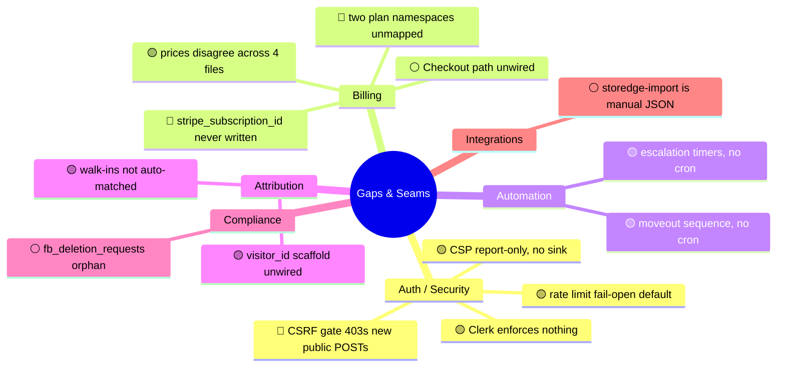

# 13 · Gaps & Seams

> **What this is:** a candid inventory of the places where the codebase's *intent* and its *wired reality* diverge — half-built scaffolds, namespace mismatches, timers with no driver, and fail-soft defaults. None of these are bugs you must fix today; they're the things that will surprise you if you assume the system does what its names imply. Each entry links to the deeper system doc.

> **How to read severity:** 🔴 can cause wrong behavior or silent data loss · 🟡 a trap when extending the system · ⚪ informational drift / cleanup.

---

## Map of the seams

---

## Auth & Security

### 🔴 The CSRF gate silently 403s any new mutating public route
A `/api/*` POST/PUT/PATCH/DELETE that carries none of `x-admin-key` / `Authorization: Bearer` / `x-org-token` **and** isn't on the path whitelist gets a 403 from `proxy.ts` *before the handler runs* — because no client sends the `x-csrf-token` header the double-submit check requires. The only signal is a 403 in Vercel logs. **Fix when adding a pre-auth public POST:** add its exact path to `isCsrfExempt()`. This broke `/portal` login historically.
→ [01 · Authentication](01-authentication.md) §2

### 🟡 Clerk enforces nothing
Clerk activates only with `pk_live_` keys, and even then marks **every** route public, so `auth.protect()` never blocks an app path. The real perimeter is the four per-route auth systems. Don't add a page expecting Clerk to guard it.
→ [01 · Authentication](01-authentication.md) §1

### 🟡 CSP is Report-Only with no report sink
`Content-Security-Policy-Report-Only` observes but never blocks, and there's no `report-uri`/`report-to` or `/api/csp-report` endpoint — so violations are dropped to the browser console with zero telemetry. It's effectively a permanent dry run. Turning on enforcement would require first wiring a report sink and auditing the directive list.
→ [11 · Security & Compliance](11-security-compliance.md) §2

### 🟡 Rate limiting is fail-open by default
`applyRateLimit` (used on ~166 routes) **allows** requests when Upstash is down (`degraded: true`). Only 3 expensive unauthenticated routes (`analyze-map`, `diagnostic-analyze`, `facility-lookup`) use the fail-closed `applyRateLimitStrict`. A Redis outage removes rate limiting almost everywhere.
→ [11 · Security & Compliance](11-security-compliance.md) §3

---

## Billing

### 🔴 `stripe_subscription_id` is never written by application code
The webhook stores `stripe_customer_id`, not the subscription id. No code path writes `stripe_subscription_id`. The deletion cron's "cancel Stripe subscription" step reads that field — so for orgs created normally it **no-ops**, and the subscription keeps billing after org deletion unless cancelled out-of-band.
→ [07 · Billing & Stripe](07-billing-stripe.md) §6

### 🔴 Two plan namespaces, never mapped
Customer-facing `Signal / System / Compound` (pricing page) vs backend `launch / growth / portfolio` (Stripe, gating, webhook). **Nothing translates between them.** A customer who "buys System" has no code path that turns that into a `growth` plan key.
→ [07 · Billing & Stripe](07-billing-stripe.md) §1

### 🟡 Prices disagree across four files
`stripe.ts` PLANS ($750/$1500/$0), `client-invoices` PLAN_PRICES ($499/$999/$1499), and the pricing page ($299/$749/$1249) all differ. Treat `stripe.ts` `PLANS` as canonical for limits/price-IDs; the dollar figures elsewhere are display artifacts that have drifted.
→ [07 · Billing & Stripe](07-billing-stripe.md) §1

### ⚪ The Stripe Checkout path is built but unwired
No frontend calls `/api/create-checkout-session`; marketing CTAs route to a sales call or `/audit-tool`. Live orgs are born `trialing` via `/api/signup`. The Checkout→webhook→`active` path works but is secondary.
→ [07 · Billing & Stripe](07-billing-stripe.md) §3

---

## Automation timers without a driver

### 🟡 Delinquency escalation has `next_stage_at` but no cron fires it
The escalation pipeline (late_notice → … → auction_complete) sets `next_stage_at = +7d`, but **no cron advances it**. Stages only progress when an admin re-invokes the bulk escalate on `/api/tenants`. The timer is informational.
→ [09 · Retention Engine](09-retention-engine.md) §4

### 🟡 Move-out remarketing has `next_send_at` but no cron fires it
The 5-step win-back sequence sets `next_send_at`, but advancement is manual/batch via PATCH `/api/moveout-remarketing`. The `process-drips`/`process-nurture` crons operate on the *lead-side* tables (`drip_sequences`, `nurture_enrollments`), not these tenant-side ones.
→ [09 · Retention Engine](09-retention-engine.md) §5

> **Pattern to internalize:** lead-side sequences (nurture/drip) are cron-driven and self-advancing. Tenant-side sequences (escalation, move-out) are admin-action-driven. Same "next_*_at" column shape, completely different execution model.

---

## Attribution

### 🟡 `visitor_id` / `source_channel` are unwired scaffold
`partial_leads.visitor_id`, `source_channel`, `source_subchannel`, `audit_submission_id` are declared and indexed ("Roadmap phase 1 attribution scaffold") but **written nowhere**. The de-facto visitor key today is `partial_leads.session_id`. Don't build reporting on the scaffold columns yet.
→ [10 · Attribution & Tracking](10-attribution-tracking.md) §2

### 🟡 Walk-ins are not auto-matched
`/api/walkin-attribution` writes free-text tenant name/unit into `activity_log` "for matching later," but no code joins walk-ins to `partial_leads` or `tenants`. Only the PMS-import path (`/api/v1/tenants` → `lead-matching.ts`) does automated lead↔tenant matching.
→ [10 · Attribution & Tracking](10-attribution-tracking.md) §4

---

## Compliance & integrations

### ⚪ `fb_deletion_requests` is an orphan table
It exists in the schema but is referenced nowhere in `src/`. The live Meta data-deletion callback writes to `data_deletion_requests`. Candidate for removal.
→ [11 · Security & Compliance](11-security-compliance.md) §5

### ⚪ `storedge-import` does no live storEDGE sync
Despite the name, it's an admin-gated endpoint that ingests **pre-parsed JSON** into the `facility_pms_*` tables. There is no storEDGE API integration — only a widget embed elsewhere. Copy must not claim live API sync.
→ [08 · PMS Pipeline](08-pms-pipeline.md) §1, and project memory `project_storedge_claims`

---

## Summary table

| Seam | Severity | System | The surprise |
|------|----------|--------|--------------|
| CSRF 403s new public POSTs | 🔴 | Auth | Handler never runs; only signal is a Vercel-log 403 |
| `stripe_subscription_id` unwritten | 🔴 | Billing | Deletion cron can't cancel the subscription |
| Two plan namespaces | 🔴 | Billing | Marketing tier ≠ backend plan key, no mapping |
| Clerk inert | 🟡 | Auth | Pages aren't protected by the proxy |
| CSP report-only, no sink | 🟡 | Security | No enforcement, no telemetry |
| Rate limit fail-open | 🟡 | Security | Redis outage drops rate limiting |
| Prices disagree x4 | 🟡 | Billing | Use `stripe.ts` PLANS as truth |
| Escalation/move-out timers | 🟡 | Retention | Tenant-side sequences need an admin to advance |
| `visitor_id` scaffold | 🟡 | Attribution | Real key is `session_id` |
| Walk-ins unmatched | 🟡 | Attribution | Land in `activity_log` only |
| `fb_deletion_requests` orphan | ⚪ | Compliance | Dead table |
| `storedge-import` JSON-only | ⚪ | PMS | No live storEDGE sync |

> These are study notes, not a backlog. If any of these matters for a feature you're building, confirm against the code first — this file reflects the codebase as read on 2026-06-26.
