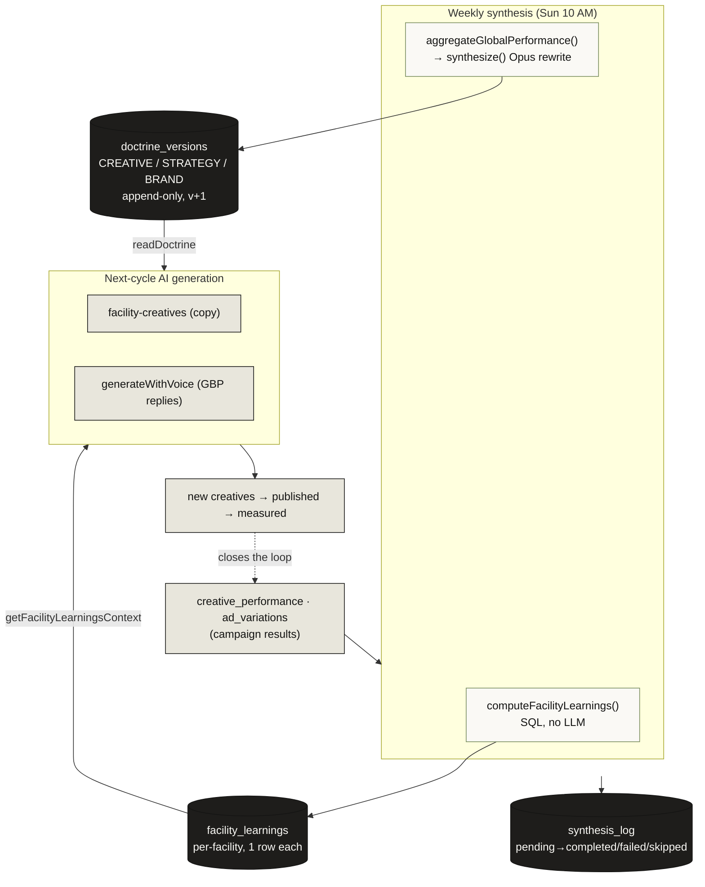
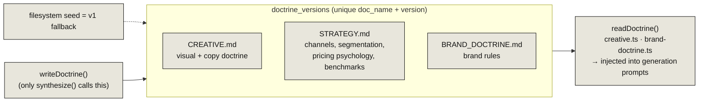
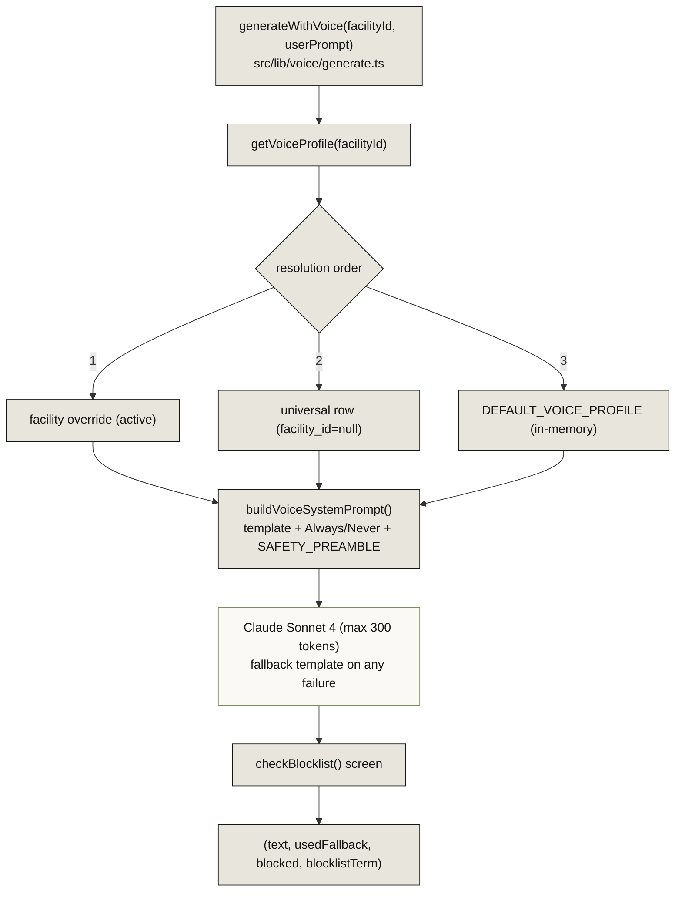
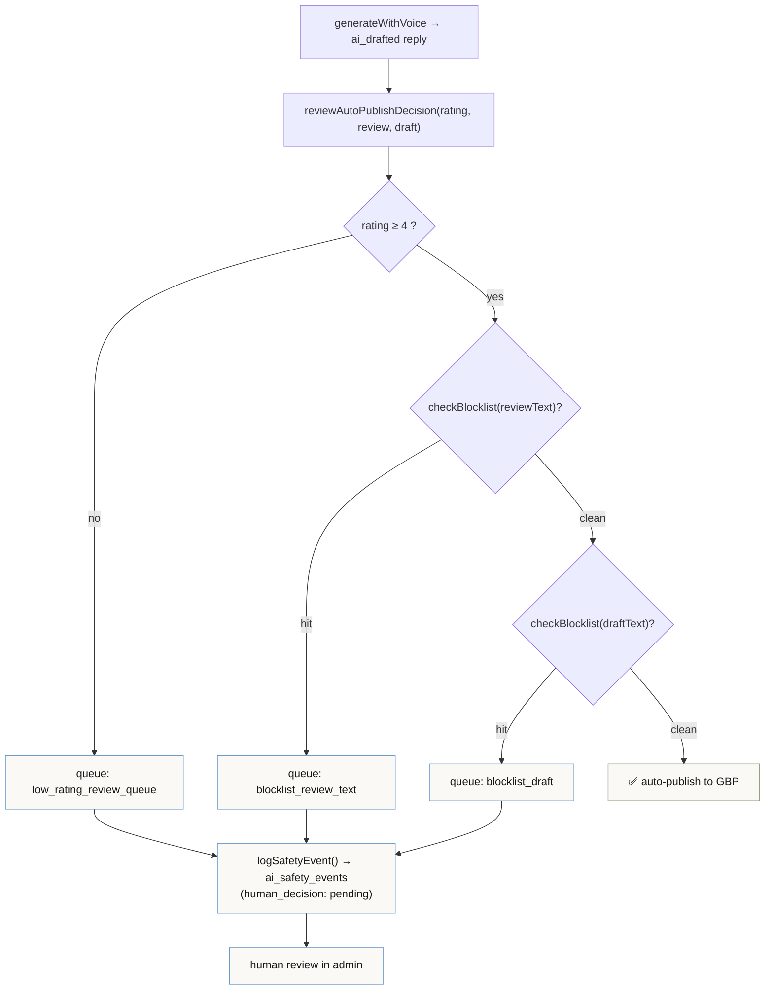
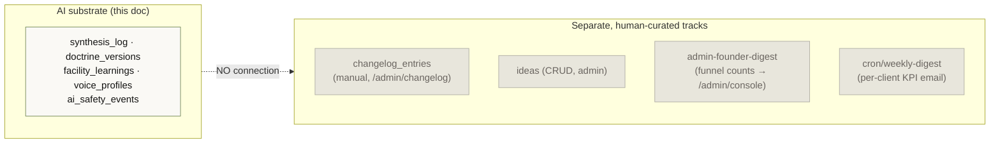

# 14 · Operator-OS AI Substrate (Synthesis · Voice · Doctrine · Safety)

> **The headline:** This is the product's namesake — the "OS" that turns facility performance data into evolving, brand-safe AI output. It has four parts: **synthesis** (campaign data → versioned strategy docs), **doctrine** (the versioned rulebooks), **voice** (per-brand AI generation), and **safety** (the auto-publish gate). The feedback loop is real: campaign results rewrite the doctrine, and the doctrine shapes the next generation.

---

## 1. The intelligence feedback loop (the whole system)

> **The "OS" claim, made concrete:** campaign performance → synthesis → evolving doctrine + per-facility learnings → injected into the next round of generation → better creatives → new performance. The schema groups these under an explicit "INTELLIGENCE FEEDBACK LOOP (Phase 2)" header.

---

## 2. Synthesis — two mechanisms, one log

"Synthesis" is actually **two parallel mechanisms** that both write to `synthesis_log`:

```mermaid
graph TB
    subgraph A["Doctrine synthesis (LLM)"]
        A1["synthesize(input)<br/>(targetDoc is a field of input)<br/>src/lib/synthesis.ts"]
        A2["readDoctrine() → current markdown"]
        A3["Claude Opus rewrites WHOLE doc<br/>(REFINE/ADD/UNCHANGED)"]
        A4["validate: starts with #, ≥50% prior length<br/>Haiku change-summary"]
        A5["writeDoctrine() → version+1"]
        A1 --> A2 --> A3 --> A4 --> A5
    end
    subgraph B["Facility learnings (no LLM)"]
        B1["computeFacilityLearnings()<br/>src/lib/facility-learnings.ts"]
        B2["raw SQL: creative_performance × ad_variations<br/>thresholds 1000 impressions, 2 periods"]
        B3["learnings_json: angle_performance,<br/>best/worst copy, recommended/avoid angles"]
        B1 --> B2 --> B3
    end

    classDef ai fill:#faf9f5,stroke:#788c5d,color:#141413
    classDef sql fill:#e8e6dc,stroke:#141413,color:#141413
    class A1,A2,A3,A4,A5 ai
    class B1,B2,B3 sql
```

| Input type (`SynthesisInput`) | Trigger | Target doc |
|-------------------------------|---------|-----------|
| `campaign_result` | weekly cron, global perf | STRATEGY |
| `style_reference` | style-ref upload (fire-and-forget) | CREATIVE |
| `market_data` / `competitive_intel` | manual via `/api/synthesize` | strategy/creative |
| `manual` | admin | either |

**Models used in synthesis:** `claude-opus-4-20250514` (full rewrite, 8k tokens) + `claude-haiku-4-5-20251001` (change summary). The prompt carries an explicit compliance block (no policy violations, no discriminatory targeting, benchmarks-not-guarantees).

### The two crons

```mermaid
gantt
    title Synthesis crons
    dateFormat HH:mm
    axisFormat %a %H:%M
    section Sunday
    weekly-synthesis (queue + global rewrite)   :10:00, 60m
    section Daily
    process-synthesis-queue (drain ≤3 pending)  :12:00, 30m
```

- **`weekly-synthesis`** (Sun 10 AM): finds facilities with `creative_performance` updated in 7d → `computeFacilityLearnings` each → `aggregateGlobalPerformance` → `synthesizeCampaignResult` rewrites STRATEGY → then drains up to 3 pending queue rows.
- **`process-synthesis-queue`** (daily 12 PM): pure drainer — up to 3 `pending` rows, refresh facility learnings, mark completed/failed. No LLM, no doctrine writes.

`synthesis_log` fields: `trigger` (weekly_cron / alert_triggered / manual / campaign_sync), `facility_id?`, `target_doc`, `input_summary`, `change_summary`, `tokens_used`, `status` (pending→completed/failed/skipped).

---

## 3. Doctrine — the versioned rulebooks

`src/lib/doctrine-store.ts` manages three "living documents," append-only:

- `readDoctrine(name)` — latest DB version first, else filesystem seed, with an in-memory cache.
- `writeDoctrine(name, content, summary)` — `nextVersion = max+1`, inserts a new row (never overwrites). **Synthesis is the only writer.**
- Doctrine is the AI-evolved strategy/creative/brand rulebook that gets injected into every generation prompt — the mechanism by which "what worked last week" becomes "how we write this week."

---

## 4. Voice — per-brand AI generation

- `voice_profiles` model: `facility_id?` (null = universal), `tone_descriptors` (register: warm-professional, reading level 7, no emoji), `do_use[]`, `do_not_use[]`, `template`, `active`.
- **Phase 1 ships exactly one universal profile** ("StorageAds Universal"); per-facility overrides are supported by schema but not yet populated.
- The `SAFETY_PREAMBLE` is baked into every voice prompt: never discuss lawsuits, injury, death, fire, theft, weapons, contraband, hazmat — direct to office.
- Consumers: `gbp-reviews`, `gbp-questions`, `cron/process-gbp`. *"Raw model output never reaches a customer without the voice template + blocklist screen."*

---

## 5. Safety — the auto-publish gate

- `checkBlocklist(text)` — 10 categories (legal, threat, injury, death, fire, weapons, contraband, hazardous, self_harm, child_safety), word-boundary regexes. A hit never hard-blocks customer service — it **routes to the human queue**.
- `ai_safety_events` — append-only audit trail: `event_type` (blocklist_hit / review_queue / escalation / qa_sample), `surface`, `ai_draft`, `escalation_reason`, `blocklist_term`, `human_decision` (pending → decided). The vision doc's "5-10% human QA sample" maps to the `qa_sample` event type.

---

## 6. What is NOT part of this system (common confusions)

- **Changelog & ideas** are manual product-management surfaces. The old git-commit "sync" was removed; entries are now created by hand. No link to synthesis.
- **Founder digest** (`admin-founder-digest` → `/admin/console`) is aggregate funnel counts, not LLM-derived.
- **Weekly digest** cron emails per-client KPIs from operational tables — not connected to `synthesis_log` or doctrine.

---

## Key files

| Concern | File |
|---------|------|
| Synthesis engine | `src/lib/synthesis.ts` |
| Facility learnings | `src/lib/facility-learnings.ts`, `performance-aggregator.ts` |
| Synthesis crons | `cron/weekly-synthesis`, `cron/process-synthesis-queue`, `/api/synthesize` |
| Doctrine store | `src/lib/doctrine-store.ts`, readers `creative.ts` / `brand-doctrine.ts` |
| Voice generation | `src/lib/voice/generate.ts`, `src/lib/voice/voice-profile.ts` |
| Safety gate | `src/lib/voice/safety.ts`, `blocklist.ts` |
| Models | `synthesis_log`, `doctrine_versions`, `facility_learnings`, `voice_profiles`, `ai_safety_events` |
| Vision framing | `docs/operator-os-vision.md`, `operator-os-phase-1-prd.md` |
