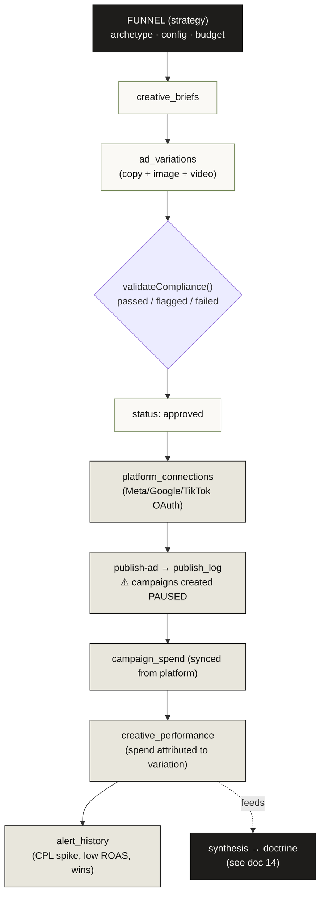
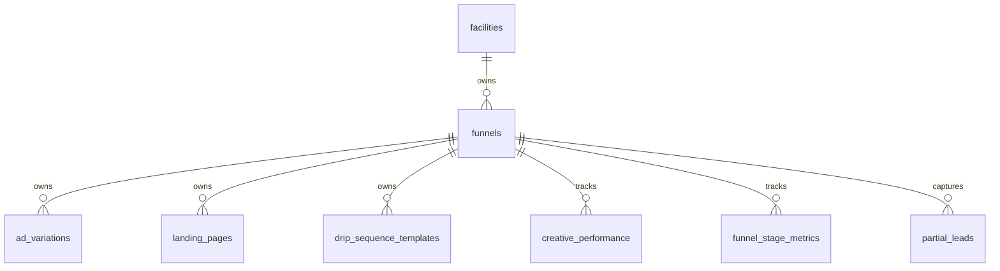
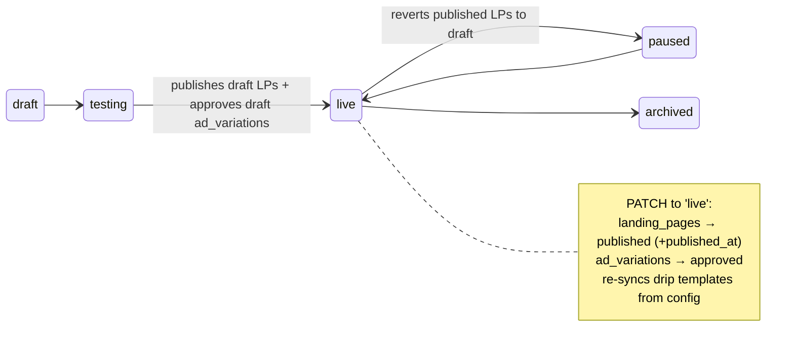
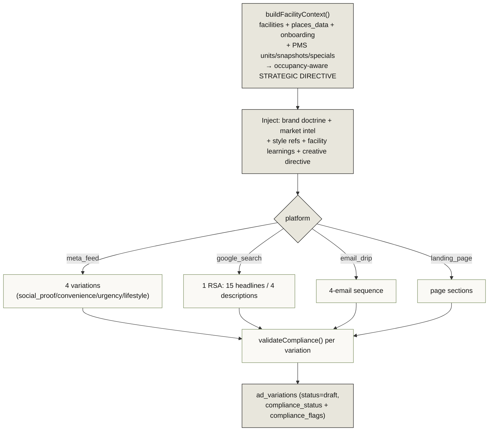
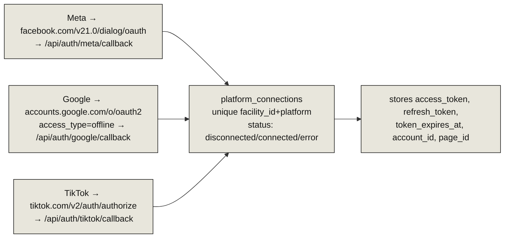
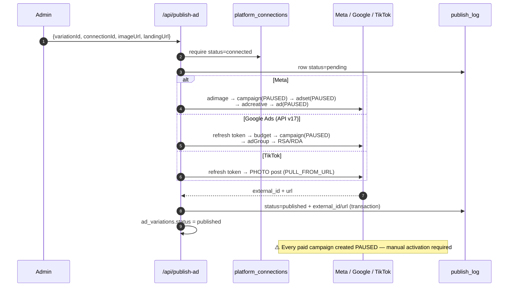
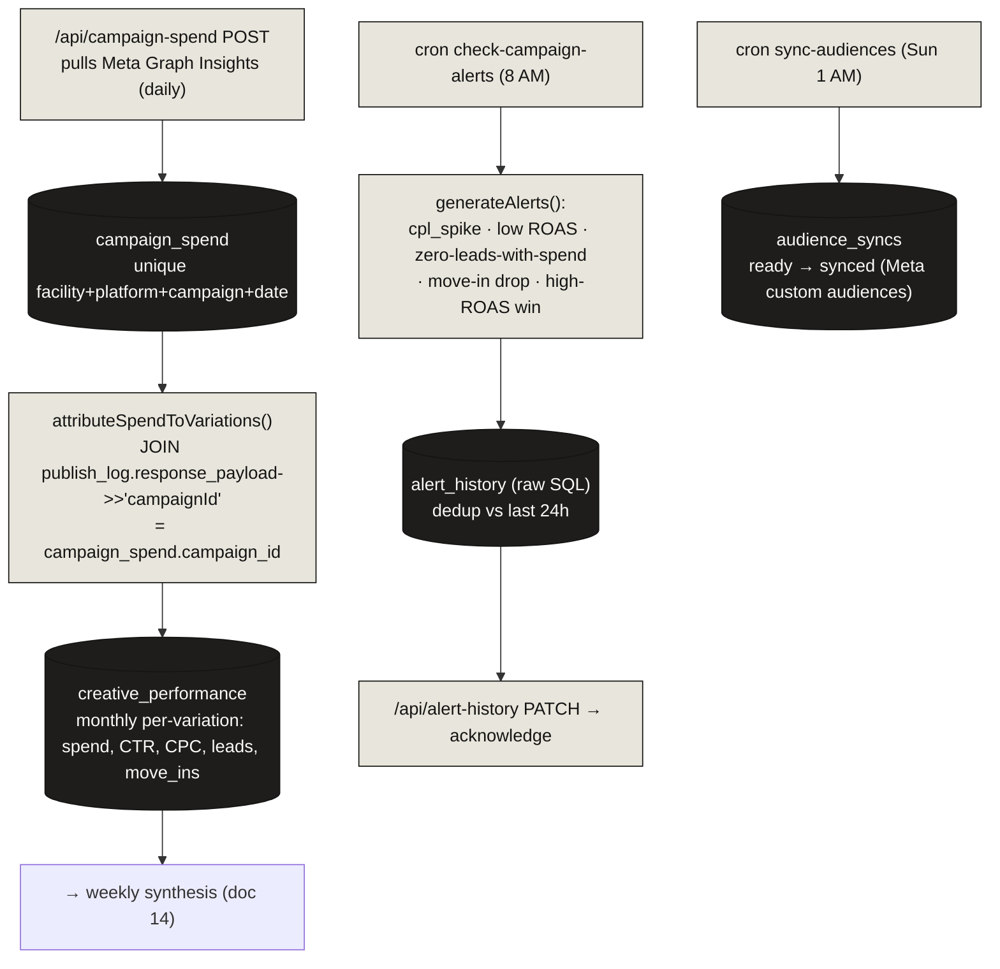

# 15 · Ad & Creative Generation + Publishing Pipeline

> **⚠️ Angelo's domain.** This document is **read-only study material** — it describes the system so the team can understand it. Per CLAUDE.md, do **not** modify the ad-platform or creative-generation internals without coordinating with Angelo.

> **The headline:** A funnel is the strategy object that owns everything. From a funnel, AI generates ad variations (copy via Anthropic, image/video via FAL.ai), each compliance-checked, then published to Meta/Google/TikTok (always **PAUSED** for manual review), with spend synced back and attributed to the originating creative.

---

## 1. The end-to-end pipeline

---

## 2. Funnels — the strategy layer that owns the graph

`funnels` carries `archetype` (social_proof, convenience, urgency, lifestyle, custom), `status` (draft → testing → live → paused → archived), `config` Json, `daily_budget`, `target_audience`. The funnel is the **cascade root** — `ad_variations`, `landing_pages`, and `drip_sequence_templates` all carry a nullable `funnel_id`.

### Status transitions have side effects

`/api/funnels/generate` is the **orchestrator** — it creates a full funnel by internally calling the individual generation routes (`facility-creatives` → `generate-image` → `landing-pages/generate`) with the admin key, then wires post-conversion + recovery drip templates.

---

## 3. Creative generation — `ad_variations` is the hub object

**`ad_variations`** is the central creative object — joined to `creative_briefs` (upstream) and `publish_log` + `creative_performance` + `drip_sequence_templates` (downstream). Fields: `platform`, `format`, `angle`, `content_json`, `asset_urls`, `status` (draft/review/approved/published/rejected), `compliance_status`, `funnel_id`, `brief_id`.

### Generation engines

| Asset | Engine | Route |
|-------|--------|-------|
| **Copy** | Anthropic `claude-sonnet-4-20250514` | `facility-creatives` |
| **Image** | Anthropic (prompt) → **FAL.ai Flux Realism** → Vercel Blob | `generate-image` |
| **Video** | Anthropic (brief) → **FAL.ai** PixVerse V6 / Wan2.2 / FFmpeg merge | `generate-video` |
| **Social** | Anthropic-only (seasonal-aware) | `generate-social-content`, `generate-social-post` |

Every copy generation injects **brand doctrine** (`@/lib/brand-doctrine`), **facility learnings** (`@/lib/facility-learnings`), market intel, and style references — this is the consumption side of the [Operator-OS feedback loop](14-operator-os-ai.md).

**Compliance** (`validateCompliance`) runs before every insert, storing `compliance_status`/`compliance_flags`. It's **advisory** — failure defaults to passed, so generation never blocks. See [11 · Security & Compliance](11-security-compliance.md) §6.

---

## 4. Platform connections (OAuth)

Signed OAuth state via `@/lib/oauth-state`. The callback routes exchange the code and write tokens back to `platform_connections`. One connection per `(facility, platform)`.

---

## 5. Publishing — two paths, always PAUSED for paid

| Path | Route | Targets | Backing table |
|------|-------|---------|---------------|
| **Paid ads** | `publish-ad` | Meta / Google Ads / TikTok (campaigns, **PAUSED**) | `publish_log` |
| **Organic social** | `publish-social` | FB / IG / GBP posts | `social_posts` (Prisma model) |

Publishing UI lives in the `ad-publisher/`, `tiktok-creator/`, and `google-ads-lab/` facility tabs.

---

## 6. Spend → attribution → alerts

> **⚠️ The attribution join is fragile and worth knowing:** spend ties back to a specific creative **only** via `publish_log.response_payload->>'campaignId' = campaign_spend.campaign_id`. That JSON-path equality is the single link between dollars and the ad that spent them.

`alert_history` is a **raw-SQL table** (like `sessions`/`alert_history`), written via raw `INSERT` and absent from `schema.prisma`. Note `social_posts` and `audience_syncs`, despite also being raw-SQL-written in places, **are** real Prisma models (`schema.prisma`) — don't assume "raw SQL write" means "not in the schema."

---

## 7. Google Ads / TikTok specifics

- `google-ads-keywords` — Anthropic generates keyword recommendations from facility context + PMS data → feeds the `google-ads-lab` UI.
- `google-conversion` — fires Google Ads conversion tracking (gclid + value) back to `googleadservices.com` (closes the Google-side conversion loop).
- `tiktok-creator` tab — builds photo slideshows (`slideshow-renderer.ts`), published via `publish-ad` as a TikTok PHOTO post.

---

## Models written at each stage

| Stage | Route | Writes |
|-------|-------|--------|
| Funnel | `funnels`, `funnels/generate` | `funnels`, `drip_sequence_templates` |
| Brief + copy | `facility-creatives` | `creative_briefs`, `ad_variations` |
| Image | `generate-image` | Vercel Blob → `ad_variations.asset_urls` |
| Video | `generate-video` | FAL output URLs |
| Social | `publish-social` | `social_posts` |
| Connect | `platform-connections` + `auth/*/callback` | `platform_connections` |
| Publish (paid) | `publish-ad` | `publish_log`, `ad_variations.status` |
| Spend | `campaign-spend` | `campaign_spend` |
| Attribution | `lib/attribution.ts` | `creative_performance` |
| Alerts | `cron/check-campaign-alerts` | `alert_history` |
| Audiences | `cron/sync-audiences` | `audience_syncs` |

---

## Key files (read-only)

| Concern | File |
|---------|------|
| Funnels | `src/app/api/funnels/route.ts`, `funnels/generate/route.ts`, `/admin/funnels` |
| Archetype defs | `src/components/admin/facility-tabs/ad-studio/types.ts` |
| Copy generation | `src/app/api/facility-creatives/route.ts` |
| Image/video | `generate-image`, `generate-video` routes |
| Platform OAuth | `src/app/api/platform-connections/route.ts`, `auth/{meta,google,tiktok}/callback` |
| Publishing | `src/app/api/publish-ad/route.ts`, `publish-social/route.ts` |
| Spend + attribution | `campaign-spend/route.ts`, `src/lib/attribution.ts` |
| Alerts | `cron/check-campaign-alerts`, `alert-history`, `campaign-alerts` routes |
| Creative tabs | `creative-studio/`, `ad-studio/`, `ad-publisher/`, `google-ads-lab/`, `tiktok-creator/` |
