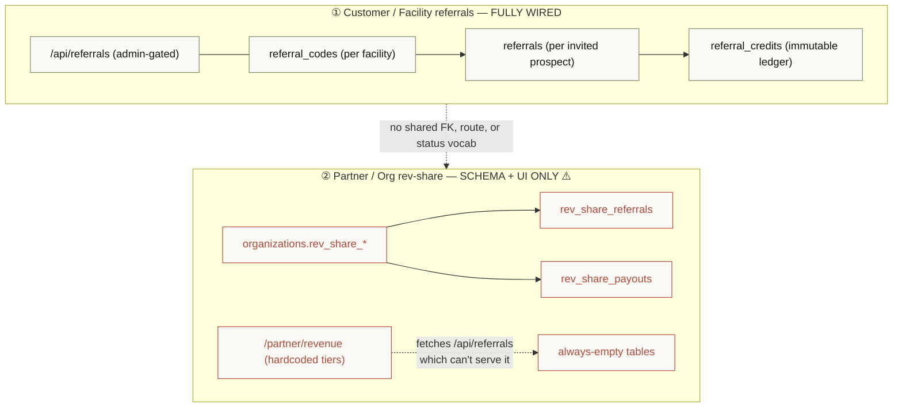
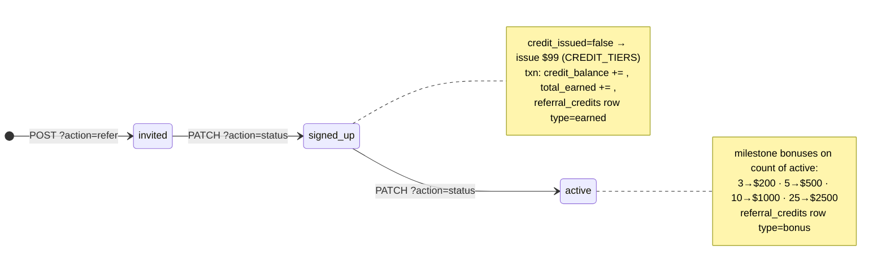
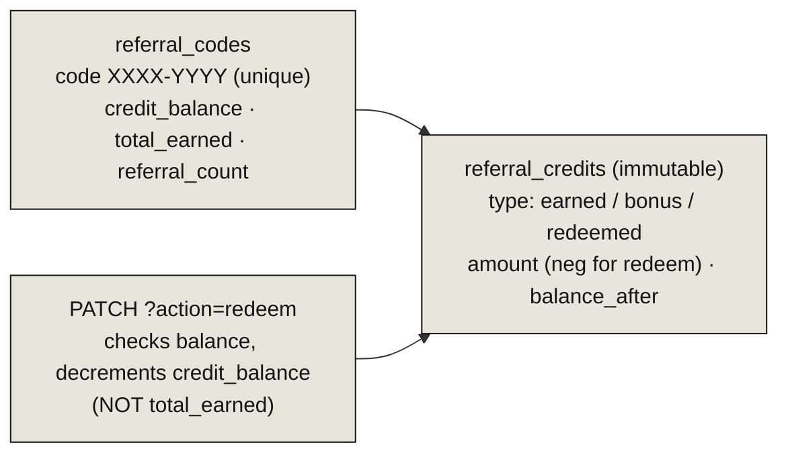
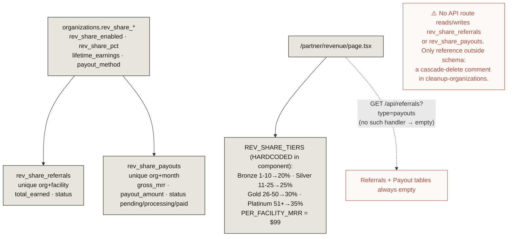

# 16 · Referrals & Revenue Share

> **The headline:** Two systems that share naming but never touch. **Customer/facility referrals** (`/api/referrals`) is fully wired — codes, invites, credits, milestone bonuses. **Partner org rev-share** (`rev_share_*` tables) is **schema + UI only** — no backend reads or writes it, and the partner revenue page fetches an endpoint that can't serve it data.

---

## 1. Two distinct systems

| | ① Customer referrals | ② Partner rev-share |
|---|---|---|
| Anchor | `facilities` | `organizations` |
| Route | `/api/referrals` (admin-key) | **none** |
| Earn model | flat $99/signup + milestone bonuses | tiered % of facility MRR |
| Output | internal `credit_balance` (manual redeem) | monthly `payout_amount` (unbuilt) |
| Stripe | none | intended, absent |
| State | ✅ functional | ⚠️ not wired |

---

## 2. System ① — Customer/facility referrals (wired)

**Flow:** create code (one per facility) → `?action=refer` invites a prospect (`invited`) → `?action=status` advances to `signed_up`/`active`, issuing a one-time $99 credit and any milestone bonus in a single transaction → `?action=redeem` spends balance. All credit math lives in `src/app/api/referrals/route.ts` (`CREDIT_TIERS`). **No Stripe** — credits are an internal balance redeemed manually by admin.

GET reads: codes list, per-code referrals, per-code ledger, and a top-20 leaderboard.

---

## 3. System ② — Partner org rev-share (schema + UI only)

The partner revenue page computes earnings **client-side** from hardcoded tiers (`grossMrr = facilityCount × $99`, `earnings = grossMrr × pct`). It fetches `/api/referrals` (the customer route, admin-gated) and `/api/referrals?type=payouts` (a handler that doesn't exist), so the Referrals and Payout History tables render empty. The `rev_share_referrals` / `rev_share_payouts` tables are designed to be populated from org MRR but **nothing computes them yet**.

→ Logged in [13 · Gaps & Seams](13-gaps-and-seams.md).

---

## Key files

| Concern | File |
|---------|------|
| Customer referrals (wired) | `src/app/api/referrals/route.ts` |
| Customer models | `referral_codes`, `referrals`, `referral_credits` in `prisma/schema.prisma` |
| Partner rev-share UI | `src/app/partner/revenue/page.tsx` (hardcoded tiers) |
| Partner models (unwired) | `organizations.rev_share_*`, `rev_share_referrals`, `rev_share_payouts` |
