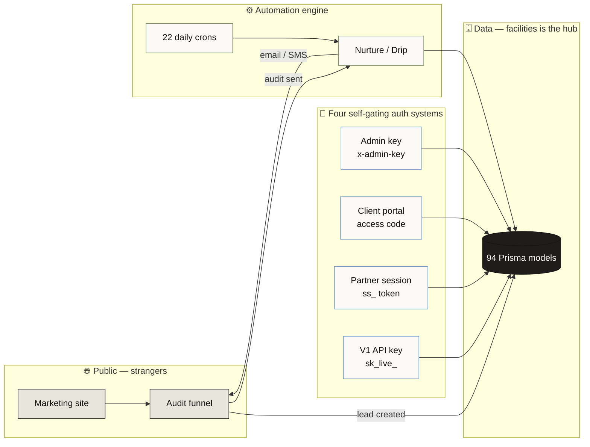

# System Maps — StorageAds.com

Visual study guides for the critical systems in this codebase. Each document is a diagram-first walkthrough grounded in the actual files, function names, and routes — not a high-level sketch. The goal is that you can read one of these and understand *how a system actually behaves in production* without spelunking 187 route files.

> **How to read the diagrams.** Every diagram is [Mermaid](https://mermaid.js.org/), which renders inline on GitHub, in VS Code (with the Markdown Preview Mermaid extension), and on most Markdown viewers. If you're staring at raw `graph TD` text, open the file in a renderer.

## The maps

### Core systems

| # | System | What it answers | Why it's critical |
|---|--------|-----------------|-------------------|
| [01](01-authentication.md) | **Authentication & Request Lifecycle** | Who is allowed to call what, and how a request travels from the edge to a handler | Four independent auth systems + a CSRF gate that silently 403s new public routes. The #1 source of "it works locally, 403s in prod." |
| [02](02-data-model.md) | **Data Model** | What entities exist and how they relate | 94 Prisma models. `facilities` is the hub everything cascades off of. State machines live in `String` fields, not enums. |
| [03](03-audit-funnel.md) | **Audit Funnel (top-of-funnel)** | How a stranger becomes a booked sales call | The primary lead wedge. Two entry paths, an AI diagnostic, a 90-day shareable report, and engagement-triggered hot-lead alerts. |
| [04](04-nurture-lifecycle.md) | **Nurture & Drip Lifecycle** | What automatically emails/texts a lead after the audit | Two parallel engines (new nurture + legacy drip fallback) driven by daily crons. This is where leads are won or dropped. |
| [05](05-background-jobs.md) | **Background Jobs (cron) & Integrations** | What runs on a schedule and which third parties we depend on | 22 Vercel crons on a daily timeline + 13 external services. Fail-closed auth. |
| [06](06-frontend-ia.md) | **Frontend Information Architecture** | The four app surfaces and their routes | Marketing / Admin / Portal / Partner. The auth boundaries — not route nesting — are the real dividers. |

### Revenue & operations systems

| # | System | What it answers | Why it's critical |
|---|--------|-----------------|-------------------|
| [07](07-billing-stripe.md) | **Billing & Stripe** | How money is collected and subscriptions tracked | The Stripe webhook is the real state engine. Two plan namespaces never meet; the live org path is `/api/signup` (trial), not Checkout. |
| [08](08-pms-pipeline.md) | **PMS Data Ingestion** | How facility management reports become structured data | Three CSV ingestion paths into `facility_pms_*`. `storedge-import` is manual JSON, not a live API. |
| [09](09-retention-engine.md) | **Tenant Retention / Churn Engine** | The tenant-side machine: churn scoring, ECRI, win-back, NOI | Heuristic (no LLM) weekly scoring crons. Escalation & move-out sequences have timers but no cron — admins drive them. |
| [10](10-attribution-tracking.md) | **Attribution & Call Tracking** | How an ad click becomes a measured move-in tied to spend | Click → lead → call/walk-in → lead↔tenant match → ROAS. Some columns are unwired scaffold; walk-ins aren't auto-matched. |
| [11](11-security-compliance.md) | **Security & Compliance** | The layered defenses + GDPR/data-deletion | Headers, CSRF, rate limiting, hashed tokens, deletion lifecycle. CSP is report-only; rate limiting is fail-open by default. |
| [12](12-gbp-external-api.md) | **GBP & External API + Webhooks** | The Google listing loop + the partner-facing API | GBP connect→sync→AI-draft→safety-gate→publish. V1 scoped keys, tenant isolation, HMAC webhooks that auto-disable after 10 failures. |

### Intelligence & growth systems

| # | System | What it answers | Why it's critical |
|---|--------|-----------------|-------------------|
| [14](14-operator-os-ai.md) | **Operator-OS AI Substrate** | How campaign data evolves the AI's strategy and stays brand-safe | The product's namesake. Synthesis → versioned doctrine → voice-shaped generation → safety gate, then the loop closes. |
| [15](15-ad-creative-pipeline.md) | **Ad & Creative Pipeline** *(Angelo's domain — read-only)* | How a funnel becomes published ads with tracked spend | Funnel owns the graph; AI generates copy (Anthropic) + image/video (FAL); published PAUSED; spend attributed back to creative. |
| [16](16-referrals-revshare.md) | **Referrals & Revenue Share** | The two referral economies | Customer referrals are fully wired ($99 + bonuses); partner rev-share is schema+UI only (not wired). |

### Meta & reference

| # | Doc | What it is |
|---|-----|-----------|
| [13](13-gaps-and-seams.md) | **Gaps & Seams** | A candid inventory of where the code's *intent* diverges from its *wired reality* — scaffolds, namespace mismatches, timers with no driver, fail-soft defaults. Read this before assuming a system does what its names imply. |
| [17](17-glossary-reference.md) | **Glossary & Quick Reference** | The single Cmd-F lookup: domain vocabulary, every `String` status lifecycle (no enums), the two plan namespaces, auth credentials, the 22-cron inventory, and the lib-file map. |

## The mental model (one diagram for the whole product)

**The one thing to internalize:** Clerk (the proxy) enforces nothing — every route is marked public. Each of the four boxes in the Auth row gates *itself*. That's why the auth boundaries, not the URL tree, define the real architecture.

## Source of truth

These docs were generated by reading the codebase on 2026-06-26 (`main` @ `3958db2`). They are a study aid, not a contract — when a doc and the code disagree, the code wins. Key anchors if you want to verify any claim:

- `src/proxy.ts` — the edge gate (CSP, CSRF, Clerk, Sentry tagging)
- `src/lib/api-helpers.ts`, `session-auth.ts`, `cron-auth.ts`, `v1-auth.ts`, `portal-auth.ts` — the auth helpers
- `prisma/schema.prisma` — the 94 models
- `vercel.json` — the 22 cron schedules
- `src/lib/nurture-templates.ts` — the sequence templates

Regenerate by re-reading these anchors when the architecture shifts.
